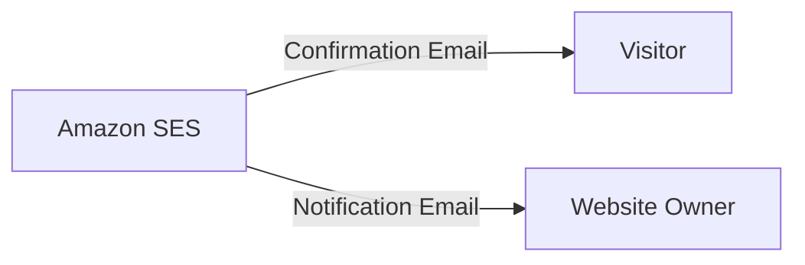
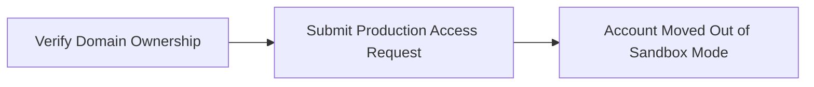

 Build a serverless backend with generative AI capabilities for handling contact forms on static websites. This documentation covers the complete end-to-end solution, covering backend development with AWS services like API Gateway, Lambda, Bedrock, and Simple Email Service, as well as frontend integration with the contact form of a static website. 

## Introduction
Static websites have gained popularity due to their speed, security, and cost-effectiveness. They can be hosted on various platforms like:

1.	AWS
2.	GitHub Pages
3.	Netlify

However, static websites have a significant limitation: they lack the ability to handle dynamic operations, such as processing contact form submissions. Traditionally, adding this functionality required setting up and maintaining a server-based solution, which introduces several challenges.

### The Challenge
A traditional server setup for contact form processing requires 24/7 server provisioning and management. While an Amazon EC2 instance could be used, it comes with several responsibilities:

1.	Continuous server operation, regardless of activity levels.
2.	Ongoing server maintenance, including regular updates and patches.
3.	Complex setup involving auto-scaling groups and load balancers to manage traffic fluctuations.
4.	Constant costs for maintaining minimum infrastructure, even during low usage periods.

These factors introduce additional complexity, expenses, and management overhead, potentially undermining the simplicity and cost-effectiveness that make static sites attractive.

### The Solution
To overcome this challenge and maintain the advantages of static site architecture, a serverless solution can be implemented to handle contact form submissions. This serverless approach comes with some great advantages:

1.	It only charges for the compute time used to process form submissions.
2.	The system automatically scales to handle varying loads without intervention.
3.	There's no need to manage server infrastructure or worry about updates and patches.
4.	The solution can be easily integrated with any static website, regardless of its hosting platform.

With this serverless solution, dynamic functionality can be added to a static site without needing traditional server management, preserving the simplicity and cost-effectiveness that make static sites attractive.

### Integrating Generative AI
You might be wondering why we're integrating generative AI into the contact form solution. Let's explore this:

1. Many websites offer generic, pre-written responses to form submissions, which can feel impersonal. Incorporating generative AI into the contact form creates a unique experience for each user, potentially leaving them with a lasting impression.
2. Integrating generative AI with serverless architecture demonstrates a practical application of emerging technologies in a common web feature, illustrating how advanced solutions can enhance routine online interactions such as submitting contact forms.

### Objectives
By the end of this documentation, you will be able to:

1. Create a serverless backend for handling contact form submissions
2. Integrate Generative AI features into a serverless backend
3. Implement automated email functionality
4. Integrate a serverless backend with a contact form of a static website

### Prerequisites
Before starting, ensure you have the following:

1. [AWS account](https://aws.amazon.com/){:target="_blank"} with appropriate permissions to create and manage the required services.
2. [Registered domain](https://aws.amazon.com/route53/){:target="_blank"} to set up Amazon Simple Email Service (SES).
3. [Visual Studio Code](https://code.visualstudio.com/){:target="_blank"} with the Live Server extension installed (for local testing of your static website).
4. [HTML5 UP Dimensions Template](https://html5up.net/dimension){:target="_blank"} to provide the static website's contact form layout and design.

> 
Amazon Route 53 is recommended for easier DNS configuration. While you can use any domain registrar, domains not managed by Route 53 will require additional steps for SES verification.
{: .prompt-tip }

### Architecture


This architecture outlines a process for dynamically generating and delivering inspirational quotes using a combination of AWS services, including Amazon API Gateway, AWS Lambda, Amazon Bedrock, and Amazon Simple Email Service (SES).

1. **Contact Form Submission**: The process begins with a static contact form hosted on your website. When a visitor submits this form, it triggers an HTTP POST request to Amazon API Gateway.

2. **Request Handling by API Gateway**: Amazon API Gateway receives the incoming request and invokes an AWS Lambda function designed to handle the form submission.

3. **Lambda Function Execution**: The AWS Lambda function is the core component of this solution and is responsible for the following tasks:
   - Processing the data submitted through the contact form.
   - Utilizing a predefined prompt to request an inspirational quote generation.
   - Invoking the Amazon Bedrock API to generate the quote based on the prompt.

4. **Quote Generation with Amazon Bedrock**: Amazon Bedrock processes the prompt provided by the Lambda function and generates a unique inspirational quote.

5. **Response Handling by Lambda Function**: Upon receiving the response from Amazon Bedrock, the AWS Lambda function:
   - Parses and formats the generated quote.
   - Initiates an email-sending process using Amazon Simple Email Service (SES).

6. **Email Delivery with Amazon SES**: Amazon SES manages the email delivery process by:
   - Sending a notification email to the website owner, confirming the form submission and the generated quote.
   - Sending a confirmation email, including the generated inspirational quote, to a third-party email service provider, which then delivers the email to the website visitor.

This architecture leverages AWS's scalable and reliable services to seamlessly integrate form submission, dynamic content generation, and email delivery, providing an efficient and automated workflow for engaging with website visitors.

### Frontend Integration
To integrate the static website frontend with the serverless backend, we will use the **HTML5 UP Dimensions Template**, which offers a modern design and is straightforward to set up and customize. The following modifications will be made to the template's contact form to facilitate communication with the backend services:

1. **Update Form Action**: Modify the form's action attribute to point to the Amazon API Gateway endpoint URL.

2. **Add Custom JavaScript**:
   - Capture form data when a user submits the contact form.
   - Send the captured data as an HTTP POST request to the API Gateway.
   - Implement HTML5 validation to ensure all required fields are filled correctly, including checks for valid email format and message length.
   - Manage the user experience by displaying appropriate success or error messages based on the API response.

To test the modified frontend, we will use the **Live Server extension** in Visual Studio Code, which allows local testing and interaction with the backend API in a simulated production environment.

Let's build it!

## Amazon Simple Email Service (SES)



This section describes how to set up Amazon Simple Email Service (SES) to handle email communications for the serverless contact form solution.

Configuring Amazon SES enables the serverless backend to:
- Automatically send emails to visitors who fill out the contact form.
- Notify the website owner about new form submissions.


### What Is Amazon SES?

Amazon SES is a scalable, cloud-based email platform that simplifies email communications for businesses and developers. It offers a cost-effective solution for sending and receiving emails using custom email addresses and domains without the need to manage personal email servers.

Amazon SES supports various types of emails, including marketing, transactional, and informational messages. Beyond sending emails, it can receive and process incoming emails, enabling developers to build complex, email-based applications.

In the context of the serverless contact form solution, Amazon SES serves two primary purposes:

1. **Sending Confirmation Emails to Visitors**

   When a visitor submits the contact form, Amazon SES automatically sends a confirmation email to the visitor. For example, upon form submission, the visitor receives an email stating:

   "Thank you for your message. We've received your message and will respond soon."

2. **Notifying Website Owners of New Submissions**

   Amazon SES sends automated emails to the website owner for each new form submission, including the submitter's details and message content.

### Benefits of Using Amazon SES With Serverless Architecture

Amazon SES offers several advantages when integrated with serverless architectures, especially for contact form implementations.

Traditional email systems can become complex and costly as a website scales. They often require:

1. Email Server Management
2. Network Configuration
3. IP Reputation Management

While third-party email services provide alternatives, they may involve complex contracts, pricing structures, and significant upfront costs.

By leveraging Amazon SES, these challenges are mitigated:

1. Email server management is fully handled by Amazon.
2. Emails are sent through Amazon's robust and reliable network infrastructure.
3. Benefit from Amazon's reputable IP addresses for improved email deliverability.

> Scalability is a key advantage of Amazon SES. Whether the website receives ten form submissions per day or ten thousand, SES seamlessly scales to handle the load without additional configuration. This aligns with serverless architecture principles, allowing developers to focus on building features rather than managing infrastructure.
{: .prompt-info }

### The Sandbox Mode

When first using Amazon SES, accounts are placed in sandbox mode as a default security measure. In sandbox mode, there are two key restrictions:

1. Emails can be sent only from addresses or domains that have been verified in Amazon SES.
2. Emails can be sent only to addresses or domains that have been verified.

These limitations impact the functionality of a serverless contact form, particularly when attempting to send confirmation emails to users who submit the form.

### Email Verification Methods

To overcome sandbox restrictions, Amazon SES provides two methods for verifying the ability to send emails:

1. **Verifying Individual Email Identities**

   - **Process**:

      ```mermaid
      flowchart LR
          A[Enter email address in SES console] --> B[SES sends verification email]
          B --> C[Click verification link in email]
          C --> D[Email address verified in SES]
      ```

   - **Limitations**:
     - Emails can only be sent to verified addresses in sandbox mode, making it impractical for public-facing contact forms, as visitors' email addresses cannot be pre-verified.
     - Requires separate verification for each sender address, which is inefficient as the number of addresses grows.

2. **Verifying a Domain**

   - **Process**:

      ```mermaid
      flowchart LR
          A[Verify ownership of entire domain] --> B[Send emails from any address within that domain]
          B --> C[contact@example.com]
          B --> D[support@example.com]
        ```

   - **Advantages**:
     - More scalable for growing solutions.
     - Presents a professional appearance with consistent domain-based email addresses.
   - **Considerations**:
     - Requires access to the domain's DNS settings, involving a slightly more complex setup.
     - Simplified if the domain is managed by Amazon Route 53, as AWS can automate DNS configuration.

### Moving to Production

To enable full functionality of a public-facing contact form, it's necessary to move beyond sandbox mode. This transition involves two steps:



Once in production, the following capabilities become available:

- Confirmation emails can be sent to any email address without prior verification.
- Utilize any email address within the verified domain without individual verifications.
- The contact form functions fully in a production environment.

### Implementing Amazon SES

To configure Amazon SES for your serverless contact form solution, perform the following steps:

1. Create and verify an individual email identity
2. Set up domain verification
3. Move out of the sandbox into production


#### Step 1: Create and Verify an Individual Email Identity

1. **Select Your AWS Region**  
   Amazon SES is a regional service, so start by logging into the AWS Management Console and selecting the AWS Region where you plan to use SES.

2. **Access the Amazon SES Console**  
   Go to the [Amazon SES console](https://console.aws.amazon.com/ses/) to begin setting up your email identity.

3. **Create an Email Identity**  
   In the SES console, under **Email Addresses**, click **Create Identity**. Choose **Email Address** as the identity type, enter the email address you want to verify, and click **Create Identity**.

4. **Verify the Email Address**  
   AWS will send a verification email to the specified address. Check your inbox, and click the verification link to confirm ownership of the email address.

5. **Confirmation**  
   Once verified, a confirmation message will appear in the SES console. At this point, your account is still in sandbox mode, meaning certain sending restrictions apply.

#### Step 2: Set Up Domain Verification

1. **Initiate Domain Verification**  
   In the SES console, click **Create Identity**, select **Domain** as the identity type, and enter your domain name.

2. **Configure DKIM Settings**  
   Enable **Easy DKIM** to have Amazon SES sign outgoing emails with DomainKeys Identified Mail (DKIM). This step is important for authenticating your emails and improving deliverability.

3. **Assign Configuration Set (Optional)**  
   If you’re not using configuration sets, leave the **Assign a Default Configuration Set** checkbox unchecked. Configuration sets allow you to apply specific rules to your email sending and can be configured later as your needs grow.

4. **Set Up a Custom MAIL FROM Domain**  
   Enable **Customize MAIL FROM Domain** to use a custom subdomain, like **mail.example.com** or **ses.example.com** for your email’s **"MAIL FROM"** address. This step separates your email sending from your primary domain, helping to manage your domain’s reputation.

5. **DNS Configuration**  
   - **Using Amazon Route 53**: AWS can automatically add the necessary DNS records for DKIM and MAIL FROM configurations.
   - **Using a Third-Party DNS Provider**: Manually add the DNS records provided by Amazon SES (CNAME for DKIM, MX, and TXT for MAIL FROM) to your DNS settings.

6. **Complete Domain Verification**  
   Click **Create Identity** to start the verification process. This may take a few minutes. Monitor the **Identities** page for the status of your domain verification and DKIM setup. AWS will send confirmation emails once the domain is successfully verified.

#### Step 3: Move Out of the Sandbox into Production

To use Amazon SES in a live environment and send emails to unverified recipients, you need to move out of the sandbox mode.

1. **Review Sending Limits**  
   In the SES console, go to **Account Dashboard** to review your current sending limits and sandbox status.

2. **Request Production Access**  
   Click **Request Production Access** to initiate the process. You’ll need to fill out the **Email Sending Limits** form, providing key information such as:

   - **Mail Type**: Choose **Transactional** for emails triggered by specific actions, like form submissions.
   - **Website URL**: Enter the URL where your contact form is hosted.
   - **Use Case Description**: Clearly describe your use case. For example:

     > "I am building a serverless contact form handler as part of an AWS Solution for my static website. This project integrates various AWS services, including Simple Email Service, Lambda, API Gateway, and Bedrock. The form handler will send confirmation emails to form submitters and notifications to me as the website owner. The expected email volume is low, approximately 5-10 emails per week. This solution helps me apply my AWS knowledge and understand cloud architecture in a practical setting, while also providing a functional contact method for my site visitors."

3. **Submit Your Request**  

  > 
   AWS typically processes these requests within one business day. Once approved, your account will move out of sandbox mode, allowing you to send emails to unverified recipients.
  {: .prompt-info }
