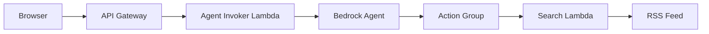

This agent lets visitors search your blog through natural conversation. Whether you're running Jekyll, Hugo, WordPress, Medium, dev.to, or any platform with RSS support, the pattern is the same. Instead of browsing categories or using a search box, visitors ask questions like "What have you written about serverless?" and the agent searches your RSS feed, finds matching posts, and returns titles, summaries, and links.

The agent decides how to respond based on the question. Content questions trigger a search. General questions get answered directly. No manual updates required - when you publish a new post, it's automatically searchable.

---

## Architecture



| Component | Purpose |
|-----------|---------|
| API Gateway | REST endpoint for frontend requests |
| Agent Invoker Lambda | Orchestrates requests to Bedrock agent |
| Bedrock Agent | Interprets queries and decides actions |
| Action Group | Defines available tools via OpenAPI schema |
| Search Lambda | Fetches and searches RSS feed content |

---

## Search Lambda

Create this first - the Bedrock agent will need its ARN for the action group.

Fetches RSS feed and returns matching posts based on query terms.

```python
import json
import urllib.request
import xml.etree.ElementTree as ET

# Replace with your RSS feed URL
# Examples:
#   Jekyll/Hugo: https://your-site.com/feed.xml
#   Medium: https://medium.com/feed/@username
#   dev.to: https://dev.to/feed/username
FEED_URL = "https://your-site.com/feed.xml"

def lambda_handler(event, context):
    # Extract topic from Bedrock agent request
    topic = ""
    for param in event.get("parameters", []):
        if param.get("name") == "topic":
            topic = param.get("value", "").lower()
            break
    
    if not topic:
        return build_response(event, [])
    
    # Fetch and parse RSS feed
    with urllib.request.urlopen(FEED_URL, timeout=10) as response:
        feed_data = response.read().decode("utf-8")
    
    root = ET.fromstring(feed_data)
    matching_posts = []
    search_terms = topic.split()
    
    # Adjust these values to control results
    # Higher values = more comprehensive but increases token usage
    # Medium feeds can have 4k+ words per post - limits prevent massive payloads
    MAX_POSTS_TO_SEARCH = 20  # Number of recent posts to evaluate
    MAX_RESULTS = 5           # Maximum matching results to return
    DESC_LENGTH = 150         # Characters to include from description
    
    # RSS 2.0 format (WordPress, Medium, AWS blogs)
    for item in root.findall(".//item")[:MAX_POSTS_TO_SEARCH]:
        title = item.find("title").text or ""
        link = item.find("link").text or ""
        description = item.find("description").text or ""
        
        searchable = f"{title.lower()} {description.lower()}"
        if all(term in searchable for term in search_terms):
            matching_posts.append({
                "title": title,
                "link": link,
                "description": description[:DESC_LENGTH] + "..."
            })
        
        if len(matching_posts) >= MAX_RESULTS:
            break
    
    # Atom format (Jekyll, Hugo) - if no RSS 2.0 items found
    if not matching_posts:
        namespace = {"atom": "http://www.w3.org/2005/Atom"}
        for entry in root.findall("atom:entry", namespace)[:MAX_POSTS_TO_SEARCH]:
            title = entry.find("atom:title", namespace)
            summary = entry.find("atom:summary", namespace)
            link = entry.find("atom:link", namespace)
            
            title_text = title.text if title is not None and title.text else ""
            summary_text = summary.text if summary is not None and summary.text else ""
            
            searchable = f"{title_text.lower()} {summary_text.lower()}"
            if all(term in searchable for term in search_terms):
                matching_posts.append({
                    "title": title_text,
                    "link": link.get("href") if link is not None else "",
                    "description": summary_text[:DESC_LENGTH] + "..."
                })
            
            if len(matching_posts) >= MAX_RESULTS:
                break
    
    return build_response(event, matching_posts)


def build_response(event, posts):
    return {
        "messageVersion": "1.0",
        "response": {
            "actionGroup": event.get("actionGroup", ""),
            "apiPath": event.get("apiPath", ""),
            "httpMethod": event.get("httpMethod", ""),
            "httpStatusCode": 200,
            "responseBody": {
                "application/json": {
                    "body": json.dumps(posts) if posts else json.dumps({"message": "No matching posts found."})
                }
            }
        }
    }
```
{: file="search-lambda/lambda_function.py" }

**Configuration:**
- Runtime: Python 3.12
- Timeout: 30 seconds
- Memory: 128 MB

---

## Bedrock Agent

Create the agent and action group. You'll need the Search Lambda ARN from the previous step.

### System Prompt

```text
You are a helpful assistant on a technical documentation website.

RULES:
1. If a user asks about content, posts, tutorials, courses, or documentation, 
   you MUST use the SearchDocumentation tool first. Never assume what content exists.

2. When returning search results, format each result as:
   - Title
   - Brief summary
   - URL (as clickable link)

3. If the search returns no results, inform the user and offer to help 
   with general questions instead.

4. For general technical questions not about site content, answer directly 
   using your knowledge.

Be concise and helpful.
```

### Action Group OpenAPI Schema

```yaml
openapi: 3.0.0
info:
  title: Documentation Search API
  version: 1.0.0
paths:
  /search:
    post:
      operationId: searchDocumentation
      summary: Search published documentation and posts
      description: Searches the RSS feed for posts matching the given topic
      requestBody:
        required: true
        content:
          application/json:
            schema:
              type: object
              properties:
                topic:
                  type: string
                  description: The topic or keywords to search for
              required:
                - topic
      responses:
        '200':
          description: Search results
          content:
            application/json:
              schema:
                type: object
                properties:
                  topic:
                    type: string
                  count:
                    type: integer
                  posts:
                    type: array
                    items:
                      type: object
                      properties:
                        title:
                          type: string
                        summary:
                          type: string
                        url:
                          type: string
```
{: file="openapi-schema.yaml" }

### Resource Policy for Search Lambda

Add this resource-based policy to allow the Bedrock agent to invoke the Search Lambda.

```json
{
  "Version": "2012-10-17",
  "Statement": [
    {
      "Effect": "Allow",
      "Principal": {
        "Service": "bedrock.amazonaws.com"
      },
      "Action": "lambda:InvokeFunction",
      "Resource": "arn:aws:lambda:us-east-1:ACCOUNT_ID:function:search-lambda",
      "Condition": {
        "ArnLike": {
          "AWS:SourceArn": "arn:aws:bedrock:us-east-1:ACCOUNT_ID:agent/AGENT_ID"
        }
      }
    }
  ]
}
```

After creating the agent, create and deploy an alias. Note the Agent ID and Alias ID for the next step.

---

## Agent Invoker Lambda

Create this after the Bedrock agent. You'll need the Agent ID and Alias ID.

Receives requests from API Gateway and invokes the Bedrock agent.

```python
import json
import uuid
import boto3

AGENT_ID = "YOUR_AGENT_ID"        # From Bedrock console
AGENT_ALIAS_ID = "YOUR_ALIAS_ID"  # From Bedrock console
REGION = "us-east-1"

bedrock = boto3.client("bedrock-agent-runtime", region_name=REGION)

def lambda_handler(event, context):
    # Handle CORS preflight
    if event.get("httpMethod") == "OPTIONS":
        return cors_response(200, "")
    
    # Parse request body
    try:
        body = json.loads(event.get("body", "{}"))
    except json.JSONDecodeError:
        body = {}
    
    message = body.get("message", "").strip()
    session_id = body.get("sessionId", str(uuid.uuid4()))
    
    if not message:
        return cors_response(400, {"error": "No message provided"})
    
    # Invoke Bedrock agent
    try:
        response = bedrock.invoke_agent(
            agentId=AGENT_ID,
            agentAliasId=AGENT_ALIAS_ID,
            sessionId=session_id,
            inputText=message
        )
        
        # Extract response from event stream
        result = ""
        for event in response.get("completion", []):
            if "chunk" in event:
                result += event["chunk"].get("bytes", b"").decode("utf-8")
        
        return cors_response(200, {
            "response": result,
            "sessionId": session_id
        })
        
    except Exception as e:
        return cors_response(500, {"error": str(e)})

def cors_response(status_code, body):
    return {
        "statusCode": status_code,
        "headers": {
            "Content-Type": "application/json",
            "Access-Control-Allow-Origin": "*",
            "Access-Control-Allow-Headers": "Content-Type",
            "Access-Control-Allow-Methods": "POST, OPTIONS"
        },
        "body": json.dumps(body) if isinstance(body, dict) else body
    }
```
{: file="invoker-lambda/lambda_function.py" }

**Configuration:**
- Runtime: Python 3.12
- Timeout: 29 seconds
- Memory: 128 MB

### Execution Role Policy

Add this policy to the Lambda execution role.

```json
{
  "Version": "2012-10-17",
  "Statement": [
    {
      "Effect": "Allow",
      "Action": "bedrock:InvokeAgent",
      "Resource": "arn:aws:bedrock:us-east-1:ACCOUNT_ID:agent-alias/AGENT_ID/ALIAS_ID"
    }
  ]
}
```

---

## API Gateway

| Setting | Value |
|---------|-------|
| Type | REST API |
| Endpoint | Regional |
| Method | POST |
| Integration | Lambda Proxy |
| CORS | Enabled |

### CORS Configuration

```
Access-Control-Allow-Origin: *
Access-Control-Allow-Headers: Content-Type
Access-Control-Allow-Methods: POST, OPTIONS
```

---

## Frontend

### Terminal CSS

```css
.terminal-window {
  background: #1e1e1e;
  border-radius: 8px;
  font-family: 'Monaco', 'Menlo', 'Ubuntu Mono', monospace;
  font-size: 14px;
  max-width: 800px;
  margin: 0 auto;
}

.terminal-header {
  background: #3d3d3d;
  padding: 8px 12px;
  border-radius: 8px 8px 0 0;
  display: flex;
  align-items: center;
  gap: 8px;
}

.terminal-btn {
  width: 12px;
  height: 12px;
  border-radius: 50%;
}

.terminal-btn.red { background: #ff5f56; }
.terminal-btn.yellow { background: #ffbd2e; }
.terminal-btn.green { background: #27ca40; }

.terminal-body {
  padding: 16px;
  height: 400px;
  overflow-y: auto;
  color: #f0f0f0;
}

.terminal-output {
  white-space: pre-wrap;
  word-wrap: break-word;
}

.terminal-input-line {
  display: flex;
  align-items: center;
}

.terminal-prompt {
  color: #27ca40;
  margin-right: 8px;
}

.terminal-input {
  background: transparent;
  border: none;
  color: #fff;
  font-family: inherit;
  font-size: inherit;
  flex: 1;
  outline: none;
}

.system-message { color: #888; }
.user-message { color: #fff; }
.agent-message { color: #f0f0f0; }
.error-message { color: #ff5f56; }
```
{: file="terminal.css" }

### Terminal JavaScript

```javascript
const API_ENDPOINT = "https://YOUR_API_ID.execute-api.us-east-1.amazonaws.com/prod/agent";
const sessionId = crypto.randomUUID();

const terminalBody = document.getElementById("terminal-body");
const terminalInput = document.getElementById("terminal-input");
const terminalOutput = document.getElementById("terminal-output");

// Focus input on click
terminalBody.addEventListener("click", () => terminalInput.focus());

// Handle input
terminalInput.addEventListener("keydown", async (e) => {
  if (e.key === "Enter") {
    const input = terminalInput.value.trim();
    terminalInput.value = "";
    
    if (!input) return;
    
    // Display user input
    appendOutput(`> ${input}`, "user-message");
    
    // Handle built-in commands
    if (input.toLowerCase() === "clear") {
      terminalOutput.innerHTML = "";
      return;
    }
    
    if (input.toLowerCase() === "help") {
      appendOutput("Available commands:\n  clear - Clear terminal\n  help - Show this message\n\nOr ask me anything about the documentation.", "system-message");
      return;
    }
    
    // Send to agent
    await sendMessage(input);
  }
});

async function sendMessage(message) {
  appendOutput("...", "system-message loading");
  
  try {
    const response = await fetch(API_ENDPOINT, {
      method: "POST",
      headers: { "Content-Type": "application/json" },
      body: JSON.stringify({ message, sessionId })
    });
    
    const data = await response.json();
    
    // Remove loading indicator
    document.querySelector(".loading")?.remove();
    
    if (data.error) {
      appendOutput(`Error: ${data.error}`, "error-message");
    } else {
      appendOutput(data.response, "agent-message");
    }
  } catch (error) {
    document.querySelector(".loading")?.remove();
    appendOutput(`Error: ${error.message}`, "error-message");
  }
}

function appendOutput(text, className) {
  const div = document.createElement("div");
  div.className = className;
  div.textContent = text;
  terminalOutput.appendChild(div);
  terminalBody.scrollTop = terminalBody.scrollHeight;
}
```
{: file="terminal.js" }

### HTML Structure

```html
<div class="terminal-window">
  <div class="terminal-header">
    <div class="terminal-btn red"></div>
    <div class="terminal-btn yellow"></div>
    <div class="terminal-btn green"></div>
    <span class="terminal-title">agent</span>
  </div>
  <div class="terminal-body" id="terminal-body">
    <div id="terminal-output">
      <div class="system-message">Welcome. Type a question or 'help' for commands.</div>
    </div>
    <div class="terminal-input-line">
      <span class="terminal-prompt">❯</span>
      <input type="text" id="terminal-input" class="terminal-input" autofocus>
    </div>
  </div>
</div>
```

---

## Testing

### Test Search Lambda

```bash
aws lambda invoke \
  --function-name search-lambda \
  --payload '{"parameters": [{"name": "topic", "value": "bedrock"}]}' \
  --cli-binary-format raw-in-base64-out \
  response.json
```

### Test API Gateway Endpoint

```bash
curl -X POST https://YOUR_API_ID.execute-api.us-east-1.amazonaws.com/prod/agent \
  -H "Content-Type: application/json" \
  -d '{"message": "What content do you have on Bedrock?", "sessionId": "test-123"}'
```

### Verify CORS

```bash
curl -X OPTIONS https://YOUR_API_ID.execute-api.us-east-1.amazonaws.com/prod/agent \
  -H "Origin: https://yourdomain.com" \
  -H "Access-Control-Request-Method: POST" \
  -v
```

---

## Deployment Checklist

- [ ] Create Search Lambda
- [ ] Create Bedrock agent with system prompt
- [ ] Create action group with OpenAPI schema
- [ ] Add resource policy to Search Lambda
- [ ] Create and deploy agent alias
- [ ] Create Agent Invoker Lambda with execution role policy
- [ ] Create API Gateway REST API
- [ ] Enable CORS on API Gateway
- [ ] Deploy API to stage
- [ ] Update frontend with API endpoint
- [ ] Test end-to-end flow
