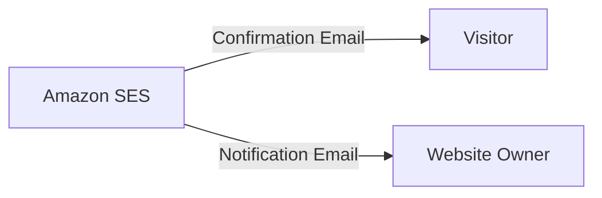
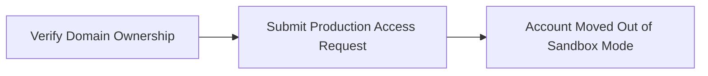
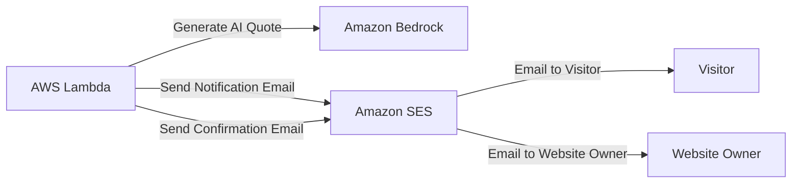
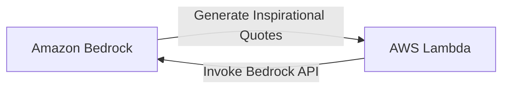

 Build a serverless backend with generative AI capabilities for handling contact forms on static websites. This documentation covers the complete end-to-end solution, covering backend development with AWS services like API Gateway, Lambda, Bedrock, and Simple Email Service, as well as frontend integration with the contact form of a static website. 

## Introduction
Static websites have gained popularity due to their speed, security, and cost-effectiveness. They can be hosted on various platforms like:

1.	AWS
2.	GitHub Pages
3.	Netlify

However, static websites have a significant limitation: they lack the ability to handle dynamic operations, such as processing contact form submissions. Traditionally, adding this functionality required setting up and maintaining a server-based solution, which introduces several challenges.

### The Challenge and Solution
A traditional server setup for contact form processing requires 24/7 server provisioning and management. While an Amazon EC2 instance could be used, it comes with several responsibilities:

1.	Continuous server operation, regardless of activity levels.
2.	Ongoing server maintenance, including regular updates and patches.
3.	Complex setup involving auto-scaling groups and load balancers to manage traffic fluctuations.
4.	Constant costs for maintaining minimum infrastructure, even during low usage periods.

These factors introduce additional complexity, expenses, and management overhead, potentially undermining the simplicity and cost-effectiveness that make static sites attractive.

To overcome this challenge and maintain the advantages of static site architecture, a serverless solution can be implemented to handle contact form submissions. This serverless approach comes with some great advantages:

1.	It only charges for the compute time used to process form submissions.
2.	The system automatically scales to handle varying loads without intervention.
3.	There's no need to manage server infrastructure or worry about updates and patches.
4.	The solution can be easily integrated with any static website, regardless of its hosting platform.

With this serverless solution, dynamic functionality can be added to a static site without needing traditional server management, preserving the simplicity and cost-effectiveness that make static sites attractive.

### Integrating Generative AI
You might be wondering why we're integrating generative AI into the contact form solution. Let's explore this:

1. Many websites offer generic, pre-written responses to form submissions, which can feel impersonal. Incorporating generative AI into the contact form creates a unique experience for each user, potentially leaving them with a lasting impression.
2. Integrating generative AI with serverless architecture demonstrates a practical application of emerging technologies in a common web feature, illustrating how advanced solutions can enhance routine online interactions such as submitting contact forms.

### Objectives
By the end of this documentation, you will be able to:

1. Create a serverless backend for handling contact form submissions
2. Integrate Generative AI features into a serverless backend
3. Implement automated email functionality
4. Integrate a serverless backend with a contact form of a static website

### Prerequisites
Before starting, ensure you have the following:

1. [AWS account](https://aws.amazon.com/){:target="_blank"} with appropriate permissions to create and manage the required services.
2. [Registered domain](https://aws.amazon.com/route53/){:target="_blank"} to set up Amazon Simple Email Service (SES).
3. [Visual Studio Code](https://code.visualstudio.com/){:target="_blank"} with the Live Server extension installed (for local testing of your static website).
4. [HTML5 UP Dimensions Template](https://html5up.net/dimension){:target="_blank"} to provide the static website's contact form layout and design.

> 
Amazon Route 53 is recommended for easier DNS configuration. While you can use any domain registrar, domains not managed by Route 53 will require additional steps for SES verification.
{: .prompt-tip }

### Solution Architecture


This solution architecture outlines a process for dynamically generating and delivering inspirational quotes using a combination of AWS services, including Amazon API Gateway, AWS Lambda, Amazon Bedrock, and Amazon Simple Email Service (SES).

#### Backend Integration

1. **Contact Form Submission**: The process begins with a static contact form hosted on your website. When a visitor submits this form, it triggers an HTTP POST request to Amazon API Gateway.

2. **Request Handling by API Gateway**: Amazon API Gateway receives the incoming request and invokes an AWS Lambda function designed to handle the form submission.

3. **Lambda Function Execution**: The AWS Lambda function is the core component of this solution and is responsible for the following tasks:
   - Processing the data submitted through the contact form.
   - Utilizing a predefined prompt to request an inspirational quote generation.
   - Invoking the Amazon Bedrock API to generate the quote based on the prompt.

4. **Quote Generation with Amazon Bedrock**: Amazon Bedrock processes the prompt provided by the Lambda function and generates a unique inspirational quote.

5. **Response Handling by Lambda Function**: Upon receiving the response from Amazon Bedrock, the AWS Lambda function:
   - Parses and formats the generated quote.
   - Initiates an email-sending process using Amazon Simple Email Service (SES).

6. **Email Delivery with Amazon SES**: Amazon SES manages the email delivery process by:
   - Sending a notification email to the website owner, confirming the form submission and the generated quote.
   - Sending a confirmation email, including the generated inspirational quote, to a third-party email service provider, which then delivers the email to the website visitor.

This backend architecture leverages AWS's scalable and reliable services to seamlessly integrate form submission, dynamic content generation, and email delivery, providing an efficient and automated workflow for engaging with website visitors.

#### Frontend Integration

To integrate the static website frontend with the serverless backend, we will use the **HTML5 UP Dimensions Template**, which offers a modern design and is straightforward to set up and customize. The following modifications will be made to the template's contact form to facilitate communication with the backend services:

1. **Update Form Action**: Modify the form's action attribute to point to the Amazon API Gateway endpoint URL.

2. **Add Custom JavaScript**:
   - Capture form data when a user submits the contact form.
   - Send the captured data as an HTTP POST request to the API Gateway.
   - Implement HTML5 validation to ensure all required fields are filled correctly, including checks for valid email format and message length.
   - Manage the user experience by displaying appropriate success or error messages based on the API response.

To test the modified frontend, you will use the **Live Server extension** in Visual Studio Code, which allows local testing and interaction with the backend API in a simulated production environment.

#### Roadmap

This documentation is structured as a progressive build-up, with each section dedicated to an AWS service required to create the solution:

- **Amazon SES**
- **AWS Lambda**
- **Amazon Bedrock**
- **API Gateway**
- **Frontend Integration**

Each section builds on the previous one, guiding you through the setup and configuration needed to create a fully functional, serverless contact form solution.

Lets build it!

## Amazon Simple Email Service (SES)



This section describes how to set up Amazon Simple Email Service (SES) to handle email communications for the serverless contact form solution.

Configuring Amazon SES enables the serverless backend to:
- Automatically send emails to visitors who fill out the contact form.
- Notify the website owner about new form submissions.

If you want to start building right away, you can skip to the [Hands-On With SES](#hands-on-with-ses) section below. Otherwise, continue reading to learn more about the benefits, context, and configuration details of using Amazon SES with your serverless architecture.

### What Is Amazon SES?

Amazon SES is a scalable, cloud-based email platform that simplifies email communications for businesses and developers. It offers a cost-effective solution for sending and receiving emails using custom email addresses and domains without the need to manage personal email servers.

Amazon SES supports various types of emails, including marketing, transactional, and informational messages. Beyond sending emails, it can receive and process incoming emails, enabling developers to build complex, email-based applications.

In the context of the serverless contact form solution, Amazon SES serves two primary purposes:

1. **Sending Confirmation Emails to Visitors**

   When a visitor submits the contact form, Amazon SES automatically sends a confirmation email to the visitor. For example, upon form submission, the visitor receives an email stating:

   "Thank you for your message. We've received your message and will respond soon."

2. **Notifying Website Owners of New Submissions**

   Amazon SES sends automated emails to the website owner for each new form submission, including the submitter's details and message content.

### Benefits of Using SES With Serverless Architecture

Amazon SES offers several advantages when integrated with serverless architectures, especially for contact form implementations.

Traditional email systems can become complex and costly as a website scales. They often require:

1. Email Server Management
2. Network Configuration
3. IP Reputation Management

While third-party email services provide alternatives, they may involve complex contracts, pricing structures, and significant upfront costs.

By leveraging Amazon SES, these challenges are mitigated:

1. Email server management is fully handled by Amazon.
2. Emails are sent through Amazon's robust and reliable network infrastructure.
3. Benefit from Amazon's reputable IP addresses for improved email deliverability.

> Scalability is a key advantage of Amazon SES. Whether the website receives ten form submissions per day or ten thousand, SES seamlessly scales to handle the load without additional configuration. This aligns with serverless architecture principles, allowing developers to focus on building features rather than managing infrastructure.
{: .prompt-info }

### The Sandbox Mode

When first using Amazon SES, accounts are placed in sandbox mode as a default security measure. In sandbox mode, there are two key restrictions:

1. Emails can be sent only from addresses or domains that have been verified in Amazon SES.
2. Emails can be sent only to addresses or domains that have been verified.

These limitations impact the functionality of a serverless contact form, particularly when attempting to send confirmation emails to users who submit the form.

### Email Verification Methods

To overcome sandbox restrictions, Amazon SES provides two methods for verifying the ability to send emails:

1. **Verifying Individual Email Identities**

   - **Process**:

      ```mermaid
      flowchart LR
          A[Enter email address in SES console] --> B[SES sends verification email]
          B --> C[Click verification link in email]
          C --> D[Email address verified in SES]
      ```

   - **Limitations**:
     - Emails can only be sent to verified addresses in sandbox mode, making it impractical for public-facing contact forms, as visitors' email addresses cannot be pre-verified.
     - Requires separate verification for each sender address, which is inefficient as the number of addresses grows.

2. **Verifying a Domain**

   - **Process**:

      ```mermaid
      flowchart LR
          A[Verify ownership of entire domain] --> B[Send emails from any address within that domain]
          B --> C[contact@example.com]
          B --> D[support@example.com]
        ```

   - **Advantages**:
     - More scalable for growing solutions.
     - Presents a professional appearance with consistent domain-based email addresses.
   - **Considerations**:
     - Requires access to the domain's DNS settings, involving a slightly more complex setup.
     - Simplified if the domain is managed by Amazon Route 53, as AWS can automate DNS configuration.

### Moving to Production

To enable full functionality of a public-facing contact form, it's necessary to move beyond sandbox mode. This transition involves two steps:



Once in production, the following capabilities become available:

- Confirmation emails can be sent to any email address without prior verification.
- Utilize any email address within the verified domain without individual verifications.
- The contact form functions fully in a production environment.

### Hands-On With SES

To configure Amazon SES for your serverless contact form solution, you will perform the following steps:

1. Create and verify an individual email identity
2. Set up domain verification
3. Move out of the sandbox into production

#### Task 1: Create and Verify an Individual Email Identity

1. **Select Your AWS Region**  
   Amazon SES is a regional service, so start by logging into the AWS Management Console and selecting the AWS Region where you plan to use SES.

2. **Access the Amazon SES Console**  
   Go to the [Amazon SES console](https://console.aws.amazon.com/ses/) to begin setting up your email identity.

3. **Create an Email Identity**  
   In the SES console, under **Email Addresses**, click **Create Identity**. Choose **Email Address** as the identity type, enter the email address you want to verify, and click **Create Identity**.

4. **Verify the Email Address**  
   AWS will send a verification email to the specified address. Check your inbox, and click the verification link to confirm ownership of the email address.

5. **Confirmation**  
   Once verified, a confirmation message will appear in the SES console. At this point, your account is still in sandbox mode, meaning certain sending restrictions apply.

#### Task 2: Set Up Domain Verification

1. **Initiate Domain Verification**  
   In the SES console, click **Create Identity**, select **Domain** as the identity type, and enter your domain name.

2. **Configure DKIM Settings**  
   Enable **Easy DKIM** to have Amazon SES sign outgoing emails with DomainKeys Identified Mail (DKIM). This step is important for authenticating your emails and improving deliverability.

3. **Assign Configuration Set (Optional)**  
   If you’re not using configuration sets, leave the **Assign a Default Configuration Set** checkbox unchecked. Configuration sets allow you to apply specific rules to your email sending and can be configured later as your needs grow.

4. **Set Up a Custom MAIL FROM Domain**  
   Enable **Customize MAIL FROM Domain** to use a custom subdomain, like **mail.example.com** or **ses.example.com** for your email’s **"MAIL FROM"** address. This step separates your email sending from your primary domain, helping to manage your domain’s reputation.

5. **DNS Configuration**  
   - **Using Amazon Route 53**: AWS can automatically add the necessary DNS records for DKIM and MAIL FROM configurations.
   - **Using a Third-Party DNS Provider**: Manually add the DNS records provided by Amazon SES (CNAME for DKIM, MX, and TXT for MAIL FROM) to your DNS settings.

6. **Complete Domain Verification**  
   Click **Create Identity** to start the verification process. This may take a few minutes. Monitor the **Identities** page for the status of your domain verification and DKIM setup. AWS will send confirmation emails once the domain is successfully verified.

#### Task 3: Move Out of the Sandbox into Production

To use Amazon SES in a live environment and send emails to unverified recipients, you need to move out of the sandbox mode.

1. **Review Sending Limits**  
   In the SES console, go to **Account Dashboard** to review your current sending limits and sandbox status.

2. **Request Production Access**  
   Click **Request Production Access** to initiate the process. You’ll need to fill out the **Email Sending Limits** form, providing key information such as:

   - **Mail Type**: Choose **Transactional** for emails triggered by specific actions, like form submissions.
   - **Website URL**: Enter the URL where your contact form is hosted.
   - **Use Case Description**: Clearly describe your use case. For example:

     > "I am building a serverless contact form handler as part of an AWS Solution for my static website. This project integrates various AWS services, including Simple Email Service, Lambda, API Gateway, and Bedrock. The form handler will send confirmation emails to form submitters and notifications to me as the website owner. The expected email volume is low, approximately 5-10 emails per week. This solution helps me apply my AWS knowledge and understand cloud architecture in a practical setting, while also providing a functional contact method for my site visitors."

3. **Submit Your Request**  

  > 
   AWS typically processes these requests within one business day. Once approved, your account will move out of sandbox mode, allowing you to send emails to unverified recipients.
  {: .prompt-info }

## AWS Lambda



This section describes how to configure AWS Lambda to handle the core processing logic for your serverless contact form solution.

Configuring AWS Lambda allows you to:
- Automatically process form submissions received through API Gateway.
- Integrate with Amazon Bedrock to generate AI content.
- Send confirmation and notification emails using Amazon SES.

If you want to start building right away, you can skip to the [Hands-On With Lambda](#hands-on-with-lambda) section below. Otherwise, continue reading to learn more about the benefits, context, and configuration details of using AWS Lambda within your serverless architecture.

### What Is AWS Lambda

AWS Lambda is a serverless compute service that allows you to run code without the need to provision or manage servers. It provides cloud-based processing power to run applications and execute code, acting as a virtual server to perform calculations and process data.

For this serverless contact form, Lambda eliminates the need to manage underlying infrastructure, enabling you to focus solely on developing the logic to handle form submissions. AWS automatically manages the compute resources required to run your code, making the process efficient and straightforward.

### Key Features and Role of AWS Lambda in the Contact Form Solution

AWS Lambda offers several key features that make it ideal for building scalable, efficient, and cost-effective serverless applications. Here’s how these features specifically benefit the contact form solution:

#### Event-Driven Architecture

AWS Lambda utilizes an event-driven model, where specific events or triggers activate functions. These events can include HTTP requests, file uploads to S3, or custom application events.

Upon detection of an event, Lambda automatically executes the corresponding code, processes the data, and manages the required compute resources. Once the code execution completes, Lambda remains idle, ready for the next event.

The contact form handler function will leverage Lambda's event-driven architecture as follows:

1. **Form Submission as an Event:** The process begins when a visitor submits the contact form. JavaScript embedded in the static website captures this submission and sends an HTTP POST request to Amazon API Gateway, which serves as the event trigger.

2. **Function Activation:** Upon detecting this event, Lambda activates the function and executes the code based on the configured settings, such as memory allocation and execution time.

3. **Event Data Processing:** The function processes the form submission data by:
   - Sending a notification email to the website owner.
   - Generating an inspirational quote using Amazon Bedrock.
   - Sending a confirmation email to the submitter with the AI-generated quote.

4. **Completion and Resource Release:** Once all tasks are complete, Lambda terminates the function, releasing the allocated resources.

5. **Waiting for the Next Event:** Lambda remains in a waiting state, ready to process the next submission.

This event-driven model provides a scalable, efficient solution for handling contact form submissions without requiring a constantly running server.

#### Automatic Scaling

AWS Lambda features automatic scaling, adjusting its processing capacity based on the volume of incoming requests. This means that Lambda dynamically scales the resources allocated to your function according to demand.

Automatic scaling provides several advantages for the contact form handler:

- **Handling Concurrent Submissions:** Lambda processes multiple submissions simultaneously, without creating queues.
- **Adapting to Varying Workloads:** Whether handling a single submission per day or hundreds suddenly, Lambda adjusts its capacity instantly.
- **Efficient Task Management:** Lambda can process new submissions while completing time-consuming tasks, like generating quotes or sending emails, ensuring minimal wait times.

#### Concurrent Execution and Rapid Scaling

Lambda supports concurrent execution, allowing it to handle multiple function invocations at the same time, akin to having multiple workers processing tasks in parallel. For our contact form, this ensures simultaneous processing of multiple submissions.

Lambda scales rapidly, adding capacity to handle 1,000 more submissions every 10 seconds, scaling up automatically until reaching the AWS account's concurrency limit. These capabilities are built into the standard Lambda service without extra costs or configurations.

#### Cost-Effectiveness With Pay-Per-Use Pricing

AWS Lambda uses a pay-per-use pricing model, ideal for serverless applications or those with unpredictable usage patterns. Here’s how it works:

1. **Flexible Cost Structure:** You are only charged for the compute time your function uses.
2. **Granular Pricing:** Charges are based on the number of requests and the execution time, measured in milliseconds.

For example, traditional servers incur costs around the clock, regardless of usage. With Lambda, costs are incurred only when the function processes requests, eliminating the need for capacity planning and server management.

Lambda's pricing model provides the following benefits:

- Charges apply only when processing submissions, common for most websites.
- During periods of low activity, costs are minimal.
- Lambda handles sudden spikes in form submissions without additional configurations or costs.
- No need for a constantly running server, reducing overall expenses.

#### Integration With Other AWS Services

Lambda integrates seamlessly with various AWS services, enabling the development of sophisticated solutions without unnecessary complexity. For the contact form handler, Lambda interacts with:

1. **API Gateway** - Manages HTTP requests from the contact form.
2. **Simple Email Service (SES)** - Manages email confirmations and notifications.
3. **Amazon Bedrock** - Generates AI-driven inspirational quotes.

#### Streamlined Development

Lambda removes the complexity of server management, allowing you to focus on writing code. For this solution, it means concentrating on processing submissions and leveraging integrated services.

**Without Lambda, a traditional server-based approach would involve:**

- Server setup and configuration.
- Web server management.
- Application environment setup.
- Complex scaling configurations.
- Ongoing monitoring and maintenance.

With Lambda, these infrastructure tasks are unnecessary, letting you focus solely on functionality.

#### Considerations

While Lambda offers numerous benefits, it is essential to consider the following:

1. **Cold Starts:** Functions may experience slight delays on the first invocation after a period of inactivity, which could impact some applications. For the contact form solution, cold starts are unlikely to significantly affect user experience due to the sporadic nature of form submissions.

2. **Stateless Execution:** Lambda functions do not retain state between executions. For scenarios where state persistence is required, such as tracking the number of forms submitted by an individual, additional AWS services like DynamoDB or SQS should be used. In our contact form solution, stateless execution is appropriate, as each submission is handled independently.

3. **Resource Limits:** Lambda functions have certain constraints, including up to 10GB of memory and a maximum execution time of 15 minutes. These resource limits are more than sufficient for processing form submissions, generating AI-driven quotes, and sending emails in our serverless contact form handler.

Now that we've covered the critical aspects of implementing Lambda for this solution, let's proceed with building the serverless contact form handler in the AWS Management Console.

### Hands-On With Lambda

To configure AWS Lambda for your serverless contact form solution, you will follow these steps:

1. Create and configure a Lambda function
2. Set up function settings
3. Configure permissions and roles
4. Implement the function code
5. Set up environment variables
6. Test the Lambda function

#### Task 1: Create and Configure a Lambda Function

1. **Access the AWS Console**  
   Go to the [AWS Lambda service](https://console.aws.amazon.com/lambda/){:target="_blank"}.

2. **Create a New Lambda Function**  
   Click **Create function** and select **Author from scratch**. Name your function **ContactFormHandler** and choose the latest Python runtime version.

3. **Configure Permissions**  
   An **execution role** is an IAM role that grants the Lambda function permission to access AWS services and resources. 
   - Keep the default option to allow the function to upload logs to CloudWatch. You'll add specific permissions for Amazon Bedrock and Amazon SES later to enable the function to utilize these services effectively.

#### Task 2: Set Up Function Settings

1. **Configure General Settings**  
   Once the function is created, go to the **Configuration** tab and adjust the following settings:

2. **Memory Allocation**  
   Keep the default memory allocation of **128 MB**, which is sufficient for processing form submissions and making API calls.

3. **Set the Timeout**  
   Set the timeout to **10 seconds** to ensure the function has enough time to process submissions, generate quotes, and send emails.

> After deploying the function, use **CloudWatch Logs** to monitor its performance. The logs will display memory usage and execution duration, helping you fine-tune these settings based on actual performance data.
{: .prompt-tip } 

#### Task 3: Configure Permissions and Roles

To enable your Lambda function to interact with other AWS services, you need to configure its execution role's permissions. This ensures that the function has the necessary access rights to perform tasks such as sending emails with Amazon SES and generating AI content with Amazon Bedrock.

##### Configuring Lambda Function Permissions

1. **Access the Permissions Section**  
   In the Lambda console, go to the left sidebar and click on **Permissions** to view and modify the function's permissions.

2. **Review the Existing Execution Role**  
   An execution role was automatically created when the function was set up. This role currently includes **CloudWatch Logs** permissions, allowing the function to create log groups, create log streams, and write log events.

3. **Add Specific Permissions for Amazon SES and Amazon Bedrock**  
   Click on the role name to open the **IAM console** in a new tab. To grant additional permissions for Amazon SES and Amazon Bedrock, you will create custom inline policies for these services.

##### Create a Policy for Amazon SES

1. **Create an Inline Policy for Amazon SES**  
   - Under **Add permission**, select **Create inline policy** from the dropdown menu. This will create a custom policy specifically for the Lambda function, which is useful for unique, one-off situations.
   - In the **Service** field, search for and select **SES**.
   - Under **Actions allowed**, select **Write** and check **SendEmail**. This grants the function permission to send email messages, which is essential for its operation.

2. **Restrict Access by Resources**  
   - Under **Resources**, select **Specific** and click **Add ARNs**.
   - Under **Identity**, click **Add ARNs** to restrict access to specific email addresses or domains. This precisely controls which email addresses or domains the function can use as senders.
   - **Specify Email Addresses or Domains**: Indicate the specific email addresses or domains from which the function is allowed to send emails. This secures the function and prevents potential misuse.

3. **Define Resource Scope**  
   - For **Resource in**, keep the default **'This account'** to ensure that the function operates within your AWS account, preventing any cross-account access.
   - For **Resource region**, enter the region where the SES account is set up. This specifies which regional SES service the function will use.
   - For **Resource identity name**, enter the domain name that is verified in SES. This further restricts the function's capabilities to only send emails from the specified domain.

4. **Finalize the SES Policy**  
   - Click **Add ARNs** to add the specified domain to the policy.
   - Click **Next**, enter a policy name (**SES-SendEmail-Policy**), and click **Create policy**.

  
> The policy created allows the Lambda function to send emails only from the specified domain and region, providing flexibility to use any email address within the domain without modifying the policy for each new address. This approach also applies the principle of least privilege, limiting permissions to a specific domain and region to reduce potential security risks while maintaining flexibility.
{: .prompt-tip }

##### Create a Policy for Amazon Bedrock

1. **Create an Inline Policy for Amazon Bedrock**  
   - Click **Create inline policy** again, and select **Bedrock** from the **Service** dropdown.
   - Under **Actions allowed**, select **Read** and check **InvokeModel**. This grants the function permission to use Bedrock's models to generate text.

2. **Define Resource Scope for Bedrock**  
   - Under **Resources**, choose **All resources** to allow the Lambda function to invoke any Bedrock model without restriction. While this is less restrictive, it provides flexibility to experiment with different models without needing to change the policy frequently.

3. **Finalize the Bedrock Policy**  
   - Click **Next**, name the policy (**Bedrock-InvokeModel-Policy**), and click **Create policy**.

4. **Attach the Bedrock Policy to the Execution Role**  
   Return to the Lambda console and refresh the **Execution Role**. In the **Resource summary**, you should now see **Amazon Bedrock**, **Amazon SES**, and **CloudWatch Logs** listed. This confirms that the function has the necessary permissions to interact with all required services.


#### Task 4: Implement The Function Code

To build the core logic for your serverless contact form handler, you need to implement the function code for AWS Lambda. This involves creating and deploying Python scripts that handle incoming form submissions, generate AI content, and send emails through Amazon SES. These scripts will enable your Lambda function to process user inputs efficiently, invoke Amazon Bedrock for inspirational quotes, and communicate with users and website owners via email.

1. **Prepare the Python Scripts**  
   The Lambda function requires two Python files: one for the main function logic `lambda_function.py` and another for the quote generation template `template.py`. Below are the scripts you need to implement:

- **`lambda_function.py`**:
    ```python
    import json
    import boto3
    import os
    import logging
    from botocore.exceptions import ClientError
    from template import generate_inspirational_quote_template

    # Set up logging
    logger = logging.getLogger()
    logger.setLevel(logging.INFO)

    # Configuration from environment variables
    RECEIVER = os.environ['RECEIVER_EMAIL']
    SENDER = os.environ['SENDER_EMAIL']
    SENDER_NAME = os.environ['SENDER_NAME']
    SES_REGION = os.environ['SES_REGION']
    BEDROCK_REGION = os.environ['BEDROCK_REGION']
    MODEL_ID = os.environ['BEDROCK_MODEL_ID']

    # Validate required environment variables
    required_vars = [RECEIVER, SENDER, SENDER_NAME, SES_REGION, BEDROCK_REGION, MODEL_ID]
    if not all(required_vars):
        raise EnvironmentError("Missing one or more required environment variables")

    # Initialize AWS service clients
    ses = boto3.client('ses', region_name=SES_REGION)
    bedrock = boto3.client('bedrock-runtime', region_name=BEDROCK_REGION)

    def lambda_handler(event, context):
        """
        Main handler function for the Lambda.
        Processes incoming events, sends emails, and generates quotes.
        """
        try:
            # Parse the incoming event data
            data = json.loads(event.get('body', '{}'))
            logger.info(f"Received message from {data.get('name', 'unknown')}")
            
            # Log environment variables for debugging
            logger.info(f"Environment Variables - RECEIVER: {RECEIVER}, SENDER: {SENDER}, SENDER_NAME: {SENDER_NAME}, MODEL_ID: {MODEL_ID}")

            # Send notification email about the new form submission
            send_notification_email(data)
            
            try:
                # Generate an inspirational quote
                quote = generate_inspirational_quote()
            except Exception as e:
                logger.error(f"Error generating inspirational quote: {str(e)}")
                quote = "'Believe in yourself and all that you are.'"  # Fallback quote if generation fails

            # Send response email to the user with the generated quote
            send_user_response_email(data, quote)
            
            # Return success response
            return response(200, {'result': 'Success'})
        
        except Exception as e:
            # Log any unexpected errors
            logger.error(f"Error: {str(e)}", exc_info=True)
            # Return error response
            return response(500, {'result': 'Failed', 'error': str(e)})

    def send_notification_email(data):
        """
        Sends a notification email about a new form submission.
        """
        try:
            # Construct the email body
            email_body = (
                f"New contact form submission:\n\n"
                f"Name: {data['name']}\n"
                f"Email: {data['email']}\n"
                f"Message: {data['message']}"
            )
            # Send the email using Amazon SES
            response = ses.send_email(
                Source=f"{SENDER_NAME} <{SENDER}>",
                Destination={'ToAddresses': [RECEIVER]},
                Message={
                    'Subject': {'Data': f"[Contact Form] New submission from {data['name']}"},
                    'Body': {'Text': {'Data': email_body}},
                },
                ReplyToAddresses=[data['email']]
            )
            logger.info(f"Notification email sent to {RECEIVER}. Message ID: {response['MessageId']}")
        except ClientError as e:
            logger.error(f"Error sending notification email: {e.response['Error']['Message']}")

    def generate_inspirational_quote():
        """
        Generates an inspirational quote using the Bedrock AI model.
        """
        # Get the quote template
        prompt = generate_inspirational_quote_template()
        # Prepare the request for the AI model
        native_request = {
            "prompt": f"Human: {prompt}\nAssistant:",
            "max_tokens_to_sample": 150,
            "temperature": 0.9,
            "top_p": 0.9,
        }
        # Call the Bedrock AI model
        response = bedrock.invoke_model(
            modelId=MODEL_ID,
            body=json.dumps(native_request),
            contentType='application/json',
            accept='application/json'
        )
        model_response = json.loads(response['body'].read())
        quote = model_response['completion'].strip()
        
        # Clean up the quote and wrap it in single quotes
        quote = quote.strip('"').strip("'").strip()
        quote = "'" + quote + "'"
        
        return quote

    def send_user_response_email(data, quote):
        """
        Sends a response email to the user with the generated inspirational quote.
        """
        # Construct the email body
        email_body = (
            f"Hi {data['name']},\n\n"
            f"Thanks for reaching out through my website. I've received your message and will get back to you soon.\n\n"
            f"In the meantime, here's an inspirational quote to brighten your day:\n\n"
            f"{quote}\n\n"
            f"Kind regards,\n"
            f"{SENDER_NAME}\n\n"
            f"{data['name']}, this quote was uniquely generated by AI (Amazon Bedrock) just for you."
        )
        
        logger.info(f"Email body: {email_body}")
        
        try:
            # Send the email using Amazon SES
            response = ses.send_email(
                Source=f"{SENDER_NAME} <{SENDER}>",
                Destination={'ToAddresses': [data['email']]},
                Message={
                    'Subject': {'Data': f"Thank you for contacting {SENDER_NAME}"},
                    'Body': {'Text': {'Data': email_body}},
                }
            )
            logger.info(f"User response email sent to {data['email']}. Message ID: {response['MessageId']}")
            logger.info(f"SES send_email response: {response}")
        except ClientError as e:
            logger.error(f"Error sending user response email: {e.response['Error']['Message']}")

    def response(status_code, body):
        """
        Generates a standardized response object for the API Gateway.
        """
        return {
            'statusCode': status_code,
            'body': json.dumps(body),
            'headers': {
                'Content-Type': 'application/json',
                'Access-Control-Allow-Origin': '*',
            },
        }

    # Log that the Lambda function is configured and ready
    logger.info("Lambda function configured and ready.")
    ```

- **`template.py`**:
    ```python
    def generate_inspirational_quote_template():
        """
        Generates a template for requesting an inspirational quote from an AI model.

        Returns:
        str: A formatted string containing the prompt template for generating an inspirational quote.
        """
        # Define the template string
        template = """
        Generate a unique, original, and thought-provoking inspirational quote about life, success, or personal growth.

        Important:
        1. Provide ONLY the quote text.
        2. Do not include any introductory phrases or explanations.
        3. The quote should be inspirational and universally applicable.
        4. Begin your response with the quote directly, without any preamble.

        Now, provide an original inspirational quote:
        """
        return template

    # NOTES:
    # 1. This template is designed for use with AI language models.
    # 2. It provides clear instructions to generate a standalone quote.
    # 3. The output is easy to extract and use without additional processing.

    # CUSTOMIZATION:
    # - To change the theme: 
    #   Replace "life, success, or personal growth" with your desired topic.
    #   Example: "technology, nature, or creativity"

    # - To adjust the style:
    #   Add style instructions in the "Important" section.
    #   Example: "5. The quote should have a motivational tone."

    # - To specify an audience:
    #   Add audience information in the "Important" section.
    #   Example: "5. The quote should be suitable for a young adult audience."
    ```

2. **Deploy the Code**  
   - Copy the content from the `lambda_function.py` file and paste it into the Lambda console's code editor.
   - In the Lambda console, create a new file named `template.py` and paste the template code provided above.

3. **Deploy the Changes**  
   Click **Deploy** to save and apply the changes to the Lambda function.

#### Task 5: Set Up Environment Variables

To ensure your Lambda function operates correctly, you must configure environment variables that provide essential configuration settings for the function. These variables allow the function to dynamically access necessary information like email addresses and AWS region settings without hardcoding values in the code. This approach improves flexibility, security, and maintainability.

##### Define Environment Variables

1. **Access Environment Variables in the Lambda Console**  
   Go to the **Configuration** tab in the Lambda console and select **Environment variables**. Click **Edit** to add the necessary environment variables.

2. **Add the Required Environment Variables**  
   Enter the following key-value pairs:

   - **RECEIVER_EMAIL**: The email address where notifications about form submissions will be received.  
   Example: `your-email@example.com`

   - **SENDER_EMAIL**: The address that will appear as the sender of the emails. Since the entire domain is verified in Amazon SES, any email address within the domain can be used without verifying individual addresses.
   Example: `noreply@example.com`, `contact@example.com`,  or any other preferred prefix.  

   - **SENDER_NAME**: The name that will appear alongside the sender's email address. This could be a name, company, or website name.  
   Example: `DigitalDenCloud`

   - **SES_REGION**: The AWS region where Amazon SES is configured. This should match the region where your SES domain is verified.  
   Example: `eu-west-2`

   - **BEDROCK_REGION**: The AWS region where Amazon Bedrock is available. This should be a region where Bedrock services can be accessed.  
   Example: `eu-west-2`

   - **BEDROCK_MODEL_ID**: The ID of the Bedrock AI model to use for generating inspirational quotes.  
   Example: `anthropic.claude-v2:1`

3. **Save the Environment Variables**  
   After entering all the environment variables, click **Save** to apply the changes.

#### Task 6: Test The Lambda Function

To ensure that your Lambda function operates correctly, test it with a simulated form submission. This testing will help verify that the function processes data as expected, generates quotes, sends emails, and handles errors effectively. By testing early, you can identify and resolve issues before integrating with other AWS services like API Gateway.

##### Create and Configure a Test Event

1. **Create a Test Event**  
   Go to the **Code** tab in the Lambda console, click **Test**, and then select **Configure test event**. Give the test event a name, such as **TestFormSubmission**.

2. **Configure the Test Event JSON**  
   Copy the following test event JSON and paste it into the test event editor, replacing any existing code:

   ```json
   {
     "body": "{\"name\":\"John Doe\",\"email\":\"your-email@example.com\",\"message\":\"This is a test message.\"}"
   }
   ```

   Replace **your-email@example.com** with your actual email address. This email is where you will receive the test email messages.

3. **Run the Test**  
   Save the test event, click **Test** to run the function, and expand the details to review the results. This test will help you:

   - Verify form data processing.
   - Check quote generation.
   - Test email sending.
   - Confirm error handling and logging.

##### Test Results Summary

1. **Expected Results**  
   The Lambda function should successfully process the simulated form submission, demonstrating that the basic structure of the contact form handler is operational. However, you will encounter a specific issue during the test.

2. **Observed Behavior**  
   The function sends two emails as intended: a notification to the specified receiver and a confirmation to the form submitter. The confirmation email includes a fallback quote rather than an AI-generated one. This fallback quote, integrated into the script, is triggered due to an error in the AI quote generation process with Bedrock. This error highlights a critical issue that must be addressed to implement the intended AI functionality.

3. **Verify Email Results**  
   Check the received emails for notifications and confirmation messages. Confirm that the emails are sent from the **SENDER_EMAIL** address with the **SENDER_NAME** as specified in the environment variables.

4. **Investigate Bedrock Issue Using CloudWatch Logs**  
   To further investigate the Bedrock issue, go to the **Monitor** tab on the Lambda function page and click **View CloudWatch logs**. This will open the **CloudWatch Logs** console, where you can analyze log streams.

   - **Log Streams Overview**: Each log stream represents a separate instance of the Lambda function's execution. These streams contain logs generated during each function invocation, allowing you to track and debug individual executions.
   - **Locate Error Messages**: Look for the error message related to the Bedrock model invocation, explaining why the AI quote generation failed. The error occurred due to a lack of access to the specified Bedrock model.

> Despite the issue with Bedrock access, the Lambda function demonstrated resilience through its fallback mechanism. It successfully processed the form submission and sent the required emails, albeit with a pre-written quote. 
{: .prompt-info } 
   
To implement the intended AI functionality, you will address the Bedrock model access issue by requesting appropriate permissions.

## Amazon Bedrock



This section describes how to use Amazon Bedrock to enhance your serverless contact form solution with generative AI capabilities.

Configuring Amazon Bedrock allows you to:
- Leverage high-performance foundation models for various AI tasks.
- Use a single, unified API to integrate AI models from different providers.
- Generate dynamic content, such as inspirational quotes, within your serverless solution.

If you want to start building right away, you can skip to the [Hands-On With Bedrock](#hands-on-with-bedrock) section below. Otherwise, continue reading to learn more about Amazon Bedrock's core concepts, capabilities, and its role in your serverless solution.

### What is Amazon Bedrock?

Amazon Bedrock is a fully managed service that provides access to foundation models (FMs) from leading AI startups and Amazon through a single, unified API. This service enables you to integrate powerful AI capabilities into your applications without managing the complexities of different model providers.

#### Bedrock's Role in The Serverless Contact Form

In your serverless contact form solution, Amazon Bedrock is used to generate personalized content for visitors who submit messages through the contact form. By integrating Bedrock's foundation models, your Lambda function can create unique and engaging responses — like inspirational quotes — that enhance the user experience.

> When a visitor submits a contact form, the Lambda function invokes Amazon Bedrock's Anthropic Claude model to generate a dynamic, AI-driven quote. This quote is then sent back to the visitor in a confirmation email, adding a personalized touch to the interaction and making your website stand out.
{: .prompt-info }

#### Foundation Models

Foundation models are large-scale machine learning models trained on vast amounts of data. These models serve as a base for various specific tasks, such as natural language processing or image recognition. They are highly versatile and capable of handling numerous AI-driven applications, including:

- Generating human-like text
- Understanding and analyzing written content
- Translating between languages
- Answering questions based on given information
- Assisting with code writing and debugging
- Creating image descriptions or generating images from text prompts

#### Single, Unified API

While foundation models offer powerful capabilities, integrating them into applications can be complex, especially when dealing with multiple models from different providers. Amazon Bedrock simplifies this by providing a single, unified API that allows you to interact with all the foundation models through a consistent interface.

This unified approach makes it easier to integrate AI capabilities into your serverless contact form handler. By using one consistent method, you can quickly switch between different AI models to best suit your needs — whether generating multilingual quotes or creating more complex AI-driven responses.

### Comparison: Amazon Bedrock vs. Other AI Services

To better understand Amazon Bedrock's capabilities, let's compare it to other AI services like OpenAI's GPT:

1. **Model Variety**: Bedrock offers models from multiple providers, while OpenAI GPT primarily offers its own models.
2. **Integration**: Bedrock seamlessly integrates with other AWS services.
3. **Customization**: Bedrock provides more options for fine-tuning and customizing models to specific needs.
4. **Data Privacy**: Bedrock runs within your AWS environment, offering better data control.
5. **Specialized Tasks**: Bedrock includes models optimized for specific tasks like text generation, summarization, and image generation.

> In the serverless contact form handler, using the Anthropic Claude model anthropic.claude-v2:1 via Amazon Bedrock provides powerful natural language understanding capabilities for generating inspirational quotes.
{: .prompt-info }

### Why Use Amazon Bedrock?

One of Bedrock's key advantages is its model variety. For your solution, the Anthropic Claude model works well now, but in the future, you could easily switch to other models — like the `Cohere Command` model for multilingual quotes — by changing the `BEDROCK_MODEL_ID` environment variable in your Lambda function. This flexibility allows you to adapt and experiment with different AI models to meet evolving needs and preferences.

### Amazon Bedrock's Providers and Use Cases

Amazon Bedrock offers foundation models from various providers, each bringing unique strengths to the platform and opening up a wide array of possibilities for different use cases:

- **Text Generation**: The Anthropic Claude model excels at creating original content such as short stories, essays, and blog posts, with advanced language understanding and generation capabilities.
- **Virtual Assistants**: The AI21 Jurassic-2 model offers robust natural language understanding and generation, capable of understanding requests, breaking down tasks, and engaging in dialogue.
- **Text and Image Search**: The Cohere Command model provides strong semantic understanding and retrieval capabilities for searching through text and image data.
- **Text Summarization**: The Amazon Titan Text models are adept at creating concise summaries of long documents and extracting important information quickly.
- **Image Generation**: The Stability AI Stable Diffusion XL model can create realistic images based on text descriptions, useful for design and advertising.

### Guardrails and Responsible AI

Amazon Bedrock also provides built-in responsible AI features, known as guardrails, which help implement safeguards tailored to your application requirements and responsible AI policies. These guardrails ensure ethical use and compliance with relevant standards.

### Hands-On With Bedrock

To use Amazon Bedrock foundation models, you must ensure you have the appropriate access. An IAM user with sufficient permissions must request access to these models through the console. Once access is granted, it is available for all users in the account for the specified region.

**Steps to Request Access:**

1. Go to the **Model Access** page in the Amazon Bedrock console.
2. Choose to enable all models or enable specific models by selecting the checkboxes next to the models you want access to.
3. Save the changes, which may take several minutes to complete.
4. If your request is successful, the access status will change to **Access Granted**.


### Testing Bedrock Integration

Now that you’ve explored these Bedrock concepts and gained model access, it's time to test the integration with your Lambda function.

With the model access in place, your function should now generate unique AI quotes using Amazon Bedrock instead of the pre-written fallback quote.

1. **Run the Test**  
   Go back to your Lambda function and initiate the test event. The function will execute with the newly granted permissions, invoking Amazon Bedrock to generate an AI quote.

2. **Check the Output**  
   After running the test, check your email for the confirmation message. The email should now contain an AI-generated inspirational quote instead of the static fallback text.

> This test confirms that your function can successfully use the Anthropic models to dynamically create inspirational quotes, enhancing the interactivity and personalization of your contact form solution.  
{: .prompt-info }

## Amazon API Gateway