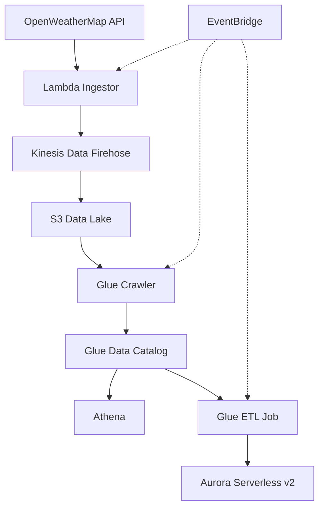
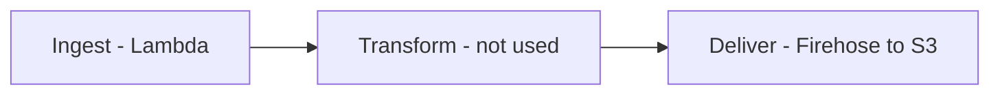

I wanted a working data engineering project to practise on, something that runs end to end rather than a single service in isolation. Weather data fits well. It is free to pull, it changes constantly, and a real pipeline has to handle it on a schedule without anyone watching.

This post builds a serverless pipeline that collects current weather data from cities around the world, lands it in an S3 data lake, catalogs it, and loads a cleaned version into a relational database for querying. Every part of it is serverless, so there is no instance running when the pipeline is idle and nothing to patch.

The build moves through three stages. Ingestion pulls data from the OpenWeatherMap API and streams it to S3. Cataloging makes the raw S3 data queryable with SQL. Transformation cleans the data and loads it into Aurora. EventBridge schedules the whole thing so it runs on its own.

<!--more-->

---

## Overview

The video below walks through the architecture before the build starts.


{: .text-center }
_Architecture overview_

The data flows in one direction. The OpenWeatherMap API is the source. Lambda fetches and shapes each record, Firehose partitions it and writes it to the S3 data lake, the Glue crawler catalogs it, Athena queries the raw lake directly, and the Glue ETL job loads a cleaned copy into Aurora Serverless v2. EventBridge schedules the Lambda function, the crawler, and the ETL job so the pipeline runs continuously with nothing to manage.



The pipeline produces two copies of the data. Raw JSON in S3 for flexible, low-cost exploration with Athena, and a cleaned relational copy in Aurora for structured queries and reporting.

The build uses the resource names below. Use the same names as you follow along and the steps line up exactly.

| Resource | Name |
|---|---|
| S3 data lake bucket | `weather-data-lake` |
| Firehose delivery stream | `weather-data-delivery-stream` |
| Lambda function | `WeatherDataIngestor` |
| Secrets Manager secret | `weather/openweather-api-key` |
| Glue database | `weather_db` |
| Glue crawler | `weather-data-crawler` |
| Glue table (created by crawler) | `weather_data` |
| Glue connection | `weather-aurora-connection` |
| Glue ETL job | `weather-s3-to-aurora-etl` |
| Aurora cluster | `weather-data-cluster` |
| Aurora initial database | `weatherdb` |

---

## OpenWeatherMap API

The pipeline needs a weather source before anything else can be built. Create a free account at [openweathermap.org/api](https://openweathermap.org/api){:target="_blank"}, then open **API Keys** and copy your key.

Test the key works by calling the current weather endpoint in a browser:

```text
https://api.openweathermap.org/data/2.5/weather?q=London&appid=<YOUR_OPENWEATHER_API_KEY>
```
{: .nolineno }

If JSON weather data appears, the key is active.

> A new API key can take up to a couple of hours to activate. If the test returns a `401` error, the key is valid but not yet live. Wait and try again rather than regenerating it.
{: .prompt-warning }

---

## Firehose Delivery Stream

> Kinesis Data Firehose is a managed streaming delivery service. It captures incoming records, buffers them, and writes them to a destination such as S3 with no servers to provision. In this pipeline it sits between the Lambda ingestor and the S3 data lake.
{: .prompt-info }

The ingestion side of the pipeline runs in three stages shown below, ingest, transform, and deliver. The Lambda function handles ingest, fetching from the API and shaping the data. The transform stage is optional in Firehose and would normally cover cleaning, reformatting, or aggregation. This pipeline does none of that in Firehose, because the Lambda function already produces records in the final JSON shape. The only job Firehose has here is the deliver stage, applying time-based partitioning and writing to S3.



That is a deliberate choice. You could split the work across two Lambda functions, one to ingest and one to transform, but that means managing two functions for no real benefit at this scale. One Lambda handles both, and Firehose stays focused on partitioning and delivery.

Open the **Amazon Data Firehose** console and create a delivery stream.

For **Source**, select **Direct PUT**. This configures the stream to receive records straight from a producer, which in this pipeline is the Lambda function. For **Destination**, select **Amazon S3**. Name the stream `weather-data-delivery-stream`.

Leave **Transform source records with AWS Lambda** turned off, the records are already in their final shape when they reach Firehose. Leave **Convert record format** off as well. The data stays as raw JSON rather than a columnar format like Parquet. Parquet improves analytics performance, but it adds conversion complexity that is not worth it for a pipeline of this size.

### Destination settings

For the **S3 bucket**, choose **Create** and make a new bucket named `weather-data-lake`.

Enable **New line delimiter**. This tells Firehose to insert a newline character between JSON records when it writes them to S3.

> A newline-delimited JSON file puts one complete record on each line. When Firehose groups several records into one file, the newline keeps them separate instead of running them together into one unreadable string. Most data tools, including the Glue crawler used later, expect this format.
{: .prompt-info }

Enable **Dynamic partitioning**. This is what creates the time-based folder structure in S3, paths like `year=2025/month=04/day=23/hour=11`. Without it, every file lands in one folder, which becomes slow to scan and expensive to query as the dataset grows. Partitioning lets Athena read only the folders that match a query instead of the whole bucket.

Enable **Inline parsing for JSON** so Firehose reads inside each record to find the values it partitions on.

Under **Dynamic partitioning keys**, define four keys. Each one uses a JQ expression to pull a time component out of the record's `event_timestamp` field. The Lambda function writes that field as a Unix epoch, which is what `strftime` reads here.

| Key name | JQ expression |
|---|---|
| `year` | `.event_timestamp \| strftime("%Y")` |
| `month` | `.event_timestamp \| strftime("%m")` |
| `day` | `.event_timestamp \| strftime("%d")` |
| `hour` | `.event_timestamp \| strftime("%H")` |

> JQ expressions are case-sensitive and the syntax has to be exact. A typo here does not error loudly, it sends records to the error prefix instead of the partitioned path.
{: .prompt-warning }

For the **S3 bucket prefix**, the goal is a Hive-compatible path. Enter the prefix so each partition key is preceded by a label:

```text
weather-data/year=!{partitionKeyFromQuery:year}/month=!{partitionKeyFromQuery:month}/day=!{partitionKeyFromQuery:day}/hour=!{partitionKeyFromQuery:hour}/
```
{: .nolineno }

The `weather-data/` part is a dedicated top-level folder. The `year=`, `month=`, `day=`, and `hour=` labels make the path self-documenting and, more importantly, produce a Hive-style partition layout that Athena and the Glue crawler recognise automatically.

For the **S3 bucket error output prefix**, enter `error/`. Set the **retry duration** to `60` seconds.

### Buffer settings

Buffer settings control how Firehose groups records before writing a file.

| Setting | Value | Effect |
|---|---|---|
| Buffer size | 5 MiB | Maximum data collected before a file is written |
| Buffer interval | 60 seconds | Maximum wait before a file is written |

These work as a whichever-comes-first pair. Firehose writes a file when it has collected 5 MiB or when 60 seconds have passed since the first record in the current buffer, whichever happens first. The weather records are small, so the 60-second interval is what triggers most writes. A short interval means test data shows up in S3 quickly.

For **compression**, select **GZIP**. This cuts S3 storage cost and speeds up retrieval. Leave the **File extension format** field empty so Firehose appends `.gz` automatically.

Under advanced settings, enable **CloudWatch error logging** to capture delivery failures. For **permissions**, accept the default option so Firehose creates an IAM role with write access to the bucket.

Create the stream. Once its status shows **Active**, it is ready to receive records.

---

## Lambda Ingestor

> AWS Lambda runs code without a server to provision or manage. It runs on a schedule and bills only for the compute time used. The alternative is an EC2 instance running continuously, billed around the clock and needing patching and scaling, even though this pipeline only does a few seconds of work every 15 minutes. Lambda is the correct fit here.
{: .prompt-info }

Open the **Lambda** console and create a function.

- **Author from scratch**
- **Function name**: `WeatherDataIngestor`
- **Runtime**: Python 3.12
- **Architecture**: keep the default
- **Permissions**: Create a new role with basic Lambda permissions

The default role only allows writing logs to CloudWatch. The function needs two more permissions, one to write to Firehose and one to read the API key from Secrets Manager. Those are added after the secret exists.

### Basic configuration

Open **Configuration**, then **General configuration**. Set the **timeout** to `30` seconds, which gives the function room to call the API and process the response. Set **memory** to `256` MB.

### Environment variables

Open **Configuration**, then **Environment variables**, and add the following. The secret value is added in the next section.

| Key | Value |
|---|---|
| `DELIVERY_STREAM_NAME` | `weather-data-delivery-stream` |
| `OPENWEATHER_API_KEY_SECRET_NAME` | `weather/openweather-api-key` |
| `DEFAULT_CITY` | `London` |

`DELIVERY_STREAM_NAME` tells the function which Firehose stream to write to. `OPENWEATHER_API_KEY_SECRET_NAME` points it at the secret holding the API key. `DEFAULT_CITY` is a fallback only. The function picks a random city from a built-in list on each run, and the fallback is used only if that list is somehow empty.

---

## Secrets Manager

> AWS Secrets Manager stores and manages credentials and API keys so they are not hardcoded into application code. Code retrieves the secret at runtime through an API call.
{: .prompt-info }

The API key should not sit in plaintext in the Lambda code or in an environment variable. Store it in Secrets Manager instead.

Open the **Secrets Manager** console and select **Store a new secret**.

- **Secret type**: Other type of secret
- Create one key-value pair, key `OPENWEATHER_API_KEY`, value your actual OpenWeatherMap API key
- **Secret name**: `weather/openweather-api-key`
- **Description**: API key for the OpenWeatherMap weather data ingestion pipeline

Complete the creation with the default settings.

The path-style name `weather/openweather-api-key` is intentional. It groups this secret under a `weather/` prefix, which keeps things tidy if the project gains more secrets later.

### Lambda permissions

The function now needs permission to read this secret and to write to Firehose. Open the function's execution role in the IAM console and attach an inline policy. Switch to **JSON** view and paste the following, replacing the Region and account ID with your own:

```json
{
  "Version": "2012-10-17",
  "Statement": [
    {
      "Effect": "Allow",
      "Action": "firehose:PutRecord",
      "Resource": "arn:aws:firehose:us-east-1:123456789012:deliverystream/weather-data-delivery-stream"
    },
    {
      "Effect": "Allow",
      "Action": "secretsmanager:GetSecretValue",
      "Resource": "arn:aws:secretsmanager:us-east-1:123456789012:secret:weather/openweather-api-key-*"
    }
  ]
}
```
{: .nolineno }

The trailing `-*` on the secret ARN matches the random suffix Secrets Manager appends to every secret. Name the policy `WeatherIngestorAccess` and create it.

---

## Lambda Function Code

The function reads the API key from Secrets Manager, picks a random city, calls the OpenWeatherMap API, converts the response into a flat JSON record, and sends that record to Firehose.

Open the **Code** tab, replace the sample code with the following, and deploy.

```python
import json
import os
import random
import time
import urllib.request

import boto3

firehose = boto3.client("firehose")
secrets = boto3.client("secretsmanager")

DELIVERY_STREAM = os.environ["DELIVERY_STREAM_NAME"]
SECRET_NAME = os.environ["OPENWEATHER_API_KEY_SECRET_NAME"]
DEFAULT_CITY = os.environ.get("DEFAULT_CITY", "London")

# Cities sampled at random on each run so the dataset
# covers multiple locations rather than one repeated city.
CITIES = [
    "London", "Tokyo", "New York", "Sydney", "Cairo",
    "Mumbai", "Reykjavik", "Nairobi", "Santiago", "Toronto",
    "Berlin", "Singapore", "Lima", "Oslo", "Istanbul",
]

API_URL = "https://api.openweathermap.org/data/2.5/weather"


def get_api_key():
    response = secrets.get_secret_value(SecretId=SECRET_NAME)
    secret = json.loads(response["SecretString"])
    return secret["OPENWEATHER_API_KEY"]


def fetch_weather(city, api_key):
    query = urllib.parse.urlencode({"q": city, "appid": api_key})
    with urllib.request.urlopen(f"{API_URL}?{query}", timeout=10) as response:
        return json.loads(response.read().decode("utf-8"))


def transform(raw):
    # OpenWeatherMap returns temperature in Kelvin. Convert to Celsius
    # and flatten the nested response into a single record.
    return {
        "city": raw.get("name"),
        "country": raw.get("sys", {}).get("country"),
        "temperature_celsius": round(raw["main"]["temp"] - 273.15, 2),
        "humidity_percent": raw["main"]["humidity"],
        "wind_speed": raw.get("wind", {}).get("speed"),
        "wind_direction_degrees": raw.get("wind", {}).get("deg"),
        "weather_condition": raw["weather"][0]["main"],
        "sunrise": raw.get("sys", {}).get("sunrise"),
        "sunset": raw.get("sys", {}).get("sunset"),
        "event_timestamp": int(time.time()),
    }


def lambda_handler(event, context):
    api_key = get_api_key()
    city = random.choice(CITIES) if CITIES else DEFAULT_CITY
    print(f"Fetching weather data for {city}")

    raw = fetch_weather(city, api_key)
    record = transform(raw)

    # Append a newline so each record sits on its own line in S3.
    response = firehose.put_record(
        DeliveryStreamName=DELIVERY_STREAM,
        Record={"Data": json.dumps(record) + "\n"},
    )

    print(f"Sent data to Firehose. RecordId: {response['RecordId']}")
    return {"statusCode": 200, "city": city, "record": record}
```
{: file="lambda_function.py" }

A few things worth pointing out. The `event_timestamp` field is written as a Unix epoch integer. That is what the Firehose JQ partitioning expressions read, so this field is not optional. The newline appended to the record in `put_record` is what the **New line delimiter** setting expects. The function reads the JSON key `OPENWEATHER_API_KEY` out of the secret, which has to match the key name set in Secrets Manager exactly.

> The transformed record includes `wind_direction_degrees` and `humidity_percent`. Both names matter later. The Glue ETL job drops the first and renames the second, so changing them here breaks the transformation step.
{: .prompt-warning }

### Testing the function

Open the **Test** tab, create a new event named `WeatherDataTest`, and keep the default JSON template. The function ignores the event payload, it uses the random city list, so an empty template is fine.

Run the test. The logs should show the function retrieving the key, fetching weather, and sending to Firehose:

```text
[INFO] Fetching weather data for Tokyo
[INFO] Sent data to Firehose. RecordId: ee4yy1NRYM7i/0sg0J2XB6+/...
```
{: .nolineno }

A `RecordId` in the response confirms Firehose accepted the record.

Wait about a minute for the buffer interval to pass, then open the `weather-data-lake` bucket. A file should appear under a path like `weather-data/year=2025/month=04/day=23/hour=11/`. Download it and open it in a text editor. Because the file is GZIP compressed, decompress it first. Inside is the flattened weather record, one JSON object with the city, temperature in Celsius, humidity, wind speed, and sunrise and sunset times.

The Lambda function and Firehose stream together form the ingestion stage. The pipeline now collects weather data and lands it in S3 on demand.

---

## Glue Crawler

The data is in S3, but nothing yet knows its structure. The next stage catalogs it.

> A Glue crawler scans files in S3 and infers their schema, the field names, data types, and partition keys. It writes that schema into the Glue Data Catalog, a central metadata store. The crawler does not move or copy data, it only records what the data looks like and where it is.
{: .prompt-info }

For this dataset the crawler reads a sample of the JSON records and works out fields like `city` as a string and `temperature_celsius` as a double, along with the four partition keys, `year`, `month`, `day`, and `hour`, from the folder structure.

First create a database to hold the catalog table. In the **Glue** console, open **Databases** and create one named `weather_db`. A Glue database is a container for tables, not a running database engine.

Now create the crawler.

- **Crawler name**: `weather-data-crawler`
- **Data source**: keep the default S3 option, browse to the `weather-data-lake` bucket, and select the `weather-data/` folder
- Choose **Crawl new sub-folders only** so future runs pick up new partitions without reprocessing everything
- **IAM role**: select **Create an IAM role**. Glue generates a role with permission to read the S3 data and write to the Data Catalog. Assign it.
- **Target database**: `weather_db`
- **Crawler schedule**: **On demand** for now. EventBridge takes over scheduling later.

Save and run the crawler. When it finishes, open the **Tables** section. There should be one table named `weather_data` pointing at the bucket and classified as JSON. The crawler will have detected the weather fields and recognised the four partition keys.

---

## Querying Weather Data With Amazon Athena

> Amazon Athena is a serverless query service that runs SQL directly against data in S3. It uses the Glue Data Catalog to understand the structure of the files. Athena reads the raw S3 files, the catalog only tells it how to interpret them.
{: .prompt-info }

This split is worth being clear about. The Glue Data Catalog holds the schema. Athena reads the actual files that stay in S3. Nothing is copied into Athena.

Open the **Athena** console. Before running a query, set a query result location. Open **Settings**, **Manage**, and specify an S3 path for results. The `weather-data-lake` bucket works, put results under a separate prefix such as `athena-results/`.

Back in the editor, select `weather_db` from the database dropdown. The `weather_data` table created by the crawler should be listed.

Check the partitioning first:

```sql
SHOW PARTITIONS weather_data;
```
{: .nolineno }

This lists every `year`, `month`, `day`, and `hour` partition, confirming the time-based layout is working.

Then preview the data:

```sql
SELECT * FROM weather_data LIMIT 10;
```
{: .nolineno }

This returns weather records with the fields the crawler identified.

Querying the lake directly with Athena is useful in its own right. You pay only for the queries you run, with no database server kept alive between them, and the partition scheme means a query filtered to a specific time range scans only the matching folders instead of the whole bucket. For this pipeline, Athena is the quick way to confirm the S3 data lake holds correct data before the ETL job loads it into Aurora.

---

## Aurora Database

> Amazon Aurora Serverless v2 is a managed relational database that scales compute and memory automatically based on load. There is no instance class to size and nothing running at full capacity when the pipeline is idle.
{: .prompt-info }

Aurora is the final destination for the cleaned data. With the data structured in a relational database, you can run standard SQL queries and reporting against it.

A note on the choice. A provisioned instance class such as `db.t3.medium` runs and bills continuously regardless of load. This pipeline ingests a handful of small records every 15 minutes, so a continuously running provisioned instance would sit near idle while still costing money. Serverless v2 scales down when there is nothing to do, which matches a bursty, scheduled workload like this one. That is why the build uses Serverless v2.

Open the **RDS** console and create a database.

- **Standard create**
- **Engine type**: Amazon Aurora (MySQL-Compatible Edition), keep the default version
- **Template**: Dev/Test
- **DB cluster identifier**: `weather-data-cluster`
- **Master username**: `admin`
- **Master password**: set a strong password and store it somewhere safe

> Set a real password and do not commit it anywhere. The proper pattern is to let RDS manage the credentials in Secrets Manager, the same way the API key is handled earlier in this build. Setting the password manually here keeps the walkthrough short, but managed credentials are the better practice for anything beyond a test build.
{: .prompt-warning }

For **Instance configuration**, select **Serverless v2**. Set a capacity range with a low minimum, for example 0.5 ACU minimum and 2 ACU maximum. The pipeline never needs much, and a low minimum keeps the idle cost down.

For **Availability and durability**, select **Don't create an Aurora Replica**. A production cluster would run at least one replica for high availability. This build does not need it.

For **Connectivity**, keep the default VPC. Set **Public access** to **Yes** so the database can be reached for testing. A production database would normally not be publicly accessible.

For the **VPC security group**, create a new one named `weather-data-db-sg`.

Under **Additional configuration**, leave the **Database port** at the MySQL default of `3306`. Set the **initial database name** to `weatherdb`. This is the database the weather table is created in.

Leave the remaining options at their defaults and select **Create database**.

---

## Glue ETL

While Aurora provisions, set up the Glue ETL job that moves data from S3 into Aurora. The job reads the cataloged data, applies a schema change, and writes the result into Aurora over a JDBC connection.

### Setting up the Glue connection to Aurora

Glue needs a defined connection before it can reach Aurora.

In the **Glue** console, open **Connections** and create a connection.

- **Connection type**: Aurora (MySQL)
- Select the `weather-data-cluster` database instance from the dropdown. The database name auto-populates.
- For credentials, select **AWS Secrets Manager** and choose the secret created automatically when the Aurora cluster was set up.

The **Network options** section auto-fills the VPC, subnet, and security group to match the Aurora cluster, which keeps the connection inside the same network.

Name the connection `weather-aurora-connection` and create it. Then test it, selecting the Glue IAM role from earlier.

### Testing the connection and the VPC error

The connection test fails:

```text
InvalidInputException: VPC S3 endpoint validation failed for SubnetId: subnet-01de289a514679b6d.
VPC: vpc-02ccacabbb9de2105. Reason: Could not find S3 endpoint or NAT gateway for
subnetId: subnet-01de289a514679b6d in VPC vpc-02ccacabbb9de2105.
```
{: .nolineno }

This is worth understanding rather than working around. Glue runs its jobs inside a VPC, and from inside that VPC it needs a network path to reach S3 and Secrets Manager. Even with the default VPC and public subnets that have an internet gateway, Glue does not use that route. It requires a private path to AWS services. The fix is to create VPC endpoints for S3 and Secrets Manager so Glue can reach both entirely inside the AWS network.

### VPC endpoints

> A VPC endpoint is a private connection between a VPC and an AWS service. Traffic to the service stays on the AWS network instead of going out over the public internet.
{: .prompt-info }

Open the **VPC** console and create the endpoints.

For S3, keep **AWS services** as the category, search for S3, and select the **S3 Gateway** endpoint. Choose a Gateway endpoint rather than Interface, Gateway endpoints exist specifically for S3 and DynamoDB, they have no hourly or data charge, and they do not consume a subnet. Select the default VPC and its route tables, and leave the policy at Full Access.

Repeat for Secrets Manager. Secrets Manager has no Gateway endpoint, so this one is an Interface endpoint.

> An Interface endpoint is not free. It bills per hour plus a data processing charge, typically in the region of 10 to 15 USD per month. The S3 Gateway endpoint has no such charge. This is a real cost of running Glue inside a VPC, not an optional extra.
{: .prompt-warning }

For the Secrets Manager endpoint, select the same subnet the Aurora cluster uses. If you do not pick a security group, it uses the default VPC security group. Check that the security group allows inbound HTTPS, or the endpoint cannot serve requests.

With both endpoints created, return to the Glue console and test the connection again. It now succeeds. This networking step is easy to miss and the build does not work without it.

### Visual ETL

In the **Glue** console, create a new job in the **Visual ETL** editor. The visual editor builds a data flow by connecting nodes, a source node for where data comes from, transform nodes for changes to the data, and a target node for where it goes. Data flows left to right.

Name the job `weather-s3-to-aurora-etl`.

### Source

For the source node, select **AWS Glue Data Catalog**. Using the catalog rather than pointing straight at the raw S3 files means the job works with the schema the crawler already mapped.

Select the node and set its properties. For **Database** choose `weather_db`, for **Table** choose `weather_data`.

The preview section at the bottom verifies the data before the job runs. Select the Glue role and wait for it to load. It should show the weather fields, and the output schema confirms Glue read the column types correctly.

### Applying the transformation

Add a node from the **Transform** section and select **Change Schema**. Connect it to the Data Catalog source node.

This step is deliberately small. It does two things, it drops the `wind_direction_degrees` column, which the Lambda function collects but this analysis does not need, and it renames `humidity_percent` to `relative_humidity` for a clearer column name.

That is the whole transformation. It is not data cleaning in any real sense, no type casting, no deduplication, no null handling. A column drop and a rename. It is here to show where transformation logic sits in the pipeline. A production build would do considerably more at this stage, and this is the node where that work would go.

### Configuring the target

Add a target node under the Change Schema node and select **MySQL**.

The visual MySQL target has a real limitation. It writes table metadata to the catalog but does not move actual rows into Aurora. It creates the table structure and leaves it empty. The visual editor does not fully support direct writes to an external database, so the target node alone does not finish the job.

The fix is script mode. Even if direct writes were supported, script mode is worth using here, it gives full control over the connection, error handling, and write behaviour, which is what a production pipeline needs.

### Switching to script mode

Open the **Script** tab and confirm the switch when warned that it is permanent.

In the generated code, find the block commented as the MySQL node. Delete that block and replace it with the JDBC write code below. The JDBC writer opens a direct connection to Aurora and writes the data in, with no intermediate step.

```python
# --- Replace the generated MySQL node block with this ---

# Convert the transformed DynamicFrame to a Spark DataFrame.
# Replace `ChangeSchema_node` with the variable name of your
# Change Schema node from the generated script.
weather_df = ChangeSchema_node.toDF()

# Pull the Aurora credentials from Secrets Manager.
import json
import boto3

secrets = boto3.client("secretsmanager", region_name="us-east-1")
secret_value = secrets.get_secret_value(SecretId="weather-data-cluster-secret")
creds = json.loads(secret_value["SecretString"])

jdbc_url = (
    f"jdbc:mysql://{creds['host']}:{creds['port']}/weatherdb"
)

# Write the transformed data into the Aurora weather_data table.
(
    weather_df.write.format("jdbc")
    .option("url", jdbc_url)
    .option("dbtable", "weather_data")
    .option("user", creds["username"])
    .option("password", creds["password"])
    .option("driver", "com.mysql.cj.jdbc.Driver")
    .mode("append")
    .save()
)

job.commit()
```
{: file="weather_s3_to_aurora_etl.py" }

> Replace `ChangeSchema_node` with the actual variable name of your Change Schema node in the generated script. The name varies between jobs. The secret ID `weather-data-cluster-secret` should match the secret RDS created for the cluster, check its exact name in the Secrets Manager console.
{: .prompt-warning }

The `mode("append")` setting adds new rows on each run rather than overwriting, so the table grows as the pipeline runs.

### Configure job details

Open the **Job details** tab.

- **IAM role**: the Glue role used throughout
- **Requested number of workers**: `2`. This controls how many parallel processing units the job uses. More workers process faster but cost more, and this dataset is small.
- **Job timeout**: `3` minutes. If the job runs longer it is terminated, which prevents a stuck job billing indefinitely.

Under **Advanced properties**, find the **Connections** section, select the refresh button, and choose `weather-aurora-connection`. Without this, Glue has no network path to Aurora through the VPC.

Save the job and select **Run**. On the **Runs** tab the job status moves to **Running**. Glue reads from S3, applies the Change Schema transform, and writes the result into Aurora over the JDBC connection.

---

## Querying Transformed Data in Aurora

With the ETL job finished, verify the result in the Aurora Query Editor. The Query Editor runs SQL against the cluster directly from the console with no connection setup.

Open the **RDS** console, select the `weather-data-cluster`, and open the **Query Editor**. Connect using the Secrets Manager secret for the cluster, providing the secret ARN for authentication.

Select the database:

```sql
USE weatherdb;
```
{: .nolineno }

List the tables:

```sql
SHOW TABLES;
```
{: .nolineno }

The `weather_data` table should be listed, confirming the ETL job created it.

Read the data:

```sql
SELECT * FROM weather_data;
```
{: .nolineno }

The result shows the weather records with the transformation applied. The humidity column is named `relative_humidity`, not `humidity_percent`, and the `wind_direction_degrees` column is gone, exactly as the Change Schema step defined.

At first there is one record, because the pipeline has only been triggered once by hand. That is expected. The next step automates the pipeline so the dataset builds up on its own.

---

## Automating the Pipeline With EventBridge

> Amazon EventBridge can run AWS services on a schedule. An EventBridge rule with a schedule expression triggers a target at a fixed interval with nothing for you to run manually.
{: .prompt-info }

So far every stage has been triggered by hand. EventBridge schedules them so the pipeline runs continuously.

The three components run at different intervals. The Lambda ingestor runs every 15 minutes, which keeps fresh weather data flowing in. The Glue crawler and the Glue ETL job run hourly, which is often enough to catalog the new partitions and load them into Aurora.

| Component | Schedule | Job |
|---|---|---|
| `WeatherDataIngestor` Lambda | Every 15 minutes | Fetch weather data and send to Firehose |
| `weather-data-crawler` Glue crawler | Hourly | Catalog new S3 partitions |
| `weather-s3-to-aurora-etl` Glue job | Hourly | Transform and load into Aurora |

For the Lambda schedule, open the **EventBridge** console, create a rule with a schedule, set a fixed rate of 15 minutes, and select the `WeatherDataIngestor` function as the target.

For the crawler and the ETL job, Glue has its own scheduling under **Triggers**. Create a scheduled trigger for the crawler set to run hourly, and a second scheduled trigger for the ETL job, also hourly. Set the ETL trigger a little after the crawler so the catalog is updated before the job reads it.

With the schedules in place the pipeline runs on its own. The Lambda function picks a random city every 15 minutes and sends its weather to Firehose, which writes to S3 under the time-partitioned path. The crawler picks up new partitions each hour, and the ETL job transforms and loads the new records into Aurora.

Left running, the Aurora table fills with hourly weather records from cities around the world, a dataset that grows continuously with no manual involvement.

---

## Cleanup

Delete the resources when finished so they stop billing. Order matters for the dependent ones.

| Service | Action |
|---|---|
| Aurora | Delete the instance first, then the cluster |
| Glue | Delete the ETL job and crawler, delete the `weather_db` database, which removes the table, then delete the scheduled triggers |
| EventBridge | Delete the rule that triggers the Lambda function |
| Lambda | Delete the `WeatherDataIngestor` function |
| Secrets Manager | Delete the OpenWeatherMap API key secret. The Aurora cluster secret is removed with the cluster. |
| Firehose | Delete the `weather-data-delivery-stream` delivery stream |
| S3 | Empty and delete the `weather-data-lake` bucket if the data is no longer needed |
| VPC endpoints | Delete the S3 Gateway and Secrets Manager Interface endpoints |
| IAM and security groups | Delete the roles and the `weather-data-db-sg` security group created for this build |

The Secrets Manager Interface endpoint is the one to be sure about. It bills per hour whether or not anything uses it, so leaving it running is a slow, quiet cost.

---

## Summary

This pipeline ingests weather data, lands it in a partitioned S3 data lake, catalogs it for SQL access, and loads a cleaned copy into Aurora, with EventBridge running every stage on a schedule. Lambda handles ingestion and transformation, Firehose handles partitioning and delivery, Glue handles cataloging and the load into Aurora, and Athena gives direct SQL access to the raw lake along the way.

Two parts of the build are worth carrying forward. The VPC endpoint requirement is easy to miss, Glue inside a VPC needs private paths to S3 and Secrets Manager, and the connection test fails clearly until they exist. And the Glue transformation here is intentionally thin, a column drop and a rename, which is the node where real cleaning logic would go in a production pipeline.
