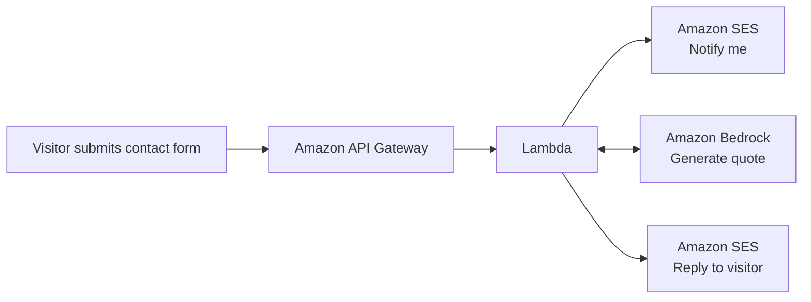
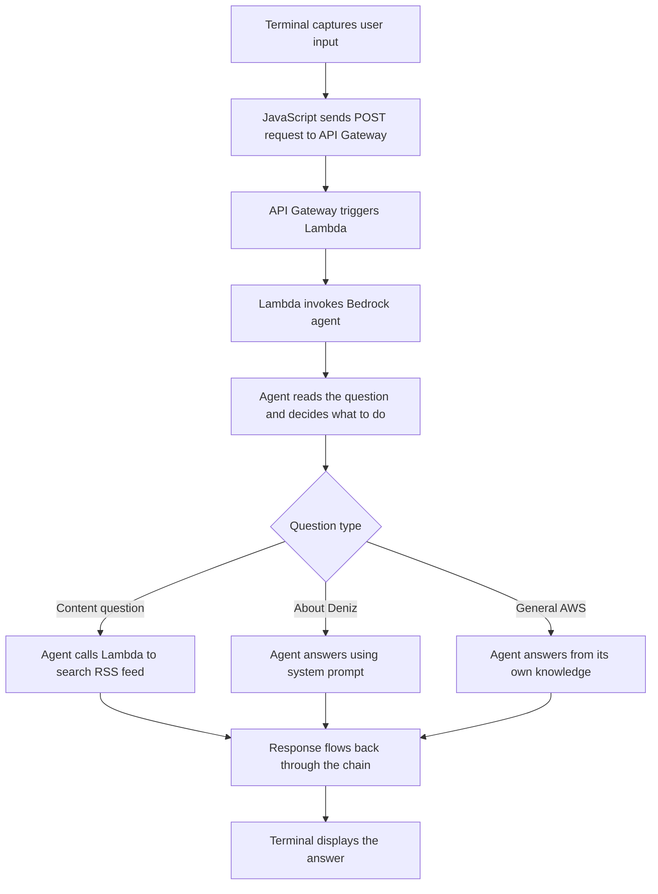
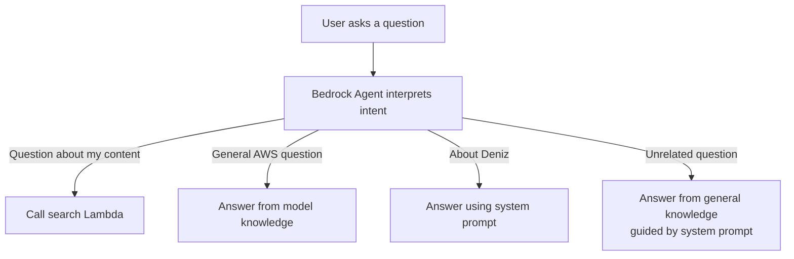
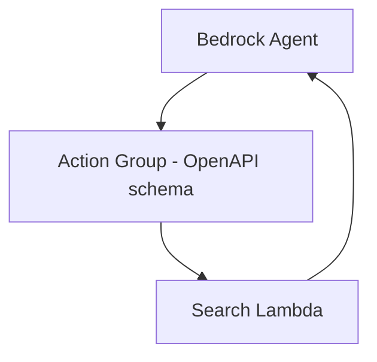

Try the agent at [digitalden.cloud](https://digitalden.cloud){:target="_blank"}

<!--more-->

## Chapter 1: The Starting Point — Creating AI Content

I had been creating lessons on Bedrock agents, and the demos were deliberately simple because I was trying to teach the mechanics. How to structure a Lambda function for Bedrock. How to define an OpenAPI schema. How to read a trace.

After building a few demos, I realised agents were not just something to teach. I wanted to build one for myself.

This is the story of how that idea turned into a real agent running on my website.

---

## Chapter 2: The Idea

What would an agent on my website actually do? How could I make it practical, something interesting and genuinely useful?

### My First Bedrock Integration: The Contact Form

[](https://docs.digitalden.cloud/posts/build-serverless-contact-forms-with-generative-ai/){:target="_blank"}
{: .w-50 .left }

This was not the first time I had thought about integrating AI into my website. Last year, when I was building a contact form for my static site, I used the typical serverless pattern: API Gateway, Lambda, and SES. However, I wanted to incorporate generative AI, so I added a Bedrock invocation to my Lambda function.

The contact form works like this. When someone submits a message, the Lambda sends me a notification email with their details. In addition, it also calls Bedrock to generate a unique inspirational quote, then sends a response email back to the visitor with that quote. The email says "this quote was uniquely generated by AI (Amazon Bedrock) just for you." It was a small touch, but it demonstrated a real use of generative AI.


That contact form was my first integration of Bedrock into my website. In spite of that, it was one-way. Visitors submit a form, I reply via email. There was no conversation, no interaction.

> 
Having built the agent for the lesson, I started thinking. What if visitors could actually have a conversation? What would an agent on my website do?
{: .prompt-tip }

---

## Chapter 3: Brainstorming — What Would the Agent Actually Do?

I brainstormed with Claude, and the first suggestions were things like a content assistant that generates LinkedIn posts, a course planning agent, a cost reporter, a documentation helper, a coffee recommender based on your mood, a photography location scout. None of them felt right. They didn't feel original, and more importantly I would not actually use any of that.

Claude suggested maybe the work demo was enough. Just document it as a blog post, but that demo was for work. I wanted something different for myself. Something more advanced.
Then came a better idea: what if the agent bridged all of my sites? I have:

- [digitalden.cloud](https://digitalden.cloud){:target="_blank"} — main homepage where visitors can learn about me, contact me, and now interact with my agent  
- [docs.digitalden.cloud](https://docs.digitalden.cloud){:target="_blank"} — where I document my AWS work and the solutions I build  
- [gallery.digitalden.cloud](https://gallery.digitalden.cloud){:target="_blank"} — photography gallery showcasing photos I take with my Sony A6700  
- [notes.digitalden.cloud](https://notes.digitalden.cloud){:target="_blank"} — notes blog where I write about things I do

Now, these sites are separate. What if the agent was the connection between them? A visitor asks a question, and the agent figures out which site has the answer. I liked that. However where would it live? How would people access it?


The answer was a dedicated section on my main homepage. Not a floating chat widget, just a section visitors can open to interact with the agent. My site already uses a modal popup pattern, so this would fit naturally. Next question. Where would the data come from?

### Choosing a Data Source

| Option | Description |
|------|-------------|
| Hardcoded in Lambda | Data stored directly in the function |
| JSON file in S3 | Data loaded from a JSON file in S3 |
| DynamoDB table | Data stored in DynamoDB |
| Scrape sites at runtime | Content scraped from websites on demand |
| Knowledge base with RAG | Knowledge base using retrieval augmented generation |

I was not feeling any of these. Hardcoded meant updating the Lambda every time I published something. JSON in S3 meant maintaining another file. DynamoDB was too much. Knowledge base added complexity I did not need yet. There had to be a better way.

Then I remembered seeing an RSS feed button on my website. I had never really understood what it was for, but I had a feeling.

### Jekyll Chirpy has an RSS feed

All my sites are built with Jekyll, a static site generator that turns markdown files into websites. I use the Chirpy theme, which is designed for documentation and blogging. It has a clean layout, dark mode, categories, tags, and importantly, it automatically generates an RSS feed. That feed contains all my posts with titles, summaries, URLs, and dates. It updates every time I build and deploy my site.

The answer was clear. The Lambda could fetch the RSS feed, parse it, and search the content. No hardcoding. No manual updates. When I publish a new post, it is automatically available to the agent:

```python
# Fetch and search the RSS feed
with urllib.request.urlopen("https://docs.digitalden.cloud/feed.xml") as response:
    feed_data = response.read().decode("utf-8")

root = ET.fromstring(feed_data)

for entry in root.findall("{http://www.w3.org/2005/Atom}entry"):
    title = entry.find("{http://www.w3.org/2005/Atom}title").text.lower()
    summary = entry.find("{http://www.w3.org/2005/Atom}summary").text.lower()

    if topic in title or topic in summary:
        matching_posts.append(title)
```
{: file="lambda/search_docs.py" }

However, when I checked my RSS feed, something was wrong. It only showed 5 posts, even though I had 35 published. After some troubleshooting, I found two issues:
- My posts were organised into year-based subfolders, which Jekyll was not picking up
- My feed template had a hard-coded limit of 5 posts

I flattened the post structure, updated the config, and rebuilt the site. After committing and pushing the changes to GitHub, the feed included every post and would automatically include future ones. Ready for the agent.

---

## Chapter 4: The UI Decision — Terminal Style

I knew what the agent would do, yet I needed a way for people to interact with it. What would the UI be?

- Chat page on my website
- Slack bot
- WhatsApp or Telegram bot
- Alexa skill
- CLI tool
- No UI, just a blog post

I liked the idea of a CLI tool, though that would only run on my machine. Blog readers could see screenshots, however random visitors to my website could not use it. What was my main goal? Public showcase? Definitely. I wanted visitors to actually try it. So no matter what I decided to build, I needed a cool web UI.

Then I thought, I could create a terminal-themed web UI. A terminal-style interface in the browser. It looks like a command line but runs on my website. Anyone can use it, no setup needed. I liked that idea:

- [x] Matches the “cloud engineer” vibe  
- [x] Different from typical chatbot UIs  
- [x] Simple to build with just HTML, CSS, and JavaScript  
- [x] Memorable. People remember “the guy with the terminal agent”


{: .w-50 .left }

I looked at libraries like xterm.js and jQuery Terminal, which are feature rich and well-built, but they also introduce additional complexity that I didn't really need. 

At its core, the interaction was simple: capture user input, send it to an API Gateway endpoint, receive a response, and render it back to the screen. A full terminal emulator would not change that flow.

Instead, i decided on a terminal-style UI for my agent.

{: .clearfix }

## Chapter 5: Designing the Architecture

In this chapter, I step back and look at how everything connects. I examine the system from three angles: 
1. The request flow
2. The architecture
3. The agent’s decision-making

Each view explains a different aspect of how the agent works, from how requests move through AWS services, to how responsibilities are structured, to how the agent decides how to respond.

### The Request Flow

A visitor lands on digitalden.cloud, clicks Agent in the navigation, and sees a terminal interface. They type a question like "What content do you have on Bedrock?" and hit enter. What happens next?



From the user’s perspective, it all feels like a simple conversation. Behind the scenes, the agent is orchestrating multiple services, deciding when to search content and when to respond directly. That ability to decide how to respond is what makes it an agent.

Now, the flow above shows how the agent decides what to do. The diagram below shows where those decisions actually run.

### The Architecture


*Figure: Agent interaction architecture showing the request and response flow.*

This diagram shows the end-to-end architecture of the agent interaction.

A request starts in the terminal-style UI, where a visitor submits a message. The browser sends a POST request to an API Gateway endpoint, which triggers a Lambda function acting as the agent invoker.

That Lambda forwards the request to a Bedrock agent. The agent interprets the question and decides how to respond. If the question is about published content, it calls a separate Lambda function configured as an action group tool. That function fetches and searches an RSS feed and returns matching results to the agent.

Once the agent has everything it needs, the response flows back through the same path and is rendered in the terminal UI.


#### Two Lambdas, Two Purposes

The design uses two Lambda functions, each with a clear and separate responsibility.

1. The first function, `agent-invoker`, sits at the boundary between the website and the agent. It is invoked by API Gateway, receives the visitor’s question, and forwards the request to the Bedrock agent. Its role is purely orchestration.

2. The second function, `agent-search-docs`, is not exposed to the website at all. It exists as a tool the agent can choose to use. When the agent decides it needs to search my published content, it invokes this function, which fetches the RSS feed, searches for relevant posts, and returns the results.

### Agent Decision-Making

Now, the Bedrock agent sits in the middle, making decisions, and this is what separates an agent from a simple chatbot.



When the agent receives a question, it first determines the intent. Questions about my published content trigger a search of my RSS feed, and the agent then presents the results in a user-friendly way. Questions about AWS or about me are answered directly, without invoking additional tools. Even unrelated questions can be answered, since the agent is powered by Claude. In those cases, the system prompt guides the response back toward AWS topics and my content.

>
The agent orchestrates. It decides which tool to use, or whether to use a tool at all. That decision-making is the core of what makes it an agent.
{: .prompt-tip }

---

## Chapter 6: Building the Frontend
I started with the frontend. The interface defines the interaction, and once that was clear, the rest of the system could follow.

### The Terminal UI

I needed three files:

- `terminal.css` for the styling
- `terminal.js` for the logic
- Updates to `index.html` to add the Agent section

### The Styling

The goal was a macOS-style terminal window. Dark background, monospace font, and those iconic red, yellow, green buttons in the header. The terminal body has a dark background with light text. System messages appear in grey, user input in white, and the prompt in green.

One challenge was that my site’s main stylesheet applied default styles to all input fields. The terminal input looked wrong, with a visible border and background. Fixing this required overriding those defaults so the input blended into the terminal. Not elegant, but necessary when working with an existing template.

### Wiring the Interaction

The JavaScript handles capturing user input, sending requests to the API, displaying responses, session management for multi-turn conversations, and built-in commands like `help` and `clear`.

A session ID is also generated when the page loads, which allows the agent to remember context within a conversation:

>
A session ID is generated when the page loads. This is passed to Bedrock with every request. The agent uses it to maintain conversation history, so follow-up questions like "tell me more about the first one" make sense.
{: .prompt-tip }

### Integrating Into the Site

I added a new Agent section to the site. Since the site already uses a modal popup pattern, clicking “Agent” in the navigation opens the terminal interface. The welcome message uses ASCII art for a bit of personality:

```
    ____  _____ _   _ ___ _____
   |  _ \| ____| \ | |_ _|__  /
   | | | |  _| |  \| || |  / / 
   | |_| | |___| |\  || | / /_ 
   |____/|_____|_| \_|___/____|

   agent v1.0 | Powered by Amazon Bedrock
```

Below the terminal, I added suggested questions to help visitors get started: 
- "Who is Deniz?"
- "What content do you have on Bedrock?"
- "What is a Bedrock Agent?"

### Testing Locally

I ran the site locally to test the UI before connecting the backend. The terminal looked right. The input worked. The styling matched my site. Ready for the backend.

---

## Chapter 7: Building the Backend

The backend was where the architecture turned into real AWS resources. It is made up of a small number of components, each with a clearly defined role. Rather than building one large Lambda to do everything, I split responsibilities so the agent could invoke tools only when it needed to.

### Searching Published Content

One Lambda exists purely to search my published content. This function is not called by the website directly. Instead, it is invoked by the Bedrock agent when the agent decides it needs to look something up.


{: .w-25 .left }

The function fetches my RSS feed, parses it, and searches for matching posts. The search logic is deliberately simple. The topic is split into words, and a post is considered a match only if all of those words appear somewhere in the title, summary, or tags. This means a query like “cost optimization” will match posts containing both “cost” and “optimization,” even if they are not adjacent. 

I used Python’s built-in libraries to fetch and parse the feed. There are no external dependencies, which keeps the Lambda lightweight and easy to maintain.

{: .clearfix }

### Invoking the Agent

The second Lambda acts as the entry point to the system. This is the function API Gateway calls when the frontend sends a request.

Its job is orchestration, not decision-making. It parses the incoming request, extracts the message and session ID, invokes the Bedrock agent, and returns the response back to the browser. It also includes the necessary CORS headers so the frontend can call the API without issues.

This function does not contain any business logic. All decisions are delegated to the agent itself.

### Configuring the Bedrock Agent

In the Bedrock console, I created the agent, selected Claude 3 Sonnet as the underlying model, and defined a system prompt that explains who the agent represents and how it should behave.

The system prompt is where the agent’s behaviour is shaped. It tells the agent when to search my published content, when to answer directly from its own knowledge, and how to respond to questions about me. More importantly, it removes ambiguity. The agent is not left to guess whether it should use a tool. The rules are explicit.

At a high level, the prompt establishes three core behaviours:
- Content questions must trigger a search of my documentation before answering
- General AWS questions can be answered directly from model knowledge
- Personal questions about me should use the provided context

Here is a simplified excerpt from the system prompt that enforces those rules:

```
You are a helpful assistant on Deniz Yilmaz's website, digitalden.cloud.

RULE:
If a user asks about Deniz's content, posts, tutorials, courses, lessons, guides,
or uses phrases like "do you have", "what do you have", "show me", or "search for",
you MUST use the SearchDocumentation tool first. Never assume what content exists.

When returning search results, always include:
- The post title
- A brief summary
- A clickable URL

When someone asks "Who is Deniz?":
Deniz Yilmaz is an AWS Community Builder with 7 AWS certifications who creates
practical AWS training content at QA and digitalden.cloud.

When visitors ask general AWS questions (for example, "What is Lambda?"):
Answer directly using your knowledge.

Be concise, friendly, and helpful.
```
{: file="system-prompt.txt" }

### Action Groups

An action group defines what tools a Bedrock agent can use and how to call them. It acts as a contract between the agent and a Lambda function, using an OpenAPI schema to describe available operations and parameters.

In this setup, I created an action group that connects the agent to a Lambda responsible for searching my published content. When the agent decides it needs to look something up, it invokes this action group. Bedrock handles the invocation and returns the results to the agent, which then incorporates them into the final response.



### IAM Permissions

There are two different permission patterns.

| Component      | Permission Type              | Why                                                                                                       |
| -------------- | ---------------------------- | --------------------------------------------------------------------------------------------------------- |
| Search Lambda  | Resource-based policy        | Allows the Bedrock agent to invoke the function directly, since the call originates from the agent itself |
| Invoker Lambda | IAM policy on execution role | Allows the function to call the Bedrock agent, acting as the bridge between the website and Bedrock       |


Keeping these permissions separate reinforces the boundary between public entry points and internal agent tools.

### API Gateway

Finally, I set up API Gateway with a single POST endpoint. It uses Lambda proxy integration so the full request is passed through to the invoker Lambda without transformation.

I enabled CORS to allow requests from my website. Once deployed, the endpoint was ready to connect to the frontend.

The backend was now complete. The frontend had something real to talk to, and the agent had everything it needed to reason, search, and respond.

---

## Chapter 8: Testing and Debugging

Time to test.

### Testing the Lambda Directly

Before testing the full flow, I tested the search Lambda in isolation using the Lambda console. I created a test event simulating what the Bedrock agent would send. The function fetched my RSS feed, found matching posts, and returned them. That confirmed the search logic itself was sound.

### Testing the API Gateway Endpoint

Next, I tested the full chain from API Gateway to the agent using curl from my terminal. The first request failed with “No message provided”.

With Lambda proxy integration, the request body arrives as a string, not a parsed object. I updated the code to handle this properly and tested again.

That surfaced a second issue: “Failed to get response from agent”. The logs showed the Bedrock client was defaulting to a different region than the agent. Explicitly setting the region resolved it.

### Testing from the Website

The final step was testing from the browser. The terminal UI loaded, but the request failed immediately. The browser console showed CORS errors.

Although CORS was enabled in API Gateway, Lambda proxy integration requires the headers to be returned from the Lambda itself. I also discovered proxy integration was not enabled on the POST method. After enabling it, redeploying, and testing again, the request succeeded.

### Using the Trace

The Bedrock trace shows how the agent reasons about each request. In the console, it exposes the agent’s rationale, which actions it chose to call, the results it received, and how the final response was formed. When behaviour wasn’t what I expected, the trace showed exactly where the decision path changed.

**Trace – agent reasoning**

> The search did not return any results related to “Bedrock Agent”, so I will try to answer this question based on my own knowledge about AWS services and Bedrock.

This trace explains why an incorrect answer appeared. When I asked “What is a Bedrock Agent?”, the agent correctly detected a content-related query and attempted to search my documentation. That search returned no results, so the agent fell back to its own knowledge to answer the question.

The issue wasn’t the request flow or the tooling. It was the model’s knowledge. I was using Claude 3 Sonnet from early 2024, when Amazon Bedrock Agents were still new, so the fallback answer was outdated.

Seeing this reasoning made the next steps clear. The behaviour could be guided by refining the system prompt or improved by moving to a newer model with more up-to-date knowledge.

>
A hallucination is when a model confidently produces an incorrect answer that appears plausible but is not grounded in the correct facts.
{: .prompt-tip }

### Final Test

Finally, I ran through the test cases:

| Question | Expected Behaviour | Result |
|----------|-------------------|--------|
| What content do you have on Bedrock? | Search RSS, return posts | ✓ |
| What is a Bedrock Agent? | Answer from model knowledge | ✓ |
| Who is Deniz? | Answer from system prompt | ✓ |
| Do you have posts about serverless? | Search RSS, return posts | ✓ |
| What is the capital of Turkey? | Answer from model knowledge | ✓ |

Everything worked. Ready to deploy.

---

## Chapter 9: Deployment and Launch

Everything worked locally. Time to go live.

### Updating the Frontend

I updated the JavaScript with the actual API Gateway endpoint and added a few suggested questions to help visitors get started.


{: .w-50 .left }

I ran through the same questions one last time after deploying. The behaviour matched what I had tested locally. Now, time to ship it.

### Committing and Pushing

My site is hosted on GitHub Pages. I committed the changes and pushed. GitHub Actions built and deployed the site. A few minutes later, the agent was live at digitalden.cloud.

### First Live Test

I opened the site on my phone to test it as a real visitor would. Clicked Agent in the navigation. The terminal appeared. Typed "What content do you have on Bedrock?" and hit enter. The loading dots appeared. A few seconds later, the response came back with titles, summaries, and links to my posts. It worked. I tested a few more questions. Asked about serverless. Asked who Deniz is. Asked what a Bedrock Agent is. All worked as expected.

### v1.0 is Live

The agent is now live at [digitalden.cloud](https://digitalden.cloud){:target="_blank"}. Click **Agent** in the navigation to try it.

It searches my documentation site, answers AWS questions, and tells visitors about me. Simple, but it works. And it is mine. Not a template I copied. Not a tutorial I followed step by step. Not a managed service someone else configured. I made the decisions, solved the problems, and shipped it. It sits on my website, uses my content, represents me. When visitors interact with it, they're interacting with something I created.

---

## Chapter 10: Future Vision

I started thinking about what to build next?

The agent works, but what makes it interesting is not what it does today, but how easily it can grow by adding new tools and new data sources. 

### More Data Sources

Right now, the agent only searches my documentation site, which was deliberate as I wanted to get a working version live without overthinking it. Now that flow is in place, expanding to other content became a much simpler problem.

My notes site is where I write about things I do and explore. Making that content searchable would allow the agent to answer more personal questions directly from what I have written, rather than just linking out to posts. Effectively, it could become my own knowledge base.


My photography site contains rich metadata about each photo, including locations, dates, and camera settings. With that data exposed through an action group, the agent could answer questions like “What photos do you have from Japan?” or “What have you shot with the Sony A6700?”

### Full Content vs Summaries

Different types of content benefit from different approaches.

- **Documentation posts**  
  Return the title, a short summary, and a link so visitors can click through to the full article.

- **Personal posts**  
  Return the full content directly, as these entries are shorter and more reflective.

Jekyll already supports this distinction through its RSS configuration, so both approaches can coexist without changing the agent logic.

### A Private Agent

The same architecture does not have to stop at public content.

A private version of the agent could search information that only I have access to. Journals, notes, ideas, drafts, and planning documents. Eventually, that becomes a personal knowledge system. Therefore, instead of going through folders or searching text files, I could ask questions like: “What was I working on last summer?” or “What were my goals for this year?” and get answers grounded in things I actually wrote.

The more I write, the more useful the agent becomes. Every note and journal entry turns into searchable context.

### One Architecture, Different Boundaries

What makes this appealing is that nothing fundamental needs to change.

The public agent on my website searches public content and helps visitors understand my work. A private agent would search personal content and help me reflect and plan. The same agent logic applies in both cases. Only the data sources and access controls are different. That separation keeps things clean and intentional.

### Action Groups Roadmap

Here is how I see the agent growing in the long run:

| Action Group | Purpose |
|--------------|---------|
| SearchDocumentation | Search posts and courses on docs.digitalden.cloud |
| SearchPhotography | Search photo metadata on gallery.digitalden.cloud |
| SearchNotes | Search personal notes on notes.digitalden.cloud |


### The Bigger Picture
This is not just a chatbot. It is a system that grows with me.

I have always liked documenting things. I take notes, I write journals, I track what I do, however that information sits in files and folders. It is hard to search. Hard to connect. An agent changes that. It does not just store information. It understands it. It can find connections I might miss. It can answer questions I did not know I had.

This started as a work project. Then it became a portfolio feature. Now I see it becoming something bigger. A personal AI that knows my work, my interests, my history. One that grows with me over time.

v1.0 is just the beginning.

---

Try it at [digitalden.cloud](https://digitalden.cloud){:target="_blank"}

