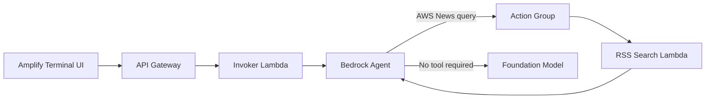
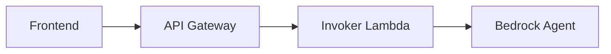

## Overview

The agent → [awsnews.digitalden.cloud](https://awsnews.digitalden.cloud/){:target="_blank"}

This post explains how to build an Amazon Bedrock agent that searches the AWS News Blog RSS feed to answer questions about recent AWS announcements. When you ask questions such as "What's new with AWS Lambda?" or "Are there any recent Amazon Bedrock updates?", the agent retrieves the live RSS feed, identifies relevant posts, and returns summaries with direct links to the original articles.

The frontend is a terminal-style web interface hosted using AWS Amplify. The UI sends requests to Amazon API Gateway, which invokes a Lambda function responsible for calling the Bedrock agent. When the agent needs current information, it invokes a second Lambda function through an action group. That function fetches and parses the RSS feed in real time.

The architecture does not use a database or a Bedrock knowledge base. The agent relies entirely on on-demand RSS retrieval and parsing performed by a Lambda function, keeping the implementation minimal and focused on live content access.

Watch the video: 

{: .text-center }
_Demo_

### Problem

A foundation model can answer general AWS questions from its training data. Ask "What is Lambda?" and it provides a solid explanation. However, if you ask "What's new with Lambda?", the model cannot answer reliably. The model's knowledge has a cutoff date. It does not know what AWS announced last week, what features launched yesterday, or what is currently in preview.

Worse, the model may not acknowledge this gap. Ask about a newer service like AWS DevOps Agent and the model might generate a confident, detailed explanation of features that sound plausible but are entirely fabricated. This is hallucination. The model produces information based on patterns rather than facts, and without access to live data, there is no way to verify accuracy.

### Solution

Build a Bedrock agent and give it a tool that searches live data. That tool is a Lambda function that searches the AWS News Blog RSS feed.

When you ask "Any recent Bedrock updates?", the agent recognises it needs current information. It invokes an action group, which triggers the Lambda function. The function fetches the live RSS feed, searches for matching posts, and returns them to the agent. The agent then responds with actual recent announcements, complete with titles, descriptions, and links.

### Architecture

A user enters a question in a terminal-style UI hosted using AWS Amplify. The browser sends a POST request to Amazon API Gateway, which invokes an AWS Lambda function. That function calls the Amazon Bedrock agent with the user's prompt.

The agent evaluates the request and determines how to respond. If the question requires current AWS announcements, the agent invokes an action group. The action group triggers a second Lambda function that retrieves and searches the AWS News Blog RSS feed.



An action group defines the tools available to the agent. It establishes a contract between the agent and the Lambda function using an OpenAPI schema that specifies the operation and input parameters. When the agent determines that RSS search is required, it invokes the action group and passes the query parameters defined in the schema.

The agent controls orchestration. It decides whether to answer directly using its model context or invoke a tool to retrieve external data. This decision logic distinguishes an agent from a direct model invocation.

## Step 1: RSS Lambda

The agent requires a tool that can retrieve current data. In this step, you complete the following tasks:

- Create a Lambda function that fetches the AWS News Blog RSS feed
- Add code that parses the feed and searches for relevant posts
- Configure permissions so the Bedrock agent can invoke the function

Open the Lambda console and create a new function:

- **Function name**: `search-aws-news`
- **Runtime**: Python 3.12
- **Architecture**: x86_64
- **Permissions**: Create a new role with basic Lambda permissions

> Basic Lambda permissions create an IAM role that allows the function to write logs to CloudWatch. The agent requires additional permissions to invoke this function, which you configure later in this step.
{: .prompt-info }

Create the function.

In the code editor, replace the existing code with the following:

```python
import json
import urllib.request
import xml.etree.ElementTree as ET

def lambda_handler(event, context):
    # Get the search topic from the agent
    topic = ""
    for param in event.get("parameters", []):
        if param.get("name") == "topic":
            topic = param.get("value", "").lower()
    
    if not topic:
        return build_response(event, [])
    
    # Fetch the AWS News Blog RSS feed
    feed_url = "https://aws.amazon.com/blogs/aws/feed/"
    with urllib.request.urlopen(feed_url, timeout=10) as response:
        feed_data = response.read().decode("utf-8")
    
    # Parse and search
    root = ET.fromstring(feed_data)
    matching_posts = []
    topic_words = topic.split()
    
    # Adjust these values to control results (increases token usage)
    MAX_POSTS_TO_SEARCH = 20 # Number of recent posts to evaluate
    MAX_RESULTS = 5          # Maximum matching results to return
    DESC_LENGTH = 150        # Characters to include from description
    
    for item in root.findall(".//item")[:MAX_POSTS_TO_SEARCH]:
        title = item.find("title").text
        link = item.find("link").text
        description = item.find("description").text or ""
        
        if all(word in title.lower() or word in description.lower() for word in topic_words):
            matching_posts.append({
                "title": title,
                "link": link,
                "description": description[:DESC_LENGTH] + "..."
            })
        
        if len(matching_posts) >= MAX_RESULTS:
            break
    
    return build_response(event, matching_posts)


def build_response(event, posts):
    return {
        "messageVersion": "1.0",
        "response": {
            "actionGroup": event.get("actionGroup", ""),
            "apiPath": event.get("apiPath", ""),
            "httpMethod": event.get("httpMethod", ""),
            "httpStatusCode": 200,
            "responseBody": {
                "application/json": {
                    "body": json.dumps(posts) if posts else json.dumps({"message": "No matching posts found."})
                }
            }
        }
    }
```
{: file="search_aws_news.py" }

Deploy the function.

> The function uses Python's built-in `urllib` and `xml` libraries to retrieve and parse the RSS feed. There is no dependency packaging step, which keeps the deployment simple and the Lambda function small.
{: .prompt-info }

The [AWS News Blog RSS](https://aws.amazon.com/blogs/aws/feed/){:target="_blank"} feed can contain a large amount of text across multiple entries. Passing the full feed to the agent would increase token usage and slow down responses. The function applies three limits to control payload size:

- Only the most recent 20 posts are evaluated, restricting the search to recent announcements
- Post descriptions are truncated to 150 characters, providing context without including the full article text
- A maximum of 5 matching results is returned, ensuring the response remains concise and readable

These values work well for a demo, but you can adjust them in the code. Increasing the post count or max results will improve coverage at the cost of higher token usage and slower responses.

### Lambda permissions

Grant Amazon Bedrock permission to invoke the function. In the Lambda console, open the **Configuration** tab and select **Permissions**. Under **Resource-based policy statements**, choose **Add permissions**.

Configure the statement as follows:

- **Statement ID**: `AllowBedrockInvocation`
- **Principal**: `bedrock.amazonaws.com`
- **Source ARN**: `arn:aws:bedrock:us-east-1:123456789012:agent/*`
- **Action**: `lambda:InvokeFunction`

> Replace the Region and account ID with your own values. The wildcard allows any Bedrock agent in the account to invoke the function. To restrict invocation to a single agent, replace the wildcard with the agent ID after the agent is created.
{: .prompt-info }

Save the permissions.

## Step 2: Bedrock Agent

With the RSS Lambda function deployed, create the Bedrock agent that uses it. In this step, you complete the following tasks:

- Configure the agent and select a foundation model
- Define the system prompt that controls agent behaviour
- Connect the agent to the Lambda function through an action group
- Configure IAM permissions so the agent can invoke the function

Open the Amazon Bedrock console, select **Agents** from the navigation pane, and create a new agent:

- **Agent name**: `aws-news-agent`

The Agent builder opens.

Under **Agent resource role**, leave **Create and use a new service role** selected. This role grants the agent permission to invoke the foundation model and call configured action groups. Bedrock creates and manages this role automatically.

Under **Model**, select a foundation model. The model interprets user requests and determines when to invoke tools. Smaller models have lower cost and faster response times. Larger models provide stronger reasoning capabilities and improved tool selection accuracy.

> Foundation models have a fixed knowledge cutoff date. They do not have awareness of AWS announcements or features released after training. This is why the agent is configured with a tool that retrieves current data from the AWS News Blog.
{: .prompt-info }

In the **Instructions for the Agent** field, enter the following system prompt:

```text
You are a helpful assistant that answers questions about AWS news and announcements.

RULES:
- For any question about recent, current, or new AWS announcements, features, or updates, use the SearchAWSNews function. Do not answer from your training data.
- Never guess what news exists. Always search first.
- If a search returns no results for a specific service, try a broader search term automatically or report no results found.
- If no results are found after searching, say so clearly and offer to help with general AWS questions instead.
- For general AWS questions not about recent news, answer directly from your knowledge.

FORMATTING:
- Use plain text only. No markdown syntax of any kind.
- Do not use asterisks, bold, italics, headers, bullet points, or special characters for emphasis.
- Present search results as a numbered list.
- For each result, show the title, a one-sentence description, and the link on separate lines.
- Display links exactly as returned by the search. Do not modify URLs.
- Apply these formatting rules to every response, including follow-up searches.

Example output format:
1. AWS Lambda Durable Functions
   New capability for building multi-step applications and AI workflows.
   Link: https://aws.amazon.com/blogs/aws/example-post/

2. Database Savings Plans
   New pricing model for AWS databases offering cost efficiency with flexibility.
   Link: https://aws.amazon.com/blogs/aws/another-example/

Be concise, friendly, and helpful.
```
{: file="system-prompt.txt" }

The system prompt removes ambiguity. Without clear rules, the agent might try to answer news questions from its training data instead of searching. The explicit instruction to use the SearchAWSNews function first ensures it calls the tool when needed.

Save the agent.

### Action group

An action group connects the agent to external tools such as Lambda functions. It defines the operation, input parameters, and response format so the agent can invoke the tool correctly.

In the **Action groups** section, add a new action group:

- **Action group name**: `SearchAWSNews`
- **Action group type**: Define with function details

Under **Action group function**, choose **Select an existing Lambda function** and select the `search-aws-news` function.

For **Action group schema**, select **Define via in-line schema editor** and replace the existing schema with the following:

```yaml
openapi: 3.0.0
info:
  title: AWS News Search API
  version: 1.0.0
  description: API to search the AWS News Blog RSS feed.
paths:
  /search-news:
    get:
      summary: Searches the AWS News Blog for posts matching a topic.
      description: Fetches the RSS feed and returns matching posts with titles, descriptions, and links.
      operationId: searchNews
      parameters:
        - name: topic
          in: query
          description: The topic to search for, such as Lambda, Bedrock, or S3
          required: true
          schema:
            type: string
      responses:
        '200':
          description: A list of matching posts.
          content:
            application/json:
              schema:
                type: object
                properties:
                  posts:
                    type: array
                    items:
                      type: object
                      properties:
                        title:
                          type: string
                        link:
                          type: string
                        description:
                          type: string
```
{: file="openapi-schema.yaml" }

This schema tells Bedrock what the tool does, what input it expects, and what response to return. The `operationId` becomes the function name the agent sees.

Create the action group and save the agent.

Select **Prepare** to compile the agent configuration.

### Agent permissions

The agent's IAM role requires permission to invoke the Lambda function. Open the agent details page and locate the service role under **Permissions**. Select the role to open it in the IAM console.

On the **Permissions** tab, create an inline policy. Switch to **JSON** view and paste the following:

```json
{
    "Version": "2012-10-17",
    "Statement": [
        {
            "Effect": "Allow",
            "Action": "lambda:InvokeFunction",
            "Resource": "arn:aws:lambda:us-east-1:123456789012:function:search-aws-news"
        }
    ]
}
```

Replace the Region and account ID with your own values.

Name the policy `BedrockAgentLambdaInvoke` and create it.

Return to the Bedrock console and prepare the agent again.

## Step 3: Test the Agent

With the agent configured, test it in the Amazon Bedrock console and review the trace to understand how the agent reasons and invokes tools.

Open the agent details page. In the **Test** panel, confirm that the alias dropdown is set to **TestAlias: Working draft**.

In the chat input, enter `What's new with Lambda?`.

{: .shadow .rounded-10 }

The agent processes the request, invokes the RSS Lambda function through the action group, and returns matching posts from the AWS News Blog.

The exact response varies based on recent AWS announcements.

### Reading the trace

The trace confirms that the agent invoked the expected action group. In the trace output, the agent selects the `SearchAWSNews` action group and executes it through Lambda. The `topic` parameter is passed with the value `Lambda`, which matches the user query.

This confirms that the agent identified the request as requiring current information and delegated the search to the Lambda function instead of answering from model training data.

## Step 4: Invoker Lambda

The Bedrock agent is currently accessible only from the console. In this step, you create a Lambda function that acts as an integration layer between the frontend and the agent. This function receives requests from API Gateway, invokes the agent, and returns the response.



In this step, you complete the following tasks:

- Create a Lambda function that invokes the Bedrock agent
- Configure the function to handle requests from API Gateway
- Grant permissions so the function can invoke the agent

Open the Lambda console and create a new function:

- **Function name**: `invoke-agent`
- **Runtime**: Python 3.12
- **Architecture**: x86_64
- **Permissions**: Create a new role with basic Lambda permissions

Create the function.

In the code editor, replace the existing code with the following:

```python
import json
import boto3

def lambda_handler(event, context):
    # Parse the request body
    try:
        if 'body' in event:
            body = event.get('body', '{}')
            if isinstance(body, str):
                body = json.loads(body)
        else:
            body = event
        message = body.get('message', '')
        session_id = body.get('sessionId', 'default-session')
    except Exception as e:
        return {
            'statusCode': 400,
            'headers': cors_headers(),
            'body': json.dumps({'error': f'Invalid request body: {str(e)}'})
        }

    if not message:
        return {
            'statusCode': 400,
            'headers': cors_headers(),
            'body': json.dumps({'error': 'No message provided'})
        }

    # Bedrock agent identifiers
    AGENT_ID = 'YOUR_AGENT_ID'
    AGENT_ALIAS_ID = 'TSTALIASID'

    try:
        client = boto3.client('bedrock-agent-runtime')
        response = client.invoke_agent(
            agentId=AGENT_ID,
            agentAliasId=AGENT_ALIAS_ID,
            sessionId=session_id,
            inputText=message
        )

        completion = ""
        for event in response.get('completion', []):
            if 'chunk' in event:
                completion += event['chunk']['bytes'].decode('utf-8')

        return {
            'statusCode': 200,
            'headers': cors_headers(),
            'body': json.dumps({'response': completion})
        }

    except Exception:
        return {
            'statusCode': 500,
            'headers': cors_headers(),
            'body': json.dumps({'error': 'Failed to get response from agent'})
        }

def cors_headers():
    return {
        'Content-Type': 'application/json',
        'Access-Control-Allow-Origin': '*',
        'Access-Control-Allow-Headers': 'Content-Type',
        'Access-Control-Allow-Methods': 'POST, OPTIONS'
    }
```
{: file="invoke_agent.py" }

Replace `YOUR_AGENT_ID` with the agent ID from the Bedrock console.

> This example uses `TSTALIASID`, the default test alias. For production deployments, create a versioned alias that points to a specific agent version.
{: .prompt-info }

The `sessionId` parameter maintains conversation context across multiple requests. When the same session ID is passed with subsequent messages, the agent retains memory of previous exchanges, enabling follow-up questions like "Tell me more about the first one" without repeating context. The frontend generates a unique session ID per browser session and includes it with each request.

Deploy the function.

### Function configuration

Open **Configuration** and select **General configuration**. Increase **Timeout** to 30 seconds and save the changes.

### Permissions

Open **Configuration** and select **Permissions**. Select the execution role to open it in the IAM console.

Add an inline policy. Switch to **JSON** view and paste the following:

```json
{
    "Version": "2012-10-17",
    "Statement": [
        {
            "Effect": "Allow",
            "Action": "bedrock:InvokeAgent",
            "Resource": "arn:aws:bedrock:us-east-1:123456789012:agent-alias/*/*"
        }
    ]
}
```

Replace the Region and account ID with your own values.

Name the policy `BedrockInvokeAgent` and create it.

## Step 5: API Gateway

The invoker Lambda function requires an HTTP endpoint so the frontend can send requests. In this step, you create a REST API in Amazon API Gateway, connect it to the Lambda function, enable CORS, and deploy the API.

In this step, you complete the following tasks:

- Create a REST API in API Gateway
- Add a POST method that invokes the Lambda function
- Enable CORS for browser-based requests
- Deploy the API and obtain the invoke URL

Open the API Gateway console and create a new API:

- **API type**: REST API
- **API name**: `aws-news-agent-api`

Create the API.

### Create a resource and method

In the **Resources** panel, select **Create resource**:

- **Resource name**: `agent`
- **CORS**: Enabled

Create the resource.

With the `/agent` resource selected, select **Create method**:

- **Method type**: POST
- **Integration type**: Lambda Function
- **Lambda proxy integration**: Enabled
- **Lambda function**: `invoke-agent`

Create the method.

> Lambda proxy integration forwards the full HTTP request to the Lambda function without modification. The function receives the request body and headers and must return a response that includes a status code and headers.
{: .prompt-info }

### Deploy the API

Select **Deploy API**:

- **Stage**: New stage
- **Stage name**: `prod`

Deploy the API.

After deployment, note the **Invoke URL**. The full endpoint used by the frontend is the invoke URL with the `/agent` resource appended:

```text
https://abc123xyz.execute-api.us-east-1.amazonaws.com/prod/agent
```

### Test the endpoint

Before building the frontend, validate the API using AWS CloudShell or your terminal. Set your endpoint as a variable:

```bash
ENDPOINT="https://abc123xyz.execute-api.us-east-1.amazonaws.com/prod/agent"
```

Then send a request to the API Gateway endpoint:

```bash
curl -X POST $ENDPOINT \
  -H "Content-Type: application/json" \
  -d '{"message": "What is new with Lambda?", "sessionId": "test-123"}'
```

A JSON response with the agent's answer confirms that API Gateway, the Lambda function, and the Bedrock agent are connected correctly.

## Step 6: Amplify

The final step is to deploy the frontend. In this step, you download the terminal-style UI, update it with your API Gateway endpoint, and deploy it using AWS Amplify.

In this step, you complete the following tasks:

- Download the frontend from GitHub
- Update the API endpoint configuration
- Deploy the frontend using AWS Amplify

### Download the frontend

Open the following GitHub repository:

```text
https://github.com/digitaldencloud/aws-news-agent-frontend
```

Select the `index.html` file, select **Raw**, then right-click and save the file locally.

### Update the API endpoint

Open `index.html` in a text editor and locate the following line:

```javascript
const API_ENDPOINT = 'YOUR_API_GATEWAY_URL';
```

Replace it with your API Gateway endpoint:

```javascript
const API_ENDPOINT = 'https://abc123xyz.execute-api.us-east-1.amazonaws.com/prod/agent';
```

Save the file.

### Deploy to AWS Amplify

Create a ZIP archive containing `index.html`.

Open the AWS Amplify console and select **Create new app**:

- **Deployment method**: Deploy without Git
- **App name**: `aws-news-agent`
- **Branch name**: `main`
- **Method**: Drag and drop

Upload the ZIP file and select **Save and deploy**.

After deployment completes, Amplify provides a public URL:

```text
https://main.d1abc123.amplifyapp.com
```

Open the URL in a browser. The terminal-style UI loads and sends requests to the API Gateway endpoint.

Enter a query, for example `What's new with Lambda?`, to verify end-to-end communication between the frontend, API Gateway, Lambda, and the Bedrock agent.

AWS Amplify provides HTTPS by default, so the frontend is served securely without additional configuration.

> To use a custom domain, go to **Hosting** > **Custom domains** in the Amplify console. Enter your subdomain (e.g. `awsnews.yourdomain.com`) and follow the steps to configure DNS. Amplify handles SSL certificate provisioning automatically.
{: .prompt-tip }

## Summary

This post demonstrated how to build an Amazon Bedrock agent that answers questions about recent AWS announcements by searching the AWS News Blog RSS feed in real time. The agent uses an action group to invoke a Lambda function when current information is required, rather than relying on model training data.

You exposed the agent through an invoker Lambda function and a REST API in Amazon API Gateway, then deployed a terminal-style frontend using AWS Amplify. The frontend sends user queries to the API, which routes requests through Lambda to the Bedrock agent and returns responses to the browser.

Without access to live data, foundation models may hallucinate when asked about newer services or recent announcements. Connecting the agent to an external data source addresses this limitation by grounding responses in verified, up-to-date information.

This implementation shows how Bedrock agents can be extended with external data sources using Lambda action groups, allowing foundation model reasoning to be combined with live data access in a lightweight, serverless architecture.