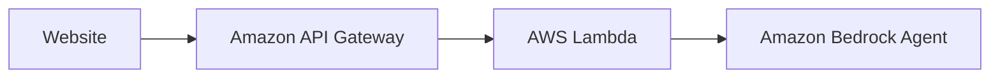
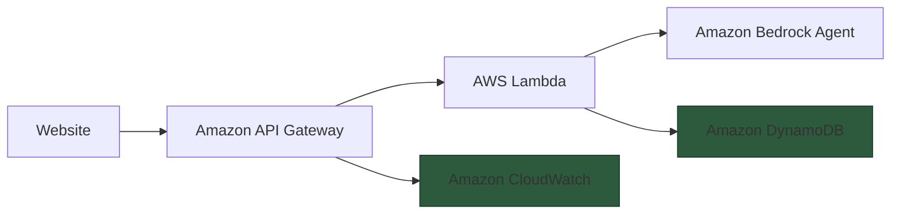
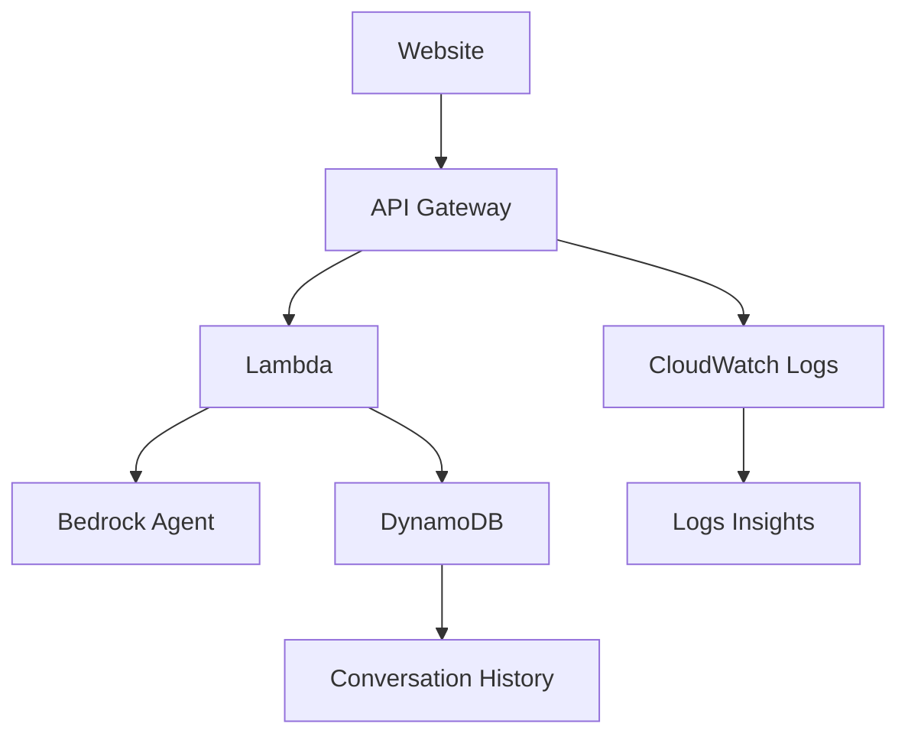

After launching my Bedrock agent at [digitalden.cloud](https://digitalden.cloud){:target="_blank"}, I wanted to add proper observability. In any production system, logging and metrics are fundamental to debugging issues, monitoring performance, and understanding usage patterns. What questions are people asking? Is the agent responding correctly? Are there patterns I can learn from? Without this data, there is no way to iterate on the agent.

This post documents how I added observability to my agent using API Gateway access logs, CloudWatch Logs Insights, and DynamoDB for persistent conversation storage.

For the full breakdown of how I built this agent, see [Building My First Bedrock Agent](/posts/building-my-first-bedrock-agent/){:target="_blank"}.

## The Problem

My agent architecture looked like this:


Requests came in, responses went out, but I had no visibility into what was happening.

- What questions are people asking?
- Is the agent responding correctly?
- Are there errors I'm not seeing?

This required three things:

1. **Traffic visibility** — who is hitting the endpoint, when, and did it succeed
2. **Conversation history** — what are people actually asking
3. **Query capability** — a way to search and analyse the data

## The Solution



API Gateway access logs capture traffic and write to CloudWatch. The Lambda stores conversations in DynamoDB. CloudWatch Logs Insights provides the query layer across both.

---

## Part 1: API Gateway Access Logging

API Gateway can log every request to CloudWatch, giving you visibility into traffic patterns, response codes, and latency.

### Step 1: Create the IAM Role

API Gateway needs permission to write to CloudWatch. This is configured at the account level, not per-API.

1. Go to **IAM → Roles → Create role**
2. Select **AWS service** as the trusted entity
3. Under **Use case**, select **API Gateway**
4. Click **Next** — AWS attaches the `AmazonAPIGatewayPushToCloudWatchLogs` managed policy automatically
5. Name the role `APIGatewayPushToCloudWatchLogs`
6. Click **Create role**

Go to **API Gateway → Settings** and paste the role ARN into the CloudWatch log role ARN field.

The managed policy uses `Resource: "*"` which is broader than necessary. For tighter security, create a custom policy instead:
```json
{
  "Version": "2012-10-17",
  "Statement": [
    {
      "Effect": "Allow",
      "Action": [
        "logs:CreateLogGroup",
        "logs:CreateLogStream",
        "logs:PutLogEvents"
      ],
      "Resource": "arn:aws:logs:eu-west-2:YOUR_ACCOUNT_ID:log-group:/aws/apigateway/*"
    }
  ]
}
```

This scopes permissions to API Gateway log groups in your region and removes read actions that API Gateway does not need.

### Step 2: Create the Log Group

In CloudWatch, create a log group for your API logs:

```
/aws/apigateway/digitalden-agent-prod
```

Copy the ARN — you'll need it next. Important: remove the `:*` suffix when pasting into API Gateway. The ARN should end with the log group name, not a wildcard.

### Step 3: Enable Access Logging

In API Gateway:

1. Go to **Stages → prod → Logs and tracing**
2. Under **CloudWatch logs**, select **Errors and info logs**
3. Enable **Detailed metrics**
4. Enable **Custom access logging**
5. Paste the log group ARN (without the `:*` suffix)
6. Add the log format:
```json
{"requestId":"$context.requestId","ip":"$context.identity.sourceIp","userAgent":"$context.identity.userAgent","requestTime":"$context.requestTime","httpMethod":"$context.httpMethod","resourcePath":"$context.resourcePath","status":"$context.status","responseLatency":"$context.responseLatency","integrationStatus":"$context.integration.status","integrationLatency":"$context.integration.latency"}
```

7. Click **Save changes**
8. **Deploy the API** — changes do not take effect until you deploy

### Log Output

Every request now produces a log entry like this:

```json
{
  "requestId": "9af414d9-6c49-4a69-8759-aae12726c37a",
  "ip": "143.58.252.234",
  "userAgent": "Mozilla/5.0 (Macintosh; Intel Mac OS X 10_15_7)...",
  "requestTime": "02/Jan/2026:10:40:36 +0000",
  "httpMethod": "POST",
  "resourcePath": "/agent",
  "status": "200",
  "responseLatency": "6563",
  "integrationStatus": "200",
  "integrationLatency": "6560"
}
```

You can see who made the request, when, whether it succeeded, and how long it took.

---

## Part 2: Querying Logs with CloudWatch Logs Insights

API Gateway access logs give you raw data, but Logs Insights lets you query and analyse that data. Instead of scrolling through individual log entries, you can filter, aggregate, and visualise patterns.

### Running a Query

1. Go to **CloudWatch → Logs → Log groups**
2. Select your log group `/aws/apigateway/digitalden-agent-prod`
3. Click **View in Logs Insights**
4. The time range defaults to 1 hour — adjust if needed
5. Enter a query under **Query definition** and click **Run query**

### Useful Queries

**Recent requests:**
```sql
fields @timestamp, ip, httpMethod, status, responseLatency
| filter resourcePath="/agent" and httpMethod="POST"
| sort @timestamp desc
| limit 50
```

This filters out OPTIONS preflight requests and shows your most recent agent interactions.

**Unique visitors:**
```sql
fields ip
| filter resourcePath="/agent" and httpMethod="POST"
| stats count() by ip
```

**Average response time:**
```sql
fields responseLatency
| filter resourcePath="/agent" and httpMethod="POST"
| stats avg(responseLatency) as avgLatency
```

**Requests over time:**
```sql
fields @timestamp
| filter resourcePath="/agent" and httpMethod="POST"
| stats count() by bin(1h)
```

This shows usage patterns by hour, useful for understanding when people interact with your agent.

---

## Part 3: Storing Conversations in DynamoDB

API Gateway logs show traffic, but not content. To see what people are actually asking, I added DynamoDB storage to the invoker Lambda.

### Step 1: Create the Table

Create a DynamoDB table with:

- **Table name**: `agent-conversations`
- **Partition key**: `sessionId` (String)
- **Sort key**: `timestamp` (String)
- **Capacity**: On-demand

The partition key groups messages by session, and the sort key orders them chronologically.

### Step 2: Add IAM Permissions

Add an inline policy to the invoker Lambda's execution role:

```json
{
  "Version": "2012-10-17",
  "Statement": [
    {
      "Effect": "Allow",
      "Action": "dynamodb:PutItem",
      "Resource": "arn:aws:dynamodb:eu-west-2:YOUR_ACCOUNT_ID:table/agent-conversations"
    }
  ]
}
```

This follows least privilege — the Lambda can only write to this specific table.

### Step 3: Update the Invoker Lambda

The invoker Lambda sits between API Gateway and the Bedrock agent. It receives requests from the website, forwards them to Bedrock, and returns the response. This is where we add the DynamoDB write to capture each conversation turn.

```python
import json
import boto3
from datetime import datetime

# Initialize clients outside handler for reuse
dynamodb = boto3.resource('dynamodb')
table = dynamodb.Table('agent-conversations')

def lambda_handler(event, context):
    # Parse the request body
    try:
        if 'body' in event:
            body = event.get('body', '{}')
            if isinstance(body, str):
                body = json.loads(body)
        else:
            body = event
        
        message = body.get('message', '')
        session_id = body.get('sessionId', 'default-session')
    except Exception as e:
        return {
            'statusCode': 400,
            'headers': cors_headers(),
            'body': json.dumps({'error': f'Invalid request body: {str(e)}'})
        }

    if not message:
        return {
            'statusCode': 400,
            'headers': cors_headers(),
            'body': json.dumps({'error': 'No message provided'})
        }
    
    # Get IP address for analytics
    ip = event.get('requestContext', {}).get('identity', {}).get('sourceIp', 'unknown')
    
    # Bedrock agent details
    AGENT_ID = 'YOUR_AGENT_ID'
    AGENT_ALIAS_ID = 'YOUR_ALIAS_ID'
    
    try:
        client = boto3.client('bedrock-agent-runtime')
        
        response = client.invoke_agent(
            agentId=AGENT_ID,
            agentAliasId=AGENT_ALIAS_ID,
            sessionId=session_id,
            inputText=message
        )
        
        # Collect the response stream
        completion = ""
        for event_chunk in response.get('completion', []):
            if 'chunk' in event_chunk:
                completion += event_chunk['chunk']['bytes'].decode('utf-8')
        
        # Log to DynamoDB
        try:
            table.put_item(
                Item={
                    'sessionId': session_id,
                    'timestamp': datetime.utcnow().isoformat(),
                    'userMessage': message[:1000],
                    'agentResponse': completion[:5000],
                    'ip': ip
                }
            )
        except Exception as db_error:
            print(f"DynamoDB write failed: {db_error}")
        
        return {
            'statusCode': 200,
            'headers': cors_headers(),
            'body': json.dumps({'message': completion})
        }
        
    except Exception as e:
        print(f"Error invoking agent: {str(e)}")
        return {
            'statusCode': 500,
            'headers': cors_headers(),
            'body': json.dumps({'error': 'Failed to get response from agent'})
        }


def cors_headers():
    return {
        'Content-Type': 'application/json',
        'Access-Control-Allow-Origin': '*',
        'Access-Control-Allow-Headers': 'Content-Type',
        'Access-Control-Allow-Methods': 'POST, OPTIONS'
    }
```

Key points:

- DynamoDB client initialised outside the handler for connection reuse
- Truncation on message and response to prevent item size errors
- Try/catch around DynamoDB write so logging failures do not break the agent response
- IP address captured for identifying unique visitors

### Log Output

Each conversation turn is stored as an item:

```json
{
  "sessionId": "6404c95c-4bec-4c31-ad07-bddb07d03a5c",
  "timestamp": "2026-01-02T10:52:50.517467",
  "userMessage": "Who is Deniz?",
  "agentResponse": "Deniz Yilmaz is a cloud engineer and AWS content creator...",
  "ip": "143.58.252.234"
}
```

Multi-turn conversations share the same sessionId, so you can see the full context of how someone interacted with your agent.

---

## The Final Architecture



Now I have complete visibility:

| Layer | What it shows | Use case |
|-------|---------------|----------|
| API Gateway logs | Traffic, status, latency | Usage analytics, error detection |
| CloudWatch Logs Insights | Aggregated queries | Trends, debugging |
| DynamoDB | Full conversations | Understanding user intent, improving the agent |

---

## Additional Considerations
- **CloudWatch Dashboard** — visualise request counts, latency, and error rates in a single view
- **CloudWatch Alarms with SNS** — get notified when error rates spike or latency exceeds thresholds
- **QuickSight** — connect to DynamoDB to analyse conversation patterns and common questions
- **Session analysis** — query DynamoDB by sessionId to understand multi-turn conversation flows
- **Cost tracking** — log Bedrock token usage per request to monitor spend
- **Geo analytics** — use IP addresses with a geolocation API to see where visitors come from
- **Popular questions** — use Bedrock to categorise stored questions and surface trending topics

The agent is no longer a black box. I can see exactly what’s happening, debug issues quickly, and make data-driven improvements.

---

Try the agent at [digitalden.cloud](https://digitalden.cloud){:target="_blank"}

Read the original post: [Building My First Bedrock Agent](/posts/building-my-first-bedrock-agent/){:target="_blank"}