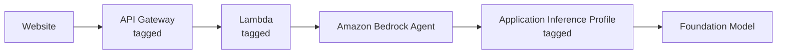
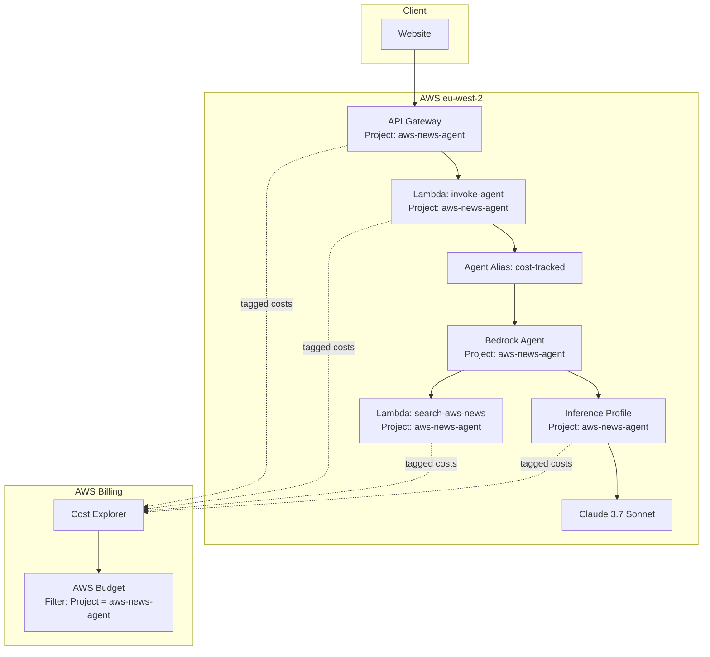

When running multiple projects on AWS, it is important to understand which project is generating which costs. AWS cost allocation tags allow costs to be filtered in Cost Explorer and used in AWS Budgets to set spending limits and receive alerts when project costs exceed defined thresholds.

Amazon Bedrock requires additional configuration because [on-demand foundation model invocation costs are not automatically associated with project-level tags](https://repost.aws/knowledge-center/bedrock-add-cost-allocation-tags){:target="_blank"}. Tagging the agent resource itself does not apply tags to model usage. Model invocation costs must be associated through an Application Inference Profile.

This post explains how to configure cost allocation for an Amazon Bedrock Agent project, outlines the limitation with tagging model usage, and shows how Application Inference Profiles are used to associate model costs with a specific project.

<!--more-->

---

## Objective

Create an AWS Budget that tracks costs generated by a single Amazon Bedrock Agent project and excludes unrelated AWS usage.

The project is the [AWS News Search Agent](https://docs.digitalden.cloud/posts/building-a-bedrock-agent-with-aws-news-search/){:target="_blank"}, which consists of the following components:

- **API Gateway**  
  REST API endpoint used by the client

- **Lambda function (invoke-agent)**  
  Invokes the Amazon Bedrock Agent

- **Lambda function (search-aws-news)**  
  Action group used for RSS-based news search

- **Amazon Bedrock Agent**  
  Configured to use Claude 3.7 Sonnet

The initial configuration followed standard AWS cost allocation practices. A `Project: aws-news-agent` tag was applied to each resource, the tag was activated for cost allocation, and an AWS Budget was created using that tag as a filter.

The resulting budget did not capture the Bedrock model invocation costs.

## The Problem

After tagging all resources and waiting for tag propagation, the `Project` tag appeared in Cost Explorer. The reported costs were minimal and did not reflect actual usage. Most of the spend came from Amazon Bedrock model invocations, and those costs were not included.

In this project, the agent invokes the foundation model using on-demand inference, where model capacity is shared and billed per request rather than pre-allocated.

The tag was applied to the Bedrock Agent resource and activated for cost allocation. However, Bedrock model invocation costs cannot be tagged directly, and tagging the agent resource does not apply tags to model usage.

> **Limitation**  
> Cost allocation tags cannot be applied to on-demand Amazon Bedrock foundation model invocations. Tagging a Bedrock Agent does not associate tags with model invocation charges.
{: .prompt-warning }

Tags applied to Bedrock agents, knowledge bases, and related resources are used for resource organisation only. These tags do not propagate to billing records for on-demand model usage.

This behaviour is documented in AWS re:Post and the Amazon Bedrock documentation, but it is not obvious when configuring cost tracking.

## The Solution

Amazon Bedrock provides **Application Inference Profiles** to enable cost allocation for on-demand foundation model usage.

An application inference profile is a resource that references a foundation model and supports cost allocation tags. When a model is invoked through an inference profile, the tags applied to the profile are included in the billing data for those model invocation charges.

From the AWS What’s New announcement on Amazon Bedrock cost allocation support for inference profiles:

> "Amazon Bedrock now enables customers to allocate and track on-demand foundation model usage. Customers can categorize generative AI inference costs by department, team, or application using AWS cost allocation tags. This is achieved by creating and tagging an application inference profile."

For more details, see the AWS announcement:  
[Amazon Bedrock announces support for cost allocation tags on inference profiles](https://aws.amazon.com/about-aws/whats-new/2024/11/amazon-bedrock-cost-allocation-tags-inference-profiles/){:target="_blank"}

With an inference profile in place, the request flow changes as follows:



The application inference profile sits between the Bedrock Agent and the foundation model. Cost allocation tags applied to the profile are used to attribute model invocation charges to the correct project in Cost Explorer and AWS Budgets.

---

## Implementation

### Step 1: Tag Standard AWS Resources

Apply a `Project` tag to the AWS resources that support cost allocation tagging. These costs appear directly in Cost Explorer and AWS Budgets.

**Tag Lambda functions**

1. Open the Lambda console  
2. Select the function  
3. Open **Configuration** and select **Tags**  
4. Add the tag `Project = aws-news-agent`

**Tag API Gateway**

1. Open the API Gateway console  
2. Select the API  
3. Open the **Tags** section  
4. Add the tag `Project = aws-news-agent`

**Tag the Bedrock Agent (resource organisation only)**

1. Open the Amazon Bedrock console  
2. Select **Agents**, then select the agent  
3. Open the **Tags** section  
4. Add the tag `Project = aws-news-agent`

> **Note**  
> Tags applied to the Bedrock Agent are used for resource organisation only. They do not associate tags with model invocation costs.
{: .prompt-info }

---

### Step 2: Activate the Cost Allocation Tag

1. Open the **Billing and Cost Management** console  
2. Select **Cost allocation tags**  
3. Locate the `Project` tag under **User-defined cost allocation tags**  
4. Select the tag and choose **Activate**

> **Timing**  
> After tagging resources, allow up to 24 hours for the tag to appear. After activation, allow up to another 24 hours for tagged costs to appear in Cost Explorer.
{: .prompt-warning }

---

### Step 3: Create an Application Inference Profile

Application inference profiles must be created using the AWS CLI or API.

List available foundation models in the Region

```bash
aws bedrock list-foundation-models --region eu-west-2 \
  --query "modelSummaries[?contains(modelId, 'claude')].modelId" \
  --output table
```
{: .nolineno }

Create the inference profile with a cost allocation tag

```bash
aws bedrock create-inference-profile \
  --region eu-west-2 \
  --inference-profile-name "aws-news-agent-profile" \
  --description "Profile for AWS News Agent cost tracking" \
  --model-source "{\"copyFrom\": \"arn:aws:bedrock:eu-west-2::foundation-model/anthropic.claude-3-7-sonnet-20250219-v1:0\"}" \
  --tags "[{\"key\": \"Project\", \"value\": \"aws-news-agent\"}]"
```
{: .nolineno }

The response includes the inference profile ARN. Save this value for later steps.

```
{
  "inferenceProfileArn": "arn:aws:bedrock:eu-west-2:123456789012:application-inference-profile/abc123xyz",
  "status": "ACTIVE"
}
```
{: .nolineno }

> **Model source**  
> Use the foundation model ARN directly (e.g., `arn:aws:bedrock:eu-west-2::foundation-model/anthropic.claude-3-7-sonnet-20250219-v1:0`), not a system inference profile ARN.
{: .prompt-info }

### Step 4: Update the Agent Execution Role

The Bedrock Agent execution role must be allowed to invoke the application inference profile.

**Retrieve the agent execution role ARN**

```bash
aws bedrock-agent get-agent --region eu-west-2 --agent-id YOUR_AGENT_ID \
  --query 'agent.agentResourceRoleArn' --output text
````

{: .nolineno }

**Attach an inline IAM policy**

```bash
aws iam put-role-policy \
  --role-name AmazonBedrockExecutionRoleForAgents_XXXXXXXX \
  --policy-name InferenceProfileAccess \
  --policy-document '{
    "Version": "2012-10-17",
    "Statement": [{
      "Effect": "Allow",
      "Action": [
        "bedrock:InvokeModel",
        "bedrock:InvokeModelWithResponseStream",
        "bedrock:GetInferenceProfile"
      ],
      "Resource": [
        "arn:aws:bedrock:eu-west-2:ACCOUNT_ID:application-inference-profile/PROFILE_ID",
        "arn:aws:bedrock:eu-west-2::foundation-model/anthropic.claude-3-7-sonnet-20250219-v1:0"
      ]
    }]
  }'
```
{: .nolineno }

This policy grants access only to the required inference profile and foundation model.

> **AccessDeniedException**  
> If the update fails immediately after attaching the policy, wait briefly and retry. IAM policy changes may take a short time to propagate.
{: .prompt-info }

---

### Step 5: Update the Agent Configuration

Update the agent to reference the application inference profile instead of the foundation model ARN.

```bash
aws bedrock-agent update-agent \
  --region eu-west-2 \
  --agent-id YOUR_AGENT_ID \
  --agent-name "SearchAWSNews" \
  --agent-resource-role-arn "arn:aws:iam::ACCOUNT_ID:role/service-role/AmazonBedrockExecutionRoleForAgents_XXXXXXXX" \
  --foundation-model "arn:aws:bedrock:eu-west-2:ACCOUNT_ID:application-inference-profile/PROFILE_ID" \
  --instruction "$(aws bedrock-agent get-agent --region eu-west-2 --agent-id YOUR_AGENT_ID --query 'agent.instruction' --output text)"
```
{: .nolineno }

The `--instruction` parameter is required. This command preserves the existing instruction text.

Prepare the agent after the update:

```bash
aws bedrock-agent prepare-agent --region eu-west-2 --agent-id YOUR_AGENT_ID
```
{: .nolineno }

---

### Step 6: Update the Agent Alias

Agent aliases cache the agent configuration. The alias must be updated to reference the revised agent configuration.

> **Why this step is required**  
> An alias continues to reference the configuration that was active when it was last updated. Changes to the agent are not used until the alias is updated.
{: .prompt-warning }

**Update an existing alias**

```bash
aws bedrock-agent update-agent-alias \
  --region eu-west-2 \
  --agent-id YOUR_AGENT_ID \
  --agent-alias-id YOUR_ALIAS_ID \
  --agent-alias-name "AgentTestAlias" \
  --routing-configuration '[{"agentVersion": "DRAFT"}]'
```

{: .nolineno }

**Create a new alias**

Create the alias in the Amazon Bedrock console under **Agents → Aliases**.
Use a name such as `cost-tracked` and point it to DRAFT or a specific version.

> **Recommendation**  
> Use a dedicated alias for production to clearly indicate that the agent uses a tagged inference profile.
{: .prompt-tip }

---

### Step 7: Update the Lambda Configuration

Ensure the Lambda function invokes the correct agent and alias.

```python
AGENT_ID = "YOUR_AGENT_ID"
AGENT_ALIAS_ID = "YOUR_ALIAS_ID"
```

{: file="lambda/invoke_agent.py" }

If a new alias was created, update the alias ID and deploy the Lambda function.

> **Deployment required**  
> Configuration changes do not take effect until the Lambda function is deployed.
{: .prompt-warning }

---

## Verification

After completing the setup, verify each component.

**Confirm inference profile has the tag:**

```bash
aws bedrock list-tags-for-resource --region eu-west-2 \
  --resource-arn "arn:aws:bedrock:eu-west-2:ACCOUNT_ID:application-inference-profile/PROFILE_ID"
```
{: .nolineno }

Expected output:

```json
{
    "tags": [
        {"key": "Project", "value": "aws-news-agent"}
    ]
}
```
{: .nolineno }

**Confirm agent uses the inference profile:**

```bash
aws bedrock-agent get-agent --region eu-west-2 --agent-id YOUR_AGENT_ID \
  --query "agent.foundationModel" --output text
```
{: .nolineno }

Should return your inference profile ARN, not a model ID.

**Confirm alias is updated:**

```bash
aws bedrock-agent get-agent-alias --region eu-west-2 \
  --agent-id YOUR_AGENT_ID --agent-alias-id YOUR_ALIAS_ID \
  --query "agentAlias.updatedAt" --output text
```
{: .nolineno }

Should show today's date.

**Confirm Lambda is being invoked:**

```bash
aws logs describe-log-streams --region eu-west-2 \
  --log-group-name "/aws/lambda/invoke-agent" \
  --order-by LastEventTime --descending --limit 1
```
{: .nolineno }

Run a test invocation through your application, then run this again. The timestamp should update.

---

## Creating the Budget

{: .shadow .rounded-10 }

After costs appear in Cost Explorer for the `Project` tag, create an AWS Budget. Allow up to 48 hours after invoking the agent for tagged costs to become visible.

1. Open the **AWS Budgets** console  
2. Select **Create budget**, then choose **Customize** and **Cost budget**  
3. Specify the budget amount and time period
4. Under **Budget scope**, select **Filter specific AWS cost dimensions**  
5. Select **Tag**, then choose **Project = aws-news-agent**  
6. Configure alert thresholds and notification recipients  
7. Create the budget

The budget tracks costs generated only by resources associated with the `Project: aws-news-agent` tag.

---

## Implementation Notes

| Issue | Resolution |
|------|------------|
| Bedrock model invocation costs not tagged | Create an application inference profile with a cost allocation tag |
| Inference profile not available in the console | Create the profile using the AWS CLI or API |
| Access denied when invoking the inference profile | Attach the required IAM permissions to the agent execution role |
| Tagged costs not visible in Cost Explorer | Allow tag propagation and ensure tagged resources have incurred costs |
| Agent configuration changes not applied | Update the agent alias after preparing the agent |
| Resources deployed across Regions | Deploy all related resources in the same Region |

---

## Common Configuration Issues

**Tag applied to the agent instead of the inference profile**

: Tags applied to a Bedrock Agent are used for resource organisation only. Model invocation costs are associated only through an application inference profile.

**Agent alias not updated**

: After updating the agent to use an inference profile, the alias continues to reference the previous configuration until it is updated.

**Resources deployed across Regions**

: Cost attribution and agent invocation become harder to reason about when Lambda, the agent, and the inference profile are deployed in different Regions.

**Tagged costs not yet visible**

: Cost allocation tags require time to propagate. Tagged usage may take up to 48 hours to appear in Cost Explorer.

**Low usage not reflected in tagged costs**

: Very small charges may not appear immediately in Cost Explorer. Generate sufficient usage to confirm tagging behavior.

---

## The Complete Architecture



All components with the `Project: aws-news-agent` tag contribute to the filtered budget view.

---

## CLI Commands Reference

| Task | Command |
|------|---------|
| List inference profiles | `aws bedrock list-inference-profiles --region eu-west-2` |
| Create an inference profile | `aws bedrock create-inference-profile --region eu-west-2 --inference-profile-name NAME --model-source '{"copyFrom":"arn:aws:bedrock:REGION::foundation-model/MODEL_ID"}' --tags '[{"key":"Project","value":"VALUE"}]'` |
| List tags for an inference profile | `aws bedrock list-tags-for-resource --region eu-west-2 --resource-arn PROFILE_ARN` |
| Retrieve agent configuration | `aws bedrock-agent get-agent --region eu-west-2 --agent-id AGENT_ID` |
| Update agent foundation model | `aws bedrock-agent update-agent --region eu-west-2 --agent-id AGENT_ID --foundation-model PROFILE_ARN` |
| Prepare agent | `aws bedrock-agent prepare-agent --region eu-west-2 --agent-id AGENT_ID` |
| Update agent alias | `aws bedrock-agent update-agent-alias --region eu-west-2 --agent-id AGENT_ID --agent-alias-id ALIAS_ID --routing-configuration '[{"agentVersion":"DRAFT"}]'` |
| List agent aliases | `aws bedrock-agent list-agent-aliases --region eu-west-2 --agent-id AGENT_ID` |

---

## Summary

Cost allocation for Amazon Bedrock Agents requires treating model invocation charges separately from standard AWS resource costs. On-demand foundation model usage is not tagged through the agent resource. Application Inference Profiles provide the mechanism for associating cost allocation tags with model invocation charges.

The configuration requires AWS CLI commands and IAM updates to create and reference an inference profile. Once in place, model usage costs appear under the project tag in Cost Explorer and can be monitored using AWS Budgets.

This configuration follows AWS cost management practices and provides clear visibility into generative AI costs at the project level.

---