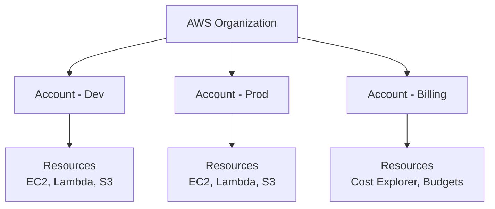
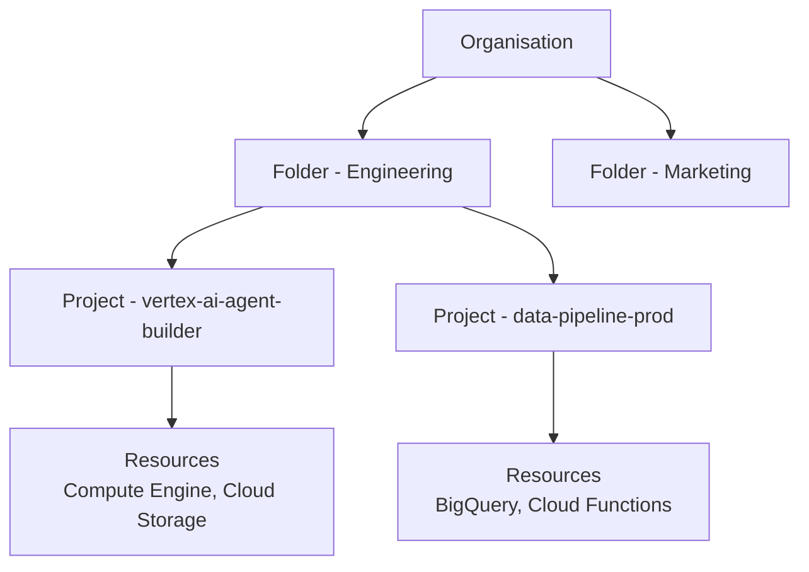

## A New Cloud

For the past two years, everything I've built has been on AWS. Over 40 lessons. 7 certifications. An agent running on my website. Every console demo, every architecture diagram, every Lambda function. All AWS.

Now I'm writing my first Google Cloud lesson.

This isn't a tutorial, it's just a journal. I want to document what it feels like to step into a new cloud platform after spending so long in another one. The things that surprised me, the mental models I had to rewire, and the moments where my AWS instincts helped or led me astray.

---

## Why Google Cloud?

At QA, we cover all the major cloud platforms. I've been creating AWS content since I joined, but the opportunity came up to build a course on Google Cloud's Vertex AI Agent Builder. I already had deep experience with Amazon Bedrock agents. I built an entire agent [series](https://docs.digitalden.cloud/tags/amazon-bedrock/){:target="_blank"} from the first demo through to observability, cost protection, and cost allocation tagging. That Bedrock knowledge made me the right person to create the Google Cloud equivalent.

However, I've never used Google Cloud.

I already have a Google account, which I use for Gmail, YouTube [(I'm a YouTube Partner)](https://www.youtube.com/@DigitalDenCloud){:target="_blank"} , Chrome, and Google Play, but i'd never opened the Google Cloud console with the intention of building something. So, I'm starting from zero on the cloud side.

---

## Chapter 1: Creating the Account

In AWS, the first thing you learn is: don't use the root user. Create an IAM user, enable MFA, and lock root away. That instinct was the first thing on my mind when I opened Google Cloud.

However, Google Cloud doesn't work like that.

### One Click and I Was In

I went to Google Cloud, clicked "Create Account", and it already knew who I was. My Google account, the same one I use for Gmail, YouTube, and Chrome, was right there:

> **Try Google Cloud for free**  
Don't worry, this trial is still free. Collecting your payment information helps us verify your identity to reduce fraud. You won't be charged unless you manually activate a full pay-as-you-go account or choose to prepay.
{: .prompt-info }

That was it. My identity, my payment method, my country, all pulled from my existing Google account. One click and I had a Google Cloud account with $300 in free credit and 90 days to use it.

In AWS, account creation is its own process. You create a new account with a unique email, set up a password, add payment details, verify your phone number. It's a standalone identity. Google Cloud doesn't do that. Your Google account *is* your cloud identity. There's no separate `root user` to worry about because the concept doesn't exist in the same way.

### What I Landed On

After signing up, the console opened and I was immediately working inside something:

- **Organisation:** Deniz Yilmaz (my personal org, auto-created)
- **Project:** My First Project
- **Project number:** 412373968496
- **Project ID:** project-558e66b5-539e-4cdb-8df

Google Cloud had already created a default project for me. In AWS, after signing up, you land on the console home page and you choose what to do. Here, I was already inside a project before I'd made any decisions.

The dashboard showed quick access links: APIs and Services, IAM and Admin, Billing, Compute Engine, Cloud Storage, BigQuery, VPC Network, Kubernetes Engine. It also had a prompt to join the Google Developer Programme.

### First Impression: Where Are All the Services?

In AWS, the console home page has that familiar grid of services. You can see everything. Hundreds of services organised by category. I was looking for the same thing.

The Google Cloud console is structured differently. I clicked the navigation pane on the left and noticed the services are listed under **Products**, not "Services" like in AWS. The navigation is a vertical sidebar rather than a top-level grid. It took me a moment to reorient, but the categories are similar: Compute, Storage, Databases, Networking, AI & Machine Learning.

It's not better or worse, just different. And "Products" vs "Services" is one of those small terminology differences that reminds you you're in a different cloud.

---

## Chapter 2: Understanding the Resource Hierarchy

After landing in the console, I needed to understand what I was looking at. Google Cloud had created an organisation and a project for me automatically. In AWS, you start with an account and choose to set up Organizations later. Here, the structure was already in place.

### AWS vs Google Cloud: How Resources Are Organised

In AWS, the hierarchy looks like this:

Each AWS account is a strong isolation boundary. You might have one account for dev, one for prod, and one for billing. Resources live inside accounts.

Google Cloud organises things differently:

The **project** is the fundamental unit in Google Cloud. Not the account. Every resource you create belongs to a project. Billing is linked to projects. APIs are enabled per project. IAM policies can be set at the project level, the folder level, or the organisation level, and they inherit downward.

In AWS, you think in terms of accounts. In Google Cloud, you think in terms of projects.

#### Which Is Better?

I've been thinking about this. Neither is objectively better. They solve the same problem differently.

AWS accounts give you hard isolation boundaries. Each account has its own IAM, its own billing, its own resource limits. If something goes wrong in one account, it can't touch another. But managing 10+ accounts with cross-account roles and SCPs adds complexity.

Google Cloud projects are lighter. You create and delete them quickly, they all sit under one organisation, and IAM inheritance means you configure once at the top and it flows down. But that inheritance is also the risk. A misconfigured org-level role grants access to every project underneath.

For what I'm doing right now, one personal project for a course, it doesn't matter. Both would work fine. The differences start to matter when you're running production workloads across teams. I'll form my own opinion as I build more on Google Cloud. Right now I've only seen the structure. Once I've built something real, I'll know which model I prefer and why.

### My Auto-Created Structure

When I signed up, Google Cloud automatically created:

- **An organisation** named "Deniz Yilmaz", linked to my Google account
- **A default project** called "My First Project"

Because I'm using a personal Google account (not Google Workspace), Google created a personal organisation for me. In a company setting, your organisation would be tied to your domain through Google Workspace or Cloud Identity, giving you centralised user management and policy control. Similar to AWS Organizations with SCPs.

I renamed the default project to `vertex-ai-agent-builder`. In AWS, I'd create a new account in my organisation. Here, I create a new project.

---

## Chapter 3: IAM. What I Found Before Configuring Anything

IAM is where my AWS muscle memory kicked in hardest. In AWS, the first thing you do after creating an account is go to IAM, create a user, attach policies, enable MFA. So naturally, I went straight to **IAM & Admin → IAM**.

### My Roles. Already Assigned

I hadn't configured anything, but I already had four roles:

| Role | Inheritance |
|---|---|
| Organisation Administrator | Inherited from `denizyilmaz-org` |
| Owner | Project level |
| Project Mover | Inherited from `denizyilmaz-org` |
| Service Usage Admin | Inherited from `denizyilmaz-org` |

In AWS terms, this is like creating an account and AWS automatically giving you root access, AdministratorAccess, and OrganizationsFullAccess all at once. The difference is that in AWS, root is a single identity with implicit full access. Here, Google explicitly lists the individual roles that make up my access, and shows me *where* each role was granted.

That **Inheritance** column is important. Three of my four roles say `denizyilmaz-org`. They were granted at the organisation level and inherited down to the project. In AWS, SCPs flow down from the management account, but IAM policies don't inherit the same way. In Google Cloud, if you grant a role at the org level, it applies to every project underneath. Powerful, and potentially dangerous if you're not careful.

### The IAM Model. Different From AWS

In AWS, IAM is built around **users, groups, roles, and policies**. You create IAM users, attach policies (JSON documents defining permissions), and optionally use roles for cross-account access or service-to-service communication.

Google Cloud IAM uses a different model: **principals, roles, and bindings**.

Here's how the concepts map:

| AWS Concept | Google Cloud Equivalent | Key Difference |
|---|---|---|
| IAM User | Google Account / Cloud Identity User | No separate "IAM user" to create |
| IAM Group | Google Group | Groups are managed in Google Workspace or Cloud Identity |
| IAM Policy (JSON document) | IAM Role (collection of permissions) | Roles are predefined or custom, not JSON documents you write |
| IAM Role (for assuming) | Service Account | Used for service-to-service auth |
| Root User | Organisation Admin / Project Owner | No single "root" that can do everything |
| AWS Organizations SCP | Organisation Policy Constraints | Both restrict what can happen, applied at org level |

### Three Types of Roles

Google Cloud has three categories of IAM roles:  

1. **Basic roles** (formerly called primitive roles)    
Are the broadest. Owner, Editor, and Viewer. Google explicitly recommends against using these in production because they include thousands of permissions across all services. I already have Owner on my project, which is fine for learning, but I'd never use it in a production environment. Same principle as AWS.

2. **Predefined roles**  
Are maintained by Google and scoped to specific services. For example, `roles/storage.objectViewer` lets you read Cloud Storage objects. Similar to AWS managed policies like `AmazonS3ReadOnlyAccess`.

3. **Custom roles**  
Let you bundle specific permissions. Just like custom IAM policies in AWS, you define exactly what actions are allowed.

The IAM page also had an **Allow** and **Deny** tab at the top. Google Cloud supports both allow policies and deny policies, just like AWS has identity-based policies and explicit denies. Deny policies take precedence. Same principle.

---

## Chapter 4: Service Accounts. Empty

In AWS, when a service needs to interact with another service, you use an **IAM role**. An EC2 instance assumes a role, a Lambda function executes with a role, and that role defines what the service can do.

In Google Cloud, the equivalent is a **service account**. I went to **IAM & Admin → Service Accounts** expecting to find some defaults. In many Google Cloud setups, default service accounts get auto-created when you enable certain APIs. The Compute Engine default service account, for example, often gets the Editor role automatically (overly permissive, and Google recommends against relying on it).

My page was completely empty. No service accounts at all.

This made sense once I thought about it. I hadn't enabled any compute services yet. No Compute Engine, no Cloud Functions, no App Engine. The service accounts will appear when I start building. When I create Cloud Functions for my agent's tool execution, Google Cloud will either create a default service account or prompt me to create one.

In AWS, the same thing happens. When you create a Lambda function, it asks you to create or assign an execution role. The difference is that the Service Accounts page in Google Cloud gives you a centralised view of every service identity across your project. In AWS, you'd go to the IAM Roles page and filter, but Lambda execution roles live alongside cross-account roles, SSO roles, and everything else. Google's separation feels cleaner.

### What I Know for Later

When I build the Vertex AI agent, I'll need service accounts for Cloud Functions executing tools. Similar to how my Bedrock agent used Lambda execution roles. The best practice is the same on both platforms: create a dedicated service account per workload with only the permissions it needs. Don't reuse the default.

---

## Chapter 5: Enabling APIs. 22 Already Active

This is the thing that doesn't exist in AWS.

In AWS, services are available by default. You don't "enable" EC2 or S3 or Lambda before using them. You just start creating resources.

Google Cloud requires you to **enable APIs** for each service you want to use, per project. Want to use Vertex AI? Enable the Vertex AI API. Want Cloud Functions? Enable the Cloud Functions API.

I went to **APIs & Services → Enabled APIs & services** expecting a short list or maybe an empty page. Instead, I found **22 APIs already enabled**, and I hadn't explicitly enabled any of them.

Here's what was already active:

| API | AWS Equivalent |
|---|---|
| Vertex AI API | Amazon Bedrock / SageMaker |
| Cloud Storage / Cloud Storage API | S3 |
| Cloud SQL | RDS |
| Cloud Logging API | CloudWatch Logs |
| Cloud Monitoring API | CloudWatch Metrics |
| Cloud Trace API | X-Ray |
| BigQuery (+ 6 related APIs) | Athena / Redshift |
| Service Usage API | No equivalent (manages other APIs) |
| Service Management API | No equivalent |
| Cloud Dataplex API | Lake Formation |
| Cloud Datastore API | DynamoDB |

The Vertex AI API already showed **300 requests** logged. I hadn't touched Vertex AI yet, but I had navigated to the Vertex AI console page briefly to look around. The console made API calls behind the scenes to load the UI.

Google Cloud shows you exactly which APIs are being called and how often, right on the enabled APIs page. In AWS, you'd need to look at CloudTrail to see that kind of activity. Google surfaces it prominently.

The fact that BigQuery and all its related APIs (Connection, Data Policy, Migration, Reservation, Storage) are enabled by default tells you something about how central BigQuery is to Google Cloud. It's like if AWS auto-enabled Athena, Glue, and Redshift in every new account.

> The API enablement model gives you a clear picture of exactly which services are active in your project. It's also a security boundary. You can't accidentally interact with a service you haven't explicitly enabled.
{: .prompt-tip }

---

## Chapter 6: Organisation Policies. Security by Default

This was the biggest philosophical difference I found between the two clouds.

I went to **IAM & Admin → Organisation Policies** and found **180 policies**. 15 of them were already active. I hadn't configured any of them.

In AWS, you start with an open account and add SCPs, guardrails, and policies. Google Cloud starts with constraints already applied, and you decide what to loosen.

### The Active Policies

Here are the ones that were enforced from day one:

| Policy | What It Does |
|---|---|
| Block service account API key bindings | Prevents creating API keys for service accounts |
| Disable Cross-Project Service Account Usage | Service accounts can't be used across projects |
| Block Compute Engine Preview Features | Can't use beta compute features |
| Service account key exposure response | Auto-responds if a key is leaked |
| Disable Create Default Service Account (Cloud Build) | Cloud Build won't auto-create a service account |

In AWS, there's no equivalent to having security constraints active before you've configured anything. You'd need to set up AWS Organizations, create SCPs, and apply them. Google applies these automatically when the organisation is created.

### Policies Relevant to Vertex AI

I also spotted several policies specifically about the services I'll be using in my course:

- `vertexai.allowedPartnerModelFeatures` (active) controls which partner model features are available
- `vertexai.disableGenAIGoogleSearchGrounding` (inactive) could block grounding with Google Search
- `vertexai.allowedGenAIModels` (inactive) could restrict which models are accessible

In AWS Bedrock, there's no organisation-level policy that restricts which foundation models you can access. You enable model access per account in the Bedrock console. Google Cloud lets you enforce model access restrictions at the org level before anyone opens Vertex AI.

### Managed vs Legacy

The policies come in two types: "Managed" and "Managed (legacy)". Some policies appear twice. For example, `iam.managed.disableServiceAccountKeyCreation` and `iam.disableServiceAccountKeyCreation`. Google is migrating to a newer policy framework. The managed versions are the new standard.

> AWS security is opt-in. Google Cloud security is opt-out. Both get you to the same place, but the starting point is different.
{: .prompt-info }

---

## Chapter 7: First Look at Vertex AI Agent Builder

I couldn't resist a quick look at what I'll actually be building the course about.

I navigated to Vertex AI in the Products sidebar and saw the full service layout:

| Vertex AI Service | What It Does | AWS Equivalent |
|---|---|---|
| Model Garden | Access Gemini and third-party models | Bedrock model catalog and model access |
| Vertex AI Studio | Prompt design and testing | Bedrock Playgrounds |
| Agent Designer (Preview) | Visual low-code agent building | Agents for Amazon Bedrock (console configuration) |
| Agent Garden | Pre-built agent samples and tools | No direct equivalent |
| Agent Engine | Deploying and scaling agents | Agents for Amazon Bedrock (managed runtime) |
| Tools | Function tools and built-in tools | Bedrock Agents action groups |
| RAG Engine | Retrieval augmented generation | Bedrock Knowledge Bases |
| Vertex AI Search | Grounding with enterprise search | Bedrock Knowledge Bases (optionally Kendra-backed) |
| Vector Search | Embeddings and similarity search | OpenSearch Serverless vector search |

This maps directly to what I covered in `Lecture 2: Google Cloud Services for Agentic AI`. Seeing them laid out in a single sidebar felt more integrated than the Bedrock experience. In AWS, agents, knowledge bases, model access, and guardrails are all under the Bedrock console but spread across different pages. Here, everything related to agent building is grouped together under Agent Builder.

I also like the name "Agent Garden". A garden of pre-built agents and tools you can pick from. I've never seen "Garden" used as a naming convention in AWS. Google uses it twice here: Model Garden and Agent Garden. Its neat.

I clicked into **Agent Designer**. It has a Preview tag, which means it's new. It opened into a visual flow builder that reminded me of Step Functions. A visual representation of the agent's orchestration flow, where you can see how the agent decides what to do. The Bedrock agent console uses forms and tabs for configuration. Google gives you a visual, interactive way to design agent logic.

I backed out without building anything. The goal today was foundation, not construction. Now I know what's waiting.

---

## Chapter 8: The Console Experience

A few more things worth noting about the Google Cloud console.

**Cloud Hub** 

: Is the new default landing page. It replaced the old project dashboard and acts as a guided home page. Similar to the AWS Console Home, but more focused on guiding you toward next steps.

**The project selector** 

: Sits at the top of every page. This is the equivalent of switching AWS regions or accounts. Since everything in Google Cloud lives in a project, you'll use this constantly. I renamed my default project from "My First Project" to `vertex-ai-agent-builder`, which felt like the Google Cloud equivalent of naming an AWS account.

**Products, not Services.**

: The navigation sidebar lists everything under "Products" rather than "Services". Small terminology difference, but it kept catching me. The categories are similar though: Compute, Storage, Databases, Networking, AI & Machine Learning.

**The search bar** 

: At the top is responsive and quickly finds services, settings, and documentation. In AWS, the console search has improved, but Google's feels snappier.

---

## What I've Learned So Far

After an afternoon exploring Google Cloud for the first time, here's what stands out as an AWS engineer:

**Identity is unified:** 

: No root user, no separate IAM user to create. Your Google account is your cloud identity. One click signup because Google already knew who I was.

**Projects, not accounts:** 

: The project is the fundamental unit. Resources, billing, APIs, and IAM are all scoped to a project. In AWS, you think in accounts. Here, you think in projects.

**Security by default:** 

: 180 organisation policies exist from day one, 15 already active. AWS starts open and you lock down. Google starts locked and you open up.

**APIs are explicit:** 

: You enable services before using them. 22 were pre-enabled, but anything beyond that requires a conscious decision. AWS makes everything available immediately.

**Agent Builder is integrated:** 

: Model Garden, Agent Designer, Agent Engine, Tools, RAG Engine, Vertex AI Search, all under one navigation section. More integrated than how Bedrock organises its agent components.

**Products, not Services:** 

: Small thing, but it keeps catching me.

---

## What's Next

The foundation is set. I have a Google Cloud account, a project named `vertex-ai-agent-builder`, an understanding of the IAM model, and 180 organisation policies applied.

The next step is the actual course content: Vertex AI Agent Builder. Having built an entire agent series on Amazon Bedrock, from the first agent through to observability and cost tracking, I'll be approaching this with a clear understanding of what agents need to do. The question now is how Google Cloud's tooling handles those same requirements.

I also need to explore billing and cost control, Cloud Shell, and set up budgets before I start provisioning anything. Those will come in the next post.

> This is my first post outside of AWS. After 40+ lessons documented on [docs.digitalden.cloud](https://docs.digitalden.cloud), it feels significant to be writing about a different cloud. Not leaving AWS. Expanding beyond it.
{: .prompt-info }

---

*This post is part of a series documenting my journey into Google Cloud as an AWS engineer. More posts will follow as I build the Vertex AI Agent Builder course.*
