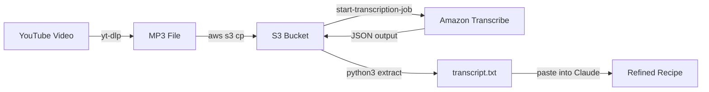
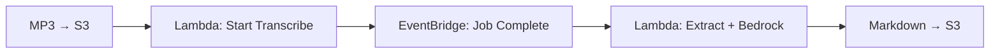

I watched a [DW Food video](https://www.youtube.com/watch?v=57HYrItZiKc){:target="_blank"} about Finnish blueberries and wanted to extract a recipe mentioned midway through. The recipe was buried in 10 minutes of footage with no timestamp and no pinned comment. Rather than rewinding and writing it down, I built a bash script that pulls the audio, sends it through Amazon Transcribe, and outputs a clean text file. The recipe itself — a Finnish blueberry pie adapted for UK ingredients — is documented on [notes.digitalden.cloud](https://notes.digitalden.cloud/posts/finnish-blueberry-pie/){:target="_blank"}.

<!--more-->

---

## Why a Transcript

I am new to baking. Having the recipe as plain text meant I could paste it into AI and work with it properly — asking what each ingredient is, whether UK substitutes exist, converting to grams, and clarifying what each step actually does. That back and forth is hard to do with a video. With a transcript it is straightforward.

---

## Pipeline Overview



| Step | Tool | Action |
|------|------|--------|
| 1 | `yt-dlp` | Extract audio from YouTube as MP3 |
| 2 | AWS CLI | Upload MP3 to S3 |
| 3 | Amazon Transcribe | Start transcription job |
| 4 | AWS CLI | Poll for job completion |
| 5 | AWS CLI + Python | Download JSON, extract plain text |

---

## Step 1: Extract Audio

```bash
yt-dlp -x --audio-format mp3 "https://www.youtube.com/watch?v=57HYrItZiKc"
```

This downloads the video, extracts the audio track, and converts it to MP3 in one command. Output: `Why Finns are obsessed with blueberries.mp3`.

> **What is yt-dlp**  
> A command line tool for downloading video and audio from YouTube and most other video platforms. The `-x` flag extracts audio only and `--audio-format mp3` converts it directly, so you never download the full video file.
{: .prompt-info }

---

## Step 2: The Transcribe Script

The bash script handles S3 upload, job creation, polling, and text extraction in a single run.

```bash
#!/bin/bash
BUCKET="your-bucket-name"
REGION="eu-west-1"

if [ -z "$1" ]; then
  echo "Usage: ./transcribe.sh <audio-file.mp3>"
  exit 1
fi

AUDIO_FILE="$1"
FILENAME=$(basename "$AUDIO_FILE" .mp3)
JOB_NAME="${FILENAME// /-}-$(date +%s)"
S3_KEY="transcribe-input/${FILENAME}.mp3"
OUTPUT_KEY="transcribe-output/${JOB_NAME}.json"
OUTPUT_TXT="${FILENAME}.txt"

echo "Uploading: $AUDIO_FILE"
aws s3 cp "$AUDIO_FILE" "s3://$BUCKET/$S3_KEY" --region "$REGION"

echo "Starting Transcribe job: $JOB_NAME"
aws transcribe start-transcription-job \
  --transcription-job-name "$JOB_NAME" \
  --media "MediaFileUri=s3://$BUCKET/$S3_KEY" \
  --media-format mp3 \
  --language-code en-US \
  --output-bucket-name "$BUCKET" \
  --output-key "$OUTPUT_KEY" \
  --region "$REGION"

echo "Polling for completion..."
while true; do
  STATUS=$(aws transcribe get-transcription-job \
    --transcription-job-name "$JOB_NAME" \
    --region "$REGION" \
    --query "TranscriptionJob.TranscriptionJobStatus" \
    --output text)

  echo "Status: $STATUS"
  [ "$STATUS" = "COMPLETED" ] && break
  [ "$STATUS" = "FAILED" ] && echo "Job failed." && exit 1
  sleep 15
done

echo "Downloading transcript..."
aws s3 cp "s3://$BUCKET/$OUTPUT_KEY" "/tmp/${JOB_NAME}.json" --region "$REGION"

echo "Extracting plain text to $OUTPUT_TXT"
python3 -c "
import json
with open('/tmp/${JOB_NAME}.json') as f:
    data = json.load(f)
print(data['results']['transcripts'][0]['transcript'])
" > "$OUTPUT_TXT"

echo "Done. $OUTPUT_TXT"
```

### Usage

```bash
chmod +x transcribe.sh
./transcribe.sh "Why Finns are obsessed with blueberries.mp3"
```

---

## Design Decisions

### S3 output path

The script uses `--output-bucket-name` and `--output-key` to write the JSON directly to a known S3 path. Without these flags, Transcribe writes to a Transcribe-managed URI that requires an extra API call to resolve. This keeps the download step to one `aws s3 cp` with a predictable path.

```bash
--output-bucket-name "$BUCKET" \
--output-key "$OUTPUT_KEY"
```

### Job name collisions

```bash
JOB_NAME="${FILENAME// /-}-$(date +%s)"
```

A Unix timestamp is appended so reruns of the same file never collide. Transcribe rejects duplicate job names.

### Text extraction

```python
data['results']['transcripts'][0]['transcript']
```

The Transcribe JSON output contains word-level timings, confidence scores, and speaker labels. For this use case none of that matters. I only need the full transcript as a single text block.

### Polling interval

```bash
sleep 15
```

A 10-minute audio file typically completes in 2–3 minutes. Polling every 15 seconds keeps it responsive without excessive API calls.

---

## Output Quality

The transcript came back clean:

{: .w-75 .shadow .rounded-10 }

### What worked

| Content | Result |
|---------|--------|
| English narration | Clean, accurate |
| Place names (Helsinki, Finland) | Correct |
| Cooking terms (rhubarb, blueberry, oats) | Correct |
| Numbers and measurements | Correct |

### Where it struggled

| Content | Expected | Output |
|---------|----------|--------|
| *mustikka* (Finnish for blueberry) | mustikka | Musica |
| Varpu (Finnish name) | Varpu | Varpoo |

This is expected. The job used `en-US` as the language code. The model is not trained on Finnish proper nouns. For a primarily English video with occasional Finnish words, the accuracy was more than enough to work with.

> **Language code selection**  
> Amazon Transcribe supports Finnish (`fi-FI`). If the source audio were predominantly Finnish, switching the language code would improve accuracy on Finnish words but degrade English sections. For mixed-language content, the dominant language is usually the better choice.
{: .prompt-info }

---

## S3 Bucket Structure

After a run, the bucket looks like this:

```
s3://your-bucket-name/
├── transcribe-input/
│   └── Why Finns are obsessed with blueberries.mp3
└── transcribe-output/
    └── Why-Finns-are-obsessed-with-blueberries-1740153600.json
```

Input and output are separated by prefix. The JSON filename includes the timestamp so multiple runs are easy to trace.

---

## Cost

| Resource | Cost |
|----------|------|
| Amazon Transcribe | ~$0.24 per 10 minutes of audio |
| S3 storage | Negligible for a single MP3 + JSON |
| S3 requests | Negligible |

For a one-off extraction this costs almost nothing.

---

## What Comes Next

The CLI version works but requires a terminal and manual execution. The next step is making it event-driven.



| Component | Role |
|-----------|------|
| S3 event notification | Triggers on MP3 upload |
| Lambda (start) | Creates Transcribe job |
| EventBridge rule | Catches `TranscribeJobStateChange` with `COMPLETED` status |
| Lambda (process) | Downloads transcript, sends to Claude via Bedrock, formats output |
| S3 (output) | Stores final markdown file |

Drop an MP3 into S3 and a formatted markdown file appears. No polling, no terminal. Markdown is the output format because all my sites run on Jekyll with the Chirpy theme, so every post is a .md file with YAML front matter. A pipeline that outputs markdown means the transcript lands in a format I can publish directly. I will document that build when I get there.

For now the CLI version is enough. And the [Finnish blueberry pie](https://notes.digitalden.cloud/posts/finnish-blueberry-pie/){:target="_blank"} it extracted was 10/10.

---

*Documented February 2026.*
