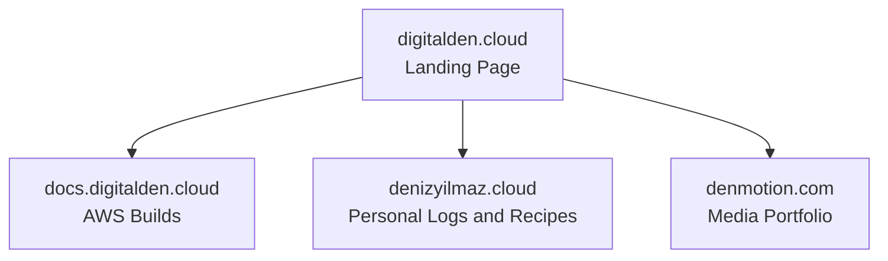
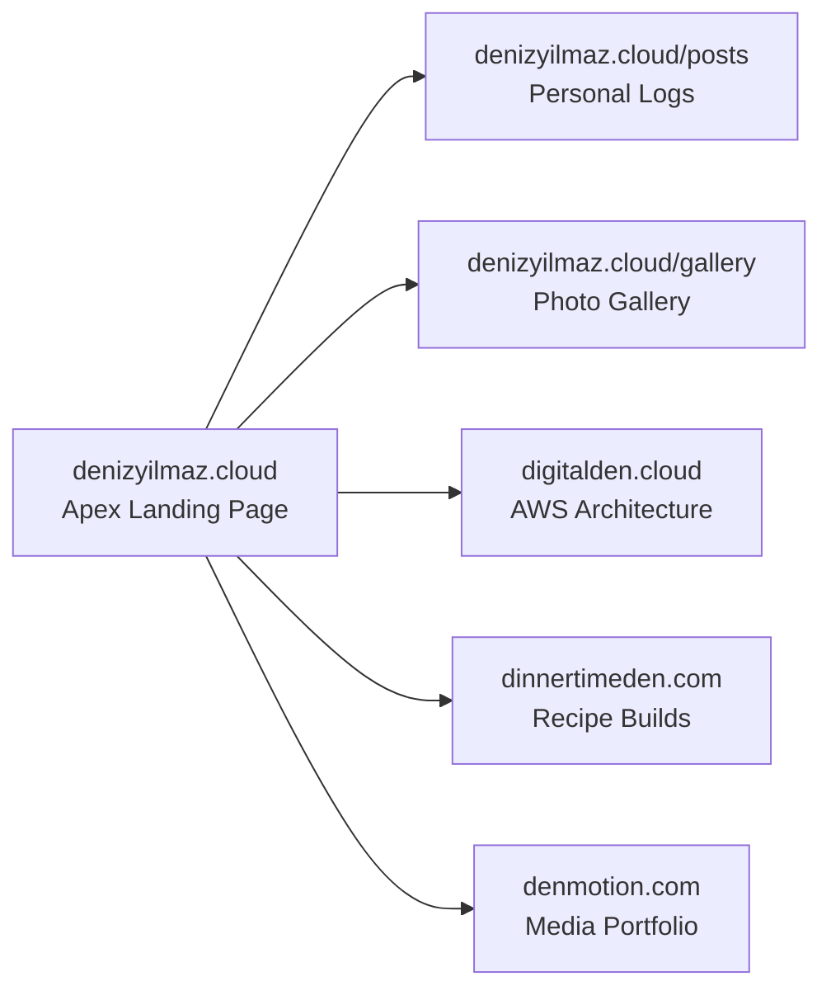

I started with cloud engineering. Cloud is my primary focus and I have always loved it. `digitalden.cloud` was the first domain I bought when I started learning AWS. As a result it naturally became the homepage for my entire portfolio. I routed traffic to `docs.digitalden.cloud` to document my AWS architectures and share the solutions I engineered. It acted as my main hub for a long time and helped me become an AWS Community Builder.

Then I learned photography. I applied the exact same mechanical focus to cameras that I used to learn cloud infrastructure.

Around the same time I started journaling. I was using a completely separate domain called `denizyilmaz.cloud` to host my personal logs. I only did this because I wanted to build my own Retrieval Augmented Generation AI. I needed a dataset of personal posts to feed my first Amazon Bedrock agent, so I wrote private notes to train a custom chatbot that actually knew who I was.

> **Retrieval Augmented Generation**  
> A standard AI model only knows its original training data. RAG is a structural pipeline that bypasses this limitation. The system searches an external database for specific facts and injects those documents directly into the prompt before the AI answers. This forces the model to read your actual data instead of guessing.
{: .prompt-info }

Writing in Markdown and pushing commits to see the site go live instantly gave me a direct dopamine hit. I was also heavily focused on clean eating at the time. I started cooking traditional Turkish meals and that naturally led to baking because I wanted to avoid ultra processed store bought cakes. I already had the camera and I was learning how to shoot video. I knew how to edit in Premiere Pro and I had an active AWS YouTube channel. I decided to start filming myself cooking and baking to make use of the tools I had.

#### Convergence

This is where the interests converged. My cloud engineering mindset accelerated my learning because I engineered solutions to speed up the process. I treated the camera like an AWS service. I isolated the variables and logged my aperture and shutter speeds until the system made sense. Looking back at my posts you can see exactly how far my cinematic footage progressed in six months. I did the same thing in the kitchen. When I wanted to bake a Finnish blueberry pie without watching a ten minute video I built a custom bash script using AWS Transcribe to extract the text instantly. I do not just follow recipes. I engineer them. I take a Swedish kladdkaka and introduce new variables like a Turkish twist.

However, I now had multiple interests scattered across the internet. The infrastructure was getting messy. `digitalden.cloud` was my main landing page. I used it to route traffic outward to different subdomains and websites. `docs.digitalden.cloud` held my AWS builds. `denizyilmaz.cloud` hosted my private logs and a growing list of scattered baking recipes. `denmotion.com` held my media.

Here is what the scattered setup looked like before the rebuild.



I had shot and edited several cinematic films and baking videos, but they were just sitting on my hard drive. My YouTube channel was named `digitalden.cloud`. I could not upload those new videos because mixing blueberry pies with serverless ETL pipelines would completely ruin the AWS channel brand.

I needed clarity. I wanted to unify my interests into one clean architecture so anyone visiting my website could instantly understand everything I do. I decided to delete the old subdomains and build a strict four domain portfolio.

## The Routing Map

Here is the exact mechanical mapping for the new infrastructure.



This physical layout gives me complete isolation for my specific interests while maintaining a unified front door. A recruiter looking at cloud pipelines does not accidentally click into my behavioural tracking.

## The Apex Identity

The original German squatter from 2003 still owns the dot com extension for my name. I am keeping `denizyilmaz.cloud` as my apex domain for now. I will review this next year when the domain comes up for renewal and I might switch to `denizyilmaz.co` instead.

I moved my custom HTML5UP landing page to the root directory here. It runs the particle animation and hosts my Amazon Bedrock AI agent. The navigation menu on this page acts as a traffic director.

The landing page and the Jekyll Chirpy blog live in the same repository. The root URL serves the HTML5UP digital business card. The blog feed serves my standard Chirpy posts. This is where I document my behavioural logs and provide the personal data for my AI agent. It requires exactly one S3 bucket and one GitHub Action. The landing page and the blog exist in the same codebase, but the user experiences them as two distinct interfaces.

## Merging a Static Landing Page Into Chirpy

The technical problem here is that Chirpy expects to own the root of the site. By default the Chirpy blog feed is the root `index.html`. I wanted the HTML5UP landing page at the root instead, with the blog moved to a path, and I wanted this without subdomains, without `baseurl` rewrites, and without breaking my existing post links.

The solution is to put the landing page inside the blog repository rather than putting the blog behind the landing page.

I kept the HTML5UP assets isolated. The CSS, JavaScript, particle config, and webfonts all live in `assets/landing/` so they never collide with Chirpy's own `assets/` directory. The landing page `index.html` sits at the repository root with this front matter.

```yaml
---
layout: null
permalink: /
---
```

`layout: null` tells Jekyll not to wrap the file in any Chirpy templating. `permalink: /` serves it at the apex. The file stays a completely self contained HTML5UP page. Jekyll passes it straight through untouched.

`baseurl` stays empty. Because I did not change `baseurl`, every existing post keeps its original URL at `/posts/...` and nothing 404s. The gallery keeps its URL at `/gallery/`. No redirects required.

## Moving the Blog Feed Off the Root

Moving the landing page to the root meant the Chirpy blog feed needed a new home. I moved it to `/posts/`. This is where I hit a real problem worth documenting.

I created a `posts/` directory with an `index.html` inside it carrying the `home` layout. The individual post pages rendered correctly at `/posts/some-post/`. However, visiting `/posts/` itself showed the page shell with zero posts in it. The feed UI loaded, but it was empty.

The cause is Jekyll's pagination engine. By default it assumes the blog feed lives at the root `index.html`. Once the feed moves to a subfolder, the pagination engine does not know where to route the post data. It builds the UI framework and passes no posts into it.

The fix is to tell the pagination engine explicitly where the feed now lives. In `_config.yml`, I set the pagination path.

```yaml
paginate: 10
paginate_path: "/posts/page:num/"
```

With `paginate_path` set, the engine recognised `posts/index.html` as the official feed. It read the `_posts` directory, collected the markdown files, and injected them into the page. Page two and beyond now route correctly through `/posts/page2/` and onward.

> The lesson is mechanical. Moving a Jekyll blog feed off the site root requires `paginate_path` to be set explicitly, because Jekyll's pagination defaults assume the feed lives at the root.
{: .prompt-tip }

## The Three Project Nodes

The rest of the architecture isolates my specific interests into dedicated environments.

**1 digitalden.cloud**  
I deleted the docs subdomain. I shifted `digitalden.cloud` to act purely as my dedicated cloud engineering and AWS documentation site. The codebase is clean and the search index only returns technical data.

**2 dinnertimeden.com**  
I bought `dinnertimeden.com` and deployed a fresh Chirpy repository on GitHub Pages. Mixing behavioural journaling with food recipes destroys the logic of a site. This domain strictly hosts the recipe builds and cooking videos.

**3 denmotion.com**  
I left `denmotion.com` untouched. The cinematic portfolio and the serverless client delivery system continue to run on their isolated S3 buckets.

## The Hosting Split

The hosting choice for each site follows one question. Should the repository be public or private.

Content I want open and shareable goes on GitHub Pages with a public repository. The cloud engineering site and the recipe site both sit here. The source being public is a feature, not a risk, because that content is educational.

Content I want private goes on AWS S3 and CloudFront with a private repository. The personal logs and the HTML5UP landing page sit here. The landing page repository stays private so my customised template is not a one click clone.

| Site | Hosting | Repository |
|------|---------|------------|
| denizyilmaz.cloud | AWS S3 and CloudFront | Private |
| digitalden.cloud | GitHub Pages | Public |
| dinnertimeden.com | GitHub Pages | Public |
| denmotion.com | AWS S3 and CloudFront | Private |

## The YouTube Rebrand

The final piece of the architecture was the video infrastructure. I dropped the `digitalden.cloud` name entirely on YouTube. I rebranded the channel to my actual name and changed the handle to `@denizyilmazcloud` to match my main hub. Instead of running three separate channels I built a unified playlist architecture.

The channel acts as the holding company. DigitalDen holds the AWS builds. DenMotion holds the cinematic films. DinnerTimeDen holds the recipe builds. This structure finally allows me to upload all the stored media files without breaking the brand.

The new DNS records have propagated and the GitHub Actions are configured. The system is live.
