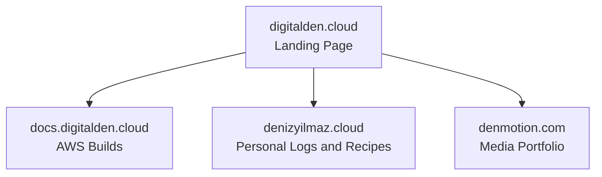
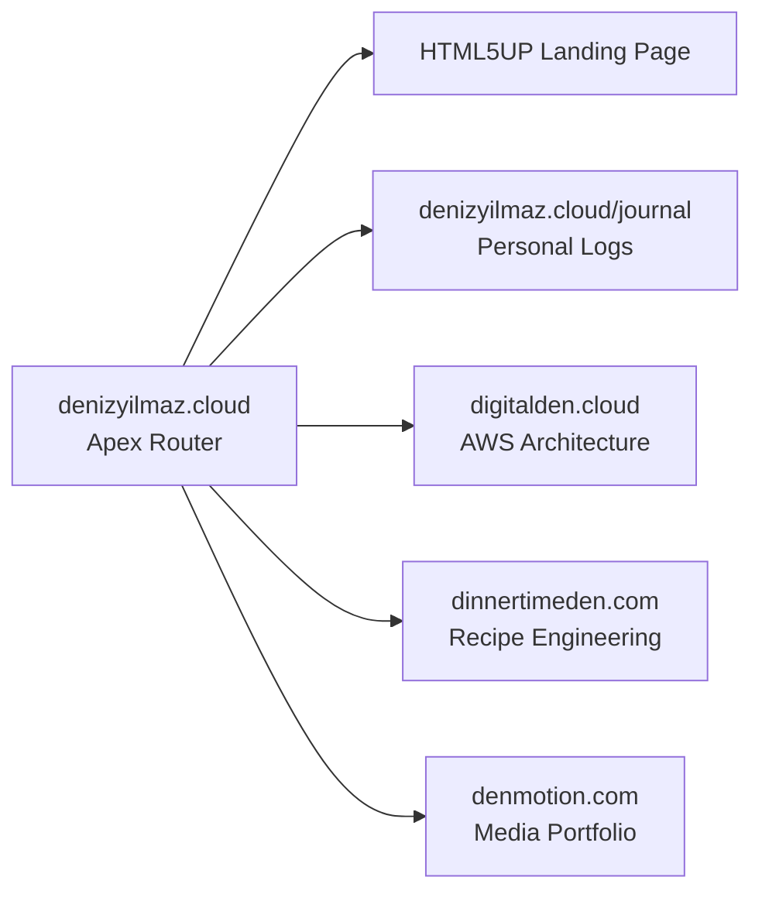

I started with cloud engineering. Cloud is my primary focus and I have always loved it. `digitalden.cloud` was the first domain I bought when I started learning AWS. As a result it naturally became the homepage for my entire portfolio. I routed traffic to `docs.digitalden.cloud` to document my AWS architectures and share the solutions I engineered. It acted as my main hub for a long time and helped me become an AWS Community Builder. 

Then I learned photography. I applied the exact same mechanical focus to cameras that I used to learn cloud infrastructure. 

Around the same time I started journaling. I was using a completely separate domain called `denizyilmaz.cloud` to host my personal logs. I only did this because I wanted to build my own Retrieval Augmented Generation AI. I needed a dataset of personal posts to feed my first Amazon Bedrock agent, so I wrote private notes to train a custom chatbot that actually knew who I was.

> **Retrieval Augmented Generation**  
> A standard AI model only knows its original training data. RAG is a structural pipeline that bypasses this limitation. The system searches an external database for specific facts and injects those documents directly into the prompt before the AI answers. This forces the model to read your actual data instead of guessing.
{: .prompt-info }

Writing in Markdown and pushing commits to see the site go live instantly gave me a direct dopamine hit. I was also heavily focused on clean eating at the time. I started cooking traditional Turkish meals and that naturally led to baking because I wanted to avoid ultra processed store bought cakes. I already had the camera and I was learning how to shoot video. I knew how to edit in Premiere Pro and I had an active AWS YouTube channel. I decided to start filming myself cooking and baking to utilize the tools I had.

#### Convergence
This is where the interests converged. My cloud engineering mindset accelerated my learning because I engineered solutions to speed up the process. I treated the camera like an AWS service. I isolated the variables and logged my aperture and shutter speeds until the system made sense. Looking back at my posts you can see exactly how far my cinematic footage progressed in six months. I did the same thing in the kitchen. When I wanted to bake a Finnish blueberry pie without watching a ten minute video I built a custom bash script using AWS Transcribe to extract the text instantly. I do not just follow recipes. I engineer them. I take a Swedish kladdkaka and introduce new variables like a Turkish twist.

However, I now had multiple interests scattered across the internet. The infrastructure was getting messy. Digitalden.cloud was my main landing page. I used it to route traffic outward to different subdomains and websites. Docs.digitalden.cloud held my AWS builds. Denizyilmaz.cloud hosted my private logs and a growing list of scattered baking recipes. Denmotion.com held my media. 

Here is what the scattered setup looked like before the rebuild.

I had shot and edited several cinematic films and baking videos, but they were just sitting on my hard drive. My YouTube channel was named digitalden.cloud. I could not upload those new videos because mixing blueberry pies with serverless ETL pipelines would completely ruin the AWS channel brand. 

I needed clarity. I wanted to unify my interests into one clean architecture so anyone visiting my website could instantly understand everything I do. I decided to delete the old subdomains completely and build a strict four domain portfolio.

## The Routing Map

Here is the exact mechanical mapping for the new infrastructure.

This physical layout gives me complete isolation for my specific interests while maintaining a unified front door. A recruiter looking at cloud pipelines does not accidentally click into my behavioral tracking. 

## The Apex Identity

The original German squatter from 2003 still owns the dot com extension for my name. I am keeping denizyilmaz.cloud as my apex domain for now. I will review this next year when the domain comes up for renewal and I might switch to denizyilmaz.co instead. 

I moved my custom HTML5UP landing page to the root directory here. It runs the particle animation and hosts my Amazon Bedrock AI agent. The navigation menu on this page acts as a traffic director.

I merged this landing page directly into a Jekyll Chirpy repository. The root URL serves the digital business card. The journal subfolder serves my standard Chirpy feed. This is where I document my behavioral logs and provide the personal data for my AI agent. It requires exactly one S3 bucket and one GitHub Action. The landing page and the blog exist in the same codebase, but the user experiences them as two distinct interfaces.

## The Three Project Nodes

The rest of the architecture isolates my specific interests into dedicated environments.

**1 digitalden.cloud**  
I deleted the docs subdomain entirely. I shifted digitalden.cloud to act purely as my dedicated cloud engineering and AWS documentation site. The codebase is clean and the search index only returns technical data.

**2 dinnertimeden.com**  
I bought dinnertimeden.com and deployed a fresh Chirpy repository. Mixing behavioral journaling with food recipes destroys the logic of a site. This domain strictly hosts the recipe engineering and cooking videos. 

**3 denmotion.com**  
I left denmotion.com untouched. The cinematic portfolio and the serverless client delivery system continue to run on their isolated S3 buckets.

## The YouTube Rebrand

The final piece of the architecture was the video infrastructure. I dropped the digitalden.cloud name entirely on YouTube. I rebranded the channel to my actual name. I changed the handle to @denizyilmazcloud to match my main hub. Instead of running three separate channels I built a unified playlist architecture.

The channel acts as the holding company. Digital Den holds the AWS builds. DinnerTimeDen holds the recipe engineering. DenMotion holds the cinematic films. This structure finally allows me to upload all the stored media files without breaking the brand.

Anyways, the new DNS records are propagating and the GitHub Actions are configured. The system is live.