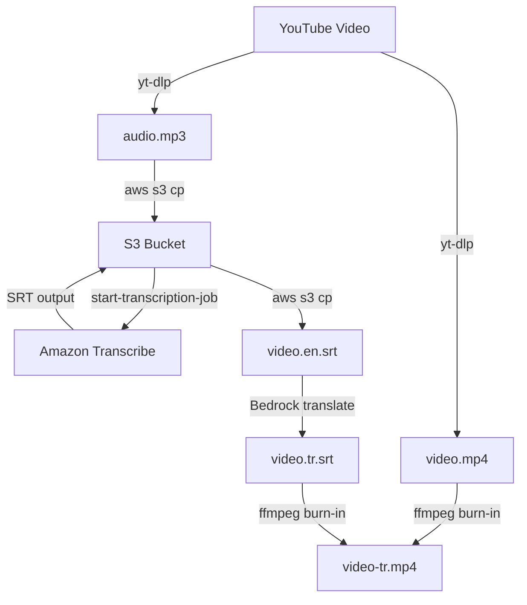
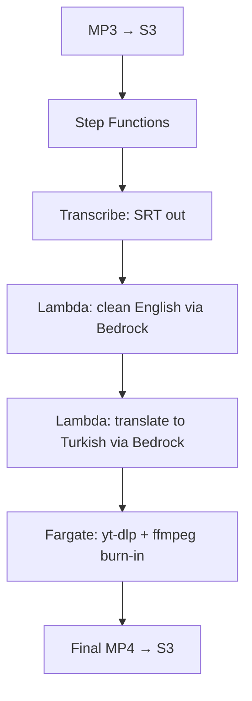

I wanted to send a [TED talk](https://www.youtube.com/watch?v=7vZmOF11P9A){:target="_blank"} to a Turkish friend who does not speak English. The talk is D. Ivan Young's "Emotional Intelligence: Using the Laws of Attraction" from TEDxLSCTomball, and it only exists in English with no subtitles of any kind, so YouTube's auto-translate was not an option. I built a workflow that downloads the video, transcribes the audio to a synced subtitle file, translates that file to Turkish with Claude on Bedrock, and burns the Turkish subtitles permanently into the video. The output is a single MP4 with hardcoded subtitles that survive WhatsApp compression and require nothing to toggle on the receiving end.

This is the CLI version. It runs locally on a Mac with the AWS CLI, yt-dlp, and ffmpeg installed.

<!--more-->

---

## Prerequisites

Three command line tools and an AWS account with two services enabled.

| Tool | Purpose | Install (macOS) |
|------|---------|-----------------|
| AWS CLI | Talks to S3, Transcribe, and Bedrock | `brew install awscli` |
| yt-dlp | Downloads the video and audio from YouTube | `brew install yt-dlp` |
| ffmpeg | Burns the subtitles into the video | `brew install ffmpeg` |
| boto3 | Python SDK for the Bedrock translation script | `pip3 install boto3 --break-system-packages --user` |

On the AWS side you need the following.

An S3 bucket for the audio upload and the Transcribe output. Note its region, because Transcribe is strict about region matching later.

Amazon Transcribe, which needs no setup beyond the IAM permission to call it.

Amazon Bedrock with model access enabled for a current Claude model under Model access in the Bedrock console, and an IAM identity with `bedrock:InvokeModel`. Bedrock model access is per-region, so enable it in the same region you call from.

> **boto3 on a Homebrew Python**  
> A plain `pip3 install boto3` on a Homebrew-managed Python fails with an externally-managed-environment error. The `--break-system-packages --user` flags install it into your home directory and away from the Homebrew install, which is the path the error message itself recommends. If you prefer to keep system packages untouched, use a virtual environment instead.
{: .prompt-info }

---

## Why Burn the Subtitles In

There are two ways to attach subtitles to a video. Soft subtitles sit in a separate file or a muxed track and the player renders them at playback, which means they can be toggled. Hard subtitles are drawn directly into the picture during a re-encode and become part of the frames.

Soft subtitles are the better choice when you control the player. Messaging apps are not that case. WhatsApp and Telegram re-mux video on send and almost always strip a separate subtitle track, so the file arrives with no captions. Burning the subtitles into the frames means they cannot be removed by re-muxing. The trade is a one-time re-encode and a slightly larger file. For sending a translated video to someone, hardcoded subtitles are the correct call.

---

## Pipeline Overview



| Step | Tool | Action |
|------|------|--------|
| 1 | `yt-dlp` | Download the video as MP4 and the audio as MP3 |
| 2 | AWS CLI | Upload the MP3 to S3 |
| 3 | Amazon Transcribe | Transcribe to a synced English SRT |
| 4 | AWS CLI | Download the SRT |
| 5 | Amazon Bedrock | Translate the SRT to Turkish with Claude |
| 6 | ffmpeg | Burn the Turkish SRT into the video |

---

## Step 1: Download the Video and Audio

You need two files. The full video for the final burn-in, and the audio on its own for Transcribe.

```bash
yt-dlp -f "bestvideo+bestaudio" --merge-output-format mp4 -o "video.mp4" "VIDEO_URL"
yt-dlp -x --audio-format mp3 -o "audio.mp3" "VIDEO_URL"
```

The first command grabs the best video and audio streams and merges them into an MP4. The second extracts only the audio track and converts it to MP3, which is the format Transcribe reads.

> **yt-dlp goes stale fast**  
> YouTube changes its internals regularly and an old yt-dlp will fail with format errors or JS challenge errors. On a Mac, install it through Homebrew with `brew install yt-dlp` and update with `brew upgrade yt-dlp` so it stays current. A pip install on a Homebrew-managed Python hits the externally-managed-environment wall, so Homebrew is the cleaner path here.
{: .prompt-warning }

If a playlist URL is passed with `&list=` and `&index=` parameters, strip those down to the bare `watch?v=` portion so yt-dlp targets the single video rather than the playlist position.

---

## Step 2: Transcribe to a Synced SRT

The audio goes to S3, then Transcribe runs against it. The important flag is `--subtitles Formats=srt`, which tells Transcribe to write a synced SRT file alongside the JSON. Without it, you get word-level JSON and have to build the timestamps yourself.

```bash
BUCKET="your-bucket-name"
REGION="us-east-1"
JOB_NAME="ted-talk-$(date +%s)"

aws s3 cp audio.mp3 "s3://$BUCKET/transcribe-input/audio.mp3" --region "$REGION"

aws transcribe start-transcription-job \
  --transcription-job-name "$JOB_NAME" \
  --media "MediaFileUri=s3://$BUCKET/transcribe-input/audio.mp3" \
  --media-format mp3 \
  --language-code en-US \
  --subtitles Formats=srt \
  --output-bucket-name "$BUCKET" \
  --region "$REGION"

while true; do
  STATUS=$(aws transcribe get-transcription-job \
    --transcription-job-name "$JOB_NAME" \
    --region "$REGION" \
    --query "TranscriptionJob.TranscriptionJobStatus" \
    --output text)
  echo "Status: $STATUS"
  [ "$STATUS" = "COMPLETED" ] && break
  [ "$STATUS" = "FAILED" ] && echo "Job failed." && exit 1
  sleep 15
done

echo "Job done: $JOB_NAME"
```

When the job completes, the SRT is in the bucket under the job name with an `.srt` extension. Pull it down.

```bash
aws s3 cp "s3://$BUCKET/${JOB_NAME}.srt" "video.en.srt" --region "$REGION"
```

> **The Transcribe region must match the bucket region**  
> Transcribe does not resolve the bucket region for you the way `aws s3 cp` does. If the `--region` on the Transcribe call does not match where the bucket actually lives, the job fails with a BadRequestException. Check the bucket region with `aws s3api get-bucket-location --bucket your-bucket-name`. A `LocationConstraint` of `null` means the bucket is in `us-east-1`, which AWS reports as null for historical reasons.
{: .prompt-warning }

The SRT comes back as numbered blocks, each with a timestamp line and the transcribed text under it.

```
0
00:00:10,439 --> 00:00:11,630
it's really good to be here,

1
00:00:11,640 --> 00:00:15,619
and I want to first acknowledge these students because this is not easy
```

A 12-minute talk produces a few hundred blocks. Note the highest block number, it tells you whether the whole file fits in a single model call later.

---

## Step 3: Translate the SRT with Bedrock

The translation runs through Claude on Amazon Bedrock. The reason to use a model here rather than Amazon Translate is context. Amazon Translate works on each subtitle block in isolation, so it cannot resolve a sentence split across two blocks and it renders English idiom literally. A model reads the whole file at once, handles the mid-sentence splits, and produces Turkish that reads the way a person would actually say it.

The prompt does two jobs. It instructs a natural Turkish translation, and it locks the structure so only the text lines change and every timestamp stays byte-for-byte identical.

```python
import boto3, json
from botocore.config import Config

REGION = "us-east-1"
MODEL = "us.anthropic.claude-sonnet-4-6"

with open("video.en.srt", "r", encoding="utf-8") as f:
    srt = f.read()

prompt = f"""You are translating an SRT subtitle file from English to Turkish.

This is a TED talk being sent to a Turkish friend who speaks no English. Translate naturally and conversationally into Turkish, the way a fluent Turkish speaker would actually say it, not word for word. Respect Turkish idiom and sentence flow. Keep the speaker's tone.

Rules you must follow exactly:
- Translate ONLY the subtitle text lines.
- Keep every block number identical.
- Keep every timestamp line identical, do not change a single character of the timings.
- Keep the exact same number of blocks and the exact same blank-line structure.
- Output the complete SRT and nothing else, no preamble, no explanation, no markdown fences.

Here is the SRT:

{srt}"""

config = Config(read_timeout=600, connect_timeout=60, retries={"max_attempts": 2})
client = boto3.client("bedrock-runtime", region_name=REGION, config=config)

resp = client.invoke_model_with_response_stream(
    modelId=MODEL,
    body=json.dumps({
        "anthropic_version": "bedrock-2023-05-31",
        "max_tokens": 16000,
        "messages": [{"role": "user", "content": prompt}]
    })
)

turkish = ""
for event in resp["body"]:
    chunk = json.loads(event["chunk"]["bytes"])
    if chunk["type"] == "content_block_delta":
        turkish += chunk["delta"]["text"]
        print(".", end="", flush=True)

print()
with open("video.tr.srt", "w", encoding="utf-8") as f:
    f.write(turkish)

print("Done. Wrote video.tr.srt")
```

Run it.

```bash
python3 translate_srt.py
```

There are three details in this script that each came from a failure during the build.

### The model identifier must be a current inference profile

Older model IDs reach end of life and get removed from Bedrock, which returns a ResourceNotFoundException. On top of that, current Claude models on Bedrock do not accept a bare foundation-model ID for on-demand calls. They require a cross-region inference profile ID, which carries a regional prefix such as `us.`. A bare ID returns a ValidationException about on-demand throughput not being supported.

List what your account can actually call and pick a current Sonnet from the output.

```bash
aws bedrock list-inference-profiles \
  --region us-east-1 \
  --query "inferenceProfileSummaries[?contains(inferenceProfileId, 'claude')].inferenceProfileId" \
  --output text
```

> **Model access has to be enabled first**  
> The inference profile only works if the model is enabled under Model access in the Bedrock console, and the calling IAM identity needs the `bedrock:InvokeModel` permission. A model that is not enabled will not appear as callable even if the profile ID is correct.
{: .prompt-info }

### Streaming avoids the read timeout

A single non-streaming `invoke_model` call has a 60-second default read timeout in boto3. Translating a few hundred blocks takes longer than that to generate, so the connection times out while the model is still working. Switching to `invoke_model_with_response_stream` returns tokens as they are produced, so the connection never sits idle long enough to time out. The `Config` object also raises the read timeout to 600 seconds as a second layer of protection.

### Turkish needs more output tokens than English

Turkish text runs longer than the equivalent English. The `max_tokens` is set to 16000 so a few hundred translated blocks have the headroom to complete. If the output is truncated mid-file, this is the value to raise.

Confirm the translation reached the final block and did not cut off.

```bash
tail -5 video.tr.srt
```

The last block number in the Turkish file should match the last block number in the English file.

---

## Step 4: Burn the Subtitles In

ffmpeg draws the Turkish SRT into the video frames during a re-encode.

```bash
ffmpeg -i video.mp4 \
  -vf "subtitles=video.tr.srt:charenc=UTF-8:force_style='FontName=Arial,FontSize=24,PrimaryColour=&Hffffff&,OutlineColour=&H000000&,BorderStyle=1,Outline=2,Shadow=0,MarginV=30'" \
  -c:v libx264 -preset medium -crf 20 \
  -c:a copy \
  video-tr.mp4
```

The flags break down as follows. The `subtitles` filter takes the SRT and renders it onto the video. `charenc=UTF-8` forces UTF-8 decoding so Turkish characters such as ı, ş, ğ, ç, ö, and ü render as letters rather than boxes. The `force_style` block sets white text with a 2px black outline and no shadow, lifted 30px off the bottom edge so it reads cleanly over any background. `-c:v libx264 -preset medium -crf 20` re-encodes the video at a visually lossless quality. `-c:a copy` leaves the audio untouched so only the picture is re-encoded.

> **CRF controls the quality and file size trade**  
> A lower CRF means higher quality and a larger file, a higher CRF means the reverse. The sane range is 18 to 23. Since messaging apps compress on send anyway, a value around 20 to 23 keeps the file smaller without a visible drop.
{: .prompt-info }

Check the result before sending. Open the file, confirm the subtitles appear at the start, jump to the middle to confirm they stay synced, and verify the Turkish characters render correctly.

```bash
open video-tr.mp4
```

---

## A Note on Accuracy

The translation is more accurate than YouTube's auto-translate for a specific mechanical reason. YouTube's pipeline machine-transcribes the English audio, then machine-translates that imperfect transcript to Turkish, so transcription errors carry into the translation and compound. This workflow translates from a transcript with a model that reads the whole talk as context, so it corrects many transcription errors from context before they reach the Turkish.

Where it cannot help is proper nouns. If Transcribe mishears a name or a place, the model has no reference for the correct version and will translate the wrong word faithfully. For a clear English talk this is rare, but it is worth a quick read of the English SRT before translating, or watching the final video before sending.

---

## Cost

| Resource | Cost |
|----------|------|
| Amazon Transcribe | ~$0.24 per 10 minutes of audio |
| Amazon Bedrock (Claude Sonnet, one SRT) | A few cents for a 12-minute talk |
| S3 storage and requests | Negligible |

For a single video this costs almost nothing.

---

## Next Steps

The CLI version works but it runs by hand on a local machine. The next step is making it event-driven so an MP3 dropped into S3 produces a finished translated video with nothing to run manually.



Step Functions is the right orchestrator because Transcribe is asynchronous. The wait for the job to finish happens in the state machine as a Wait and Choice loop rather than inside a Lambda burning runtime on a poll. The two Bedrock steps stay as Lambdas. The download and the burn-in move into a Fargate task, because ffmpeg re-encoding a full video does not fit Lambda's 15-minute timeout and capped temp space, and an always-on EC2 instance is wasteful for a job that runs occasionally. I will document that build when I get there.

For now the CLI version does the job, and the talk arrived in Turkish.

---

*Documented June 2026.*
