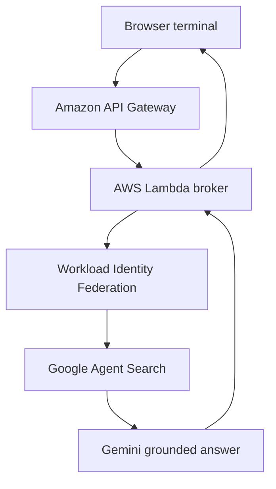

There is an interactive terminal on the About page of [denizyilmaz.cloud](https://denizyilmaz.cloud){:target="_blank"}. Gold particles drift behind it. A visitor types a question about me, the request leaves the browser, enters AWS in London, crosses into Google Cloud, retrieves from a search index built over everything I have published, and a Gemini model writes an answer grounded entirely in my own posts, citations attached. Follow-up questions work because the conversation holds a session. If I have not written about something, the agent says so instead of inventing.

This post is the complete system in one place. The frontend architecture, the cross-cloud request path, the identity design, and the production guardrails. Two companion posts on my personal blog hold the full build logs with every command and every bug, linked at the end. This one covers what was designed and why.

## The Portfolio Context

denizyilmaz.cloud is the apex of a four domain portfolio. It fronts the brand and routes outward, this site holds the cloud engineering work, dinnertimeden.com holds recipe builds, denmotion.com holds cinematic media. The apex needed to do two jobs that pull in opposite directions, be cinematic enough to work as a first impression, and run a full blog underneath. That tension produced the first architecture decision.

## A Hybrid Frontend

The site runs two completely different frontends on one domain, from one repo, through one deploy.

The root is a customised HTML5UP Dimension template. Static HTML and CSS with particles.js running the animated background. The journal at /posts/ is a full Jekyll Chirpy site with categories, archives, and a gallery. They coexist because Jekyll is told to leave the landing page alone, the index.html at the repo root carries two lines of front matter.

```yaml
---
layout: null
permalink: /
---
```

`layout: null` stops Jekyll wrapping the file in any Chirpy template, `permalink: /` serves it at the apex. The HTML5UP assets live isolated under assets/landing/ so the two frontends never collide, and the Chirpy feed relocates to /posts/ with an explicit `paginate_path` so pagination keeps working off the root. One S3 bucket, one CloudFront distribution, one GitHub Actions deploy, two visual languages. A pure Chirpy site cannot be cinematic and a pure HTML5UP site has no blog engine, the hybrid takes both halves.

## The Agent Architecture

The terminal is the visible end of a request path that crosses two cloud providers per question.



The grounding layer is Google Agent Search, the product formerly named Vertex AI Search. A website data store crawls the blog, and the Answer API on top of it runs retrieval per question, hands the matching content to Gemini, and generates an answer constrained to that material. The constraint is the design. Gemini is the writer, not the source, its training shapes the language while every fact must come from a retrieved post. This eliminates the hallucination class entirely, and it also means a public endpoint cannot be milked as a free general chatbot, the model has nothing to say beyond my corpus.

The broker is a Python Lambda behind an API Gateway HTTP API. It validates input, manages conversation sessions so follow-ups resolve, filters citations down to genuine post URLs, and shapes the response for the terminal. Sessions are created and stored on the Google side, the Lambda just carries the ID, which keeps the broker stateless.

## Identity Without Credentials

The interesting engineering problem was authentication. An AWS Lambda needs to call a Google Cloud API, and the obvious answer is a service account key stored in Secrets Manager. I refused that design, a long-lived credential sitting in storage is a liability that needs rotation, monitoring, and luck.

The system uses Workload Identity Federation instead. Google is configured to trust AWS as an identity provider, so the Lambda proves who it is using the IAM role it already runs as, and Google exchanges that proof for a short-lived access token at request time.

```json
{
  "type": "external_account",
  "audience": "//iam.googleapis.com/projects/PROJECT_NUMBER/locations/global/workloadIdentityPools/aws-pool/providers/aws-provider",
  "subject_token_type": "urn:ietf:params:aws:token-type:aws4_request",
  "service_account_impersonation_url": "https://iamcredentials.googleapis.com/v1/projects/-/serviceAccounts/SA_EMAIL:generateAccessToken",
  "credential_source": {
    "environment_id": "aws1",
    "regional_cred_verification_url": "https://sts.REGION.amazonaws.com?Action=GetCallerIdentity&Version=2011-06-15"
  }
}
```

That file is the entire credential configuration and it contains no secret, it is instructions for an exchange, not a key. The Lambda's execution role maps to a Google service account holding exactly one role, read access to the search engine. There is no API key, no JSON key file, and no stored secret anywhere in the system. Every credential in the chain is machine-issued at runtime and expires within the hour. If the architecture has a centrepiece, this is it.

## Containment

A public AI endpoint with no authentication needs walls, and the walls are layered so no single failure runs up a bill.

```bash
# Gateway throttle, 2 requests per second, burst of 5
aws apigatewayv2 update-stage --api-id API_ID --stage-name prod \
  --default-route-settings ThrottlingRateLimit=2,ThrottlingBurstLimit=5

# The Lambda can never run more than 3 copies at once
aws lambda put-function-concurrency --function-name vertex-agent \
  --reserved-concurrent-executions 3
```

Behind those sit Google's own per-minute quota on grounded queries, a CloudWatch alarm that emails when hourly invocations spike past normal traffic, and a GCP budget with alert thresholds. The budget is the honest layer, billing alerts notify rather than cap, which is exactly why the request-level throttles exist in front of them. The free tier covers ten thousand grounded queries a month, and the throttles make exceeding it roughly impossible.

Observability runs on both clouds. The Lambda logs every question and answer as structured JSON pairs in CloudWatch, one command reads a week of conversations, and Google's session store holds the same conversations server side as the source of truth. What strangers ask the agent is the most honest reader feedback a blog can get, and it feeds what I write next.

## The Terminal

The frontend is a terminal rather than a chat widget, deliberately. A prompt and a blinking cursor promise a tool, which matches what the system is, and it photographs like a brand. The same two files serve a terminal on the HTML5UP landing page and on a dedicated Chirpy page, one implementation, two surfaces.

The detail I like most is that the static terminal knows live site data with no API behind it. Jekyll computes the numbers at build time and writes them into the page as JavaScript, Liquid writing code.

```html
<script>
window.SITE_DATA = {
    totalPosts: {{ site.posts | size }},
    totalCategories: {{ site.categories | size }},
    lastUpdated: {{ site.posts.first.date | date: "%-d %b %Y" | jsonify }}
};
</script>
```

A `stats` command prints those numbers plus a build-time word count across every post, a `latest` command lists the five newest posts as links, and a `whoami` command explains the two-cloud architecture in plain language for non-technical visitors. Suggested question chips draw from a pool where every entry is verified against the live endpoint before it earns a slot, because a suggested question that returns a refusal is a broken button. And a question can ride in on the URL, `?q=` fires it automatically on arrival, so a QR code can open the site mid-conversation.

## The Lineage

This is the second generation of the idea. The [first Bedrock agent](/posts/building-my-first-bedrock-agent/) ran on this site with a knowledge base and a Lambda, and it taught me the failure mode that shaped everything above, a model that can answer beyond its source material will eventually be confidently wrong about you. The v2 design grounds harder, authenticates without secrets, and contains costs structurally rather than hopefully.

## The Full Build Logs

The complete implementation, every command, every config, and the bugs that earned their place in the record, is documented in two parts on my personal blog. [Part one covers the backend](https://denizyilmaz.cloud/posts/building-a-cross-cloud-ai-agent/){:target="_blank"}, the Lambda, the federation setup, and the grounding engine. [Part two covers the frontend](https://denizyilmaz.cloud/posts/a-terminal-as-a-front-door/){:target="_blank"}, the terminal, the commands, and the suggestion system. The agent itself takes questions at [denizyilmaz.cloud](https://denizyilmaz.cloud){:target="_blank"}, ask it anything I have written about.
