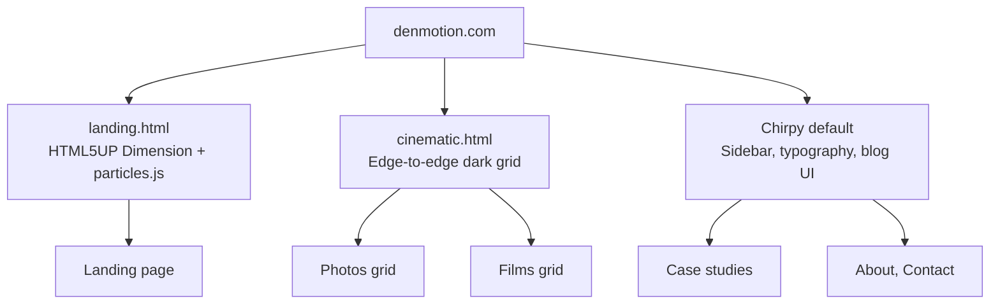
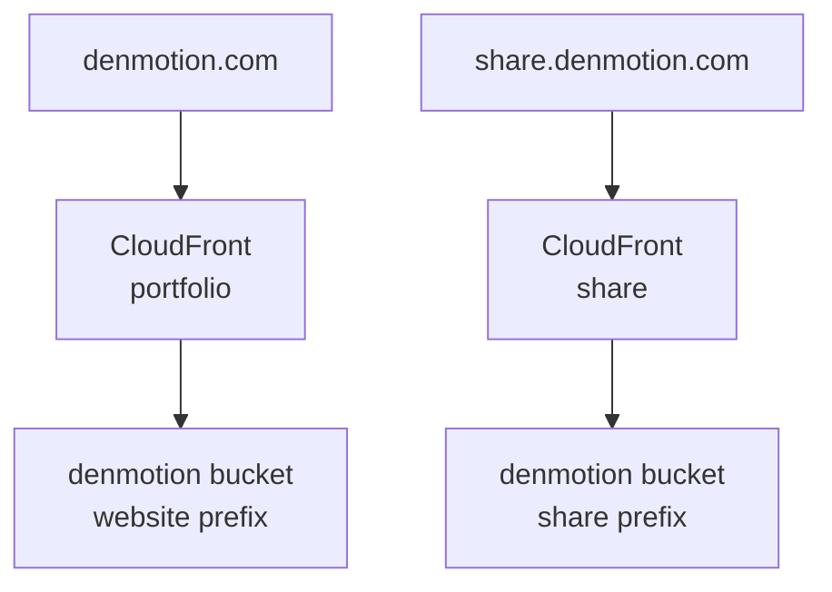

I shoot film and photography under a brand called DenMotion. The work is hosted on infrastructure I built and own, no Squarespace, no Vimeo, no YouTube embeds. A visitor lands on a dark particle animation, picks Films or Photos, and drops into an edge-to-edge cinematic grid where video thumbnails play on hover. Clicking one opens a full-screen player streaming the master file at the exact quality it left Premiere Pro. The whole thing runs on a single S3 bucket and CloudFront, costs under a pound a month, and deploys from a private repo on `git push`.

This post is the architecture. The brand story and the full build logs live across three posts on my personal site, linked at the end. This one covers what was engineered and why it holds together.

## The Problem With Portfolio Platforms

Filmmakers spend thousands on a camera, hours colour grading, then upload to a platform that compresses the result. YouTube crushes dark shadows and shifts grades. Squarespace recompresses uploaded video natively. The standard fix is paying for Vimeo on top of a site builder, two subscriptions to show one reel. I wanted the client to see the exact file that came out of the edit, served fast, with no third-party logos and no recommended videos at the end. That requirement drove every decision below.

## Three Layout Engines, One Repo

The constraint that shaped the build is that a portfolio has three kinds of page with three completely different needs. The landing page wants to be cinematic. The galleries want to be edge-to-edge and immersive. The case studies and contact pages want to be readable. No single template does all three well, so the site runs three independent layouts inside one Jekyll project.



The trick that makes this work without the three systems fighting is asset isolation plus standalone layouts. The landing and cinematic layouts are self-contained HTML documents that do not extend Chirpy's templates, each with its own head and its own stylesheet, and the HTML5UP assets live isolated under their own directory so the two design systems never load on the same page. The result is zero CSS bleed, the landing page shows no Chirpy styling, the galleries show no blog UI, and the visitor moves between all three without noticing they are different engines.

## Self-Hosted Video, the 3-File Strategy

Hosting video properly is the part most portfolios get wrong. A single master file is too heavy to autoplay in a grid and too slow to load on hover. So every film exists as three files on S3, each with one job.

| File | Purpose | When it loads |
| --- | --- | --- |
| Poster PNG | Static first frame, prevents the empty black box | On page load |
| Thumbnail MP4 | Five-second silent loop, 720p, low bitrate | On hover, or autoplay on mobile |
| Master MP4 | Full resolution with audio | Only when opened in the lightbox |

The grid loads posters first, swaps to the silent loop on hover, and only fetches the heavy master when a visitor chooses to watch. Desktop plays on hover, mobile autoplays the muted loops since there is no cursor, and the layout detects which to use. The viewer never downloads a large file unless they commit to watching it, and when they do, it is the uncompressed master straight from CloudFront.

## Clean URLs With a CloudFront Function

Alongside the portfolio sits a share system at a subdomain, for sending clients a single edited video as a branded page rather than a raw file link. It produced the build's favourite piece of engineering.

I wanted to send `share.denmotion.com/client/project`, no file extension, a clean route rather than a link to a file in a folder. The problem is there is no file called `project` in S3, the file is `project.mp4`, so CloudFront looks for the extensionless path, fails, and errors. The fix is a CloudFront Function, a lightweight JavaScript snippet that runs at the edge in under a millisecond before the request reaches S3.

```javascript
function handler(event) {
    var request = event.request;
    var uri = request.uri;

    // Real files pass through untouched
    if (uri.match(/\.\w+$/)) {
        return request;
    }
    // Clean URLs serve the branded viewer page
    request.uri = '/index.html';
    return request;
}
```

A request with an extension passes through to S3. A clean request gets rewritten to the viewer page, whose JavaScript reads the original path, appends the extension, and streams the matching video into a branded player. The visitor sees a dark DenMotion page with the work in it, never a raw file, never an extension. The same edge-function pattern later solved subdirectory routing when the main site moved to CloudFront, since CloudFront, unlike GitHub Pages, does not serve `index.html` from a directory path on its own.

## Two Distributions, One Bucket

The entire system, portfolio and share, runs on a single S3 bucket partitioned by prefix, with two CloudFront distributions scoped to their own paths.



Each distribution uses an origin path scoping it to one prefix, so the portfolio distribution physically cannot read the share files and vice versa, one bucket with hard internal walls. A single wildcard certificate covers every subdomain, and the bucket blocks all public access so every byte is served through CloudFront via Origin Access Control. Nothing is reachable directly.

## Private Repo, Automated Deploy

The site code is the intellectual property, the three layouts and the grid logic, so the repo is private. That breaks GitHub Pages on a free account, so the site deploys to S3 and CloudFront through GitHub Actions instead. On every push, the Action builds the Jekyll site, syncs it to the bucket's website prefix, and invalidates the CloudFront cache, live in about forty-five seconds.

The deploy authenticates as an IAM user scoped to exactly what it needs and nothing more.

```json
{
    "Effect": "Allow",
    "Action": ["s3:PutObject", "s3:DeleteObject", "s3:ListBucket"],
    "Resource": [
        "arn:aws:s3:::denmotion",
        "arn:aws:s3:::denmotion/website/*"
    ]
}
```

The deployer can write to the website prefix and invalidate one distribution. It cannot touch the share, films, or photos prefixes, cannot reach the other distribution, and has no console access. If the credentials leaked, the blast radius is the website files alone. Least privilege scoped to a prefix.

## The Full Architecture

| Layer | Technology | Purpose |
| --- | --- | --- |
| Domain | Route 53 | DNS for apex and subdomains |
| Portfolio CDN | CloudFront | Serves the Jekyll site from the website prefix |
| Share CDN | CloudFront | Serves the branded viewer from the share prefix |
| Routing | CloudFront Functions | Subdirectory routing and clean URLs at the edge |
| Storage | S3, single bucket | All files, partitioned by prefix |
| TLS | ACM wildcard cert | Every subdomain, one certificate |
| Build | GitHub Actions | Jekyll build, S3 sync, cache invalidation on push |
| Deploy auth | IAM, prefix-scoped | Least-privilege programmatic access |
| Media | S3 + CloudFront | Self-hosted, zero-compression video and photos |

Two distributions, one bucket, one certificate, one hosted zone, one IAM deployer. Zero databases, zero servers, zero monthly platform fees beyond storage and requests. The whole thing runs for less than the cost of a coffee and delivers video at a quality the hosted platforms compress away.

## What It Demonstrates

The reason this build is worth documenting is the intersection it sits on. Self-hosting cinematic video needs S3, CloudFront, edge functions, IAM, and DNS, the cloud engineering. Making a portfolio that actually feels premium needs custom layouts, a video grid, and hover-to-play logic, the frontend. Cloud engineers do not usually shoot and grade film, and videographers do not usually configure CloudFront distributions, and the build lives in the gap between the two. Adding a new piece of work is a few lines of config and a `git push`, which is the payoff of treating a creative portfolio as infrastructure.

## The Full Build Logs

The complete story, the brand naming, every layout decision, the cinematic grid CSS, the share system, and the GitHub-Pages-to-S3 migration, is documented in three posts on my personal site. [Building the brand and the portfolio site](https://denizyilmaz.cloud/posts/denmotion-building-the-brand/){:target="_blank"} covers the three layouts and the cinematic grid. [Building the share system](https://denizyilmaz.cloud/posts/denmotion-building-the-share-system/){:target="_blank"} covers the CloudFront Function and the branded viewer. [Moving to S3 and CloudFront](https://denizyilmaz.cloud/posts/denmotion-moving-to-s3-cloudfront/){:target="_blank"} covers the migration, the IAM setup, and the deploy pipeline. The work itself is at [denmotion.com](https://denmotion.com){:target="_blank"}.
