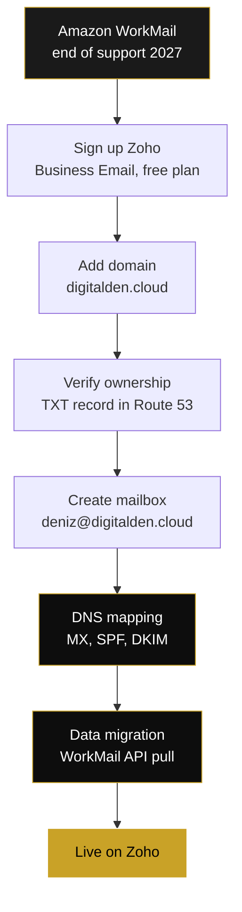
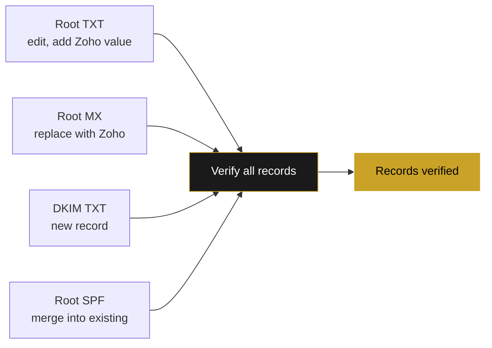
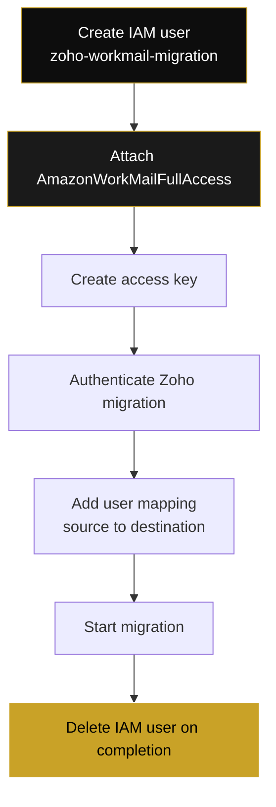
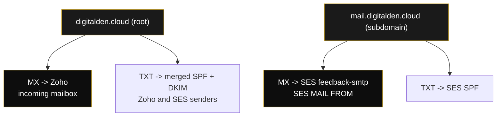

Amazon is ending support for Amazon WorkMail on March 31, 2027. New customer sign-ups closed on April 30, 2026. Existing customers retain access until the end-of-support date, after which the service and its resources are removed.

This follows a familiar AWS pattern. Services such as Cloud9, CodeCommit, CodeStar, S3 Select, and several others have been closed to new customers or deprecated over the past few years, each with a defined migration window. WorkMail is the latest. The runway is long enough to migrate without urgency, but the work has to be done before the cut-off.

This document covers my full migration of a single custom-domain mailbox, `deniz@digitalden.cloud`, from WorkMail to Zoho Mail. It includes the Route 53 DNS configuration, the data migration of existing mail, and the steps required to avoid breaking an existing Amazon SES configuration that shares the same domain.

<!--more-->

---

## Background

### WorkMail and why a custom-domain mailbox matters

Amazon WorkMail was AWS's managed email and calendar service. It provided real mailboxes on a custom domain, accessible through webmail and IMAP, comparable to Google Workspace or Microsoft 365.

A custom-domain mailbox such as `deniz@digitalden.cloud` maps an inbox directly to a domain you own. This matters for two reasons. It presents a consistent, professional identity rather than a generic provider address, after all `deniz@digitalden.cloud` does look more professional than `denizyilmaz@hotmail.co.uk`, and it keeps the address under your control. If the email provider changes, as it is changing here, the address stays the same and only the routing underneath moves.

### WorkMail is not SES

These are separate services and the distinction is important for this migration.

WorkMail provides a **mailbox**. It receives mail, stores it, and lets you read and reply. This is the service being replaced.

Amazon SES is a **sending** service. It sends transactional and application email, such as contact form confirmations, through AWS infrastructure. It does not provide a mailbox.

A single domain can use both at once. In my case, `digitalden.cloud` used WorkMail for the inbox and SES for a serverless contact form. Migrating the mailbox to Zoho must not disturb the SES configuration. The two systems are independent, but they share DNS records on the same domain, which is where care is required.

### SES is not a prerequisite

This migration does not require SES. SES appears in this document only because it was already configured on my domain and shares DNS records that can be affected by the mailbox migration. A domain with no SES setup can skip every SES-related step here. The full SES configuration for the contact form is documented separately.

---

## Choice of replacement

I selected Zoho Mail. It is one of the alternatives named in the AWS WorkMail end-of-support notice, alongside Kopano Cloud and Zoom Mail, and it offers a free tier suitable for a single mailbox.

The Zoho Mail Forever Free plan provides:

- One domain
- Up to five users
- 5 GB storage per user
- Webmail and the Zoho Mail mobile application

The free tier does not include IMAP, POP, or ActiveSync. Mail is accessed through Zoho webmail and the Zoho Mail mobile app only. Desktop mail clients such as Apple Mail or Outlook are not supported on the free tier and require the paid Mail Lite plan, which adds IMAP.

IMAP
: Internet Message Access Protocol. Syncs mail between the server and your client, leaving messages on the server so every device sees the same state. This is what lets Apple Mail or Outlook show the same inbox as webmail.

POP
: Post Office Protocol. Downloads mail to a single client and, by default, removes it from the server. Older and largely superseded by IMAP for multi-device use.

ActiveSync
: Microsoft's Exchange ActiveSync protocol. Syncs mail, calendar, and contacts to a client, common with Outlook and mobile devices.

---

## Migration overview



The two stages that carry operational risk are the DNS mapping and the data migration. The remainder is account configuration.

---

## Step 1: Account sign-up

Zoho's sign-up offers Business Email and Personal Email. Select **Business Email**. Personal Email provides a `@zohomail.com` address and cannot host a custom domain. The sign-up URL should contain `type=org&plan=free`.

The email address requested during sign-up is the account recovery and login contact. It is not the mailbox being created. Any existing accessible address can be used.

For a multi-domain or client scenario, create a separate Zoho organisation per domain owner. A client's domain belongs under their own Zoho account, not bundled into yours, so they retain ownership of their email.

---

## Step 2: Domain addition and verification

I added `digitalden.cloud` as the domain.

The domain input field prefills a `www.` prefix that may not clear from the field. In my case the prefix could not be removed from the input, but Zoho strips it on submission. Confirm the success screen displays the bare domain, `digitalden.cloud`, and not `www.digitalden.cloud`, before continuing.

Verification uses a TXT record. Select the TXT method. Zoho provides a value in the following form:

```text
Host:  @  (root domain)
Type:  TXT
Value: zoho-verification=zbXXXXXXXX.zmverify.zoho.eu
```

A root TXT record already existed on my domain. Mine held an SPF record and a Google site verification string, the latter left over from setting up Agent Search through the Gemini Enterprise Agent Platform, which verifies domain ownership the same way. Route 53 stores multiple TXT values within a single record at the same name, so I did not create a second root TXT record. I edited the existing record and added the Zoho value as an additional quoted line.

```text
"v=spf1 include:amazonses.com ~all"
"google-site-verification=XXXXXXXXXXXXXXXXXXXXXXXX"
"zoho-verification=zbXXXXXXXX.zmverify.zoho.eu"
```

Each value occupies its own line and is enclosed in double quotes. Two separate TXT records at the same name are invalid per the DNS specification and per SPF rules.

I saved the record and verified. Route 53 propagation for this change completed in approximately two minutes.

---

## Step 3: Mailbox creation

Create the first mailbox address to match the existing WorkMail address exactly. My existing address was `deniz@digitalden.cloud`, so I created `deniz@digitalden.cloud`. Matching the address ensures the data migration maps cleanly and that mail to the existing address continues to function after cutover.

This first address also serves as the administrator login for the Zoho organisation.

---

## Step 4: DNS mapping

This stage redirects incoming mail. Three record sets are required in Route 53: MX, SPF, and DKIM.

### MX records

The root MX record is replaced. It previously pointed to WorkMail.

```text
Before:
10 inbound-smtp.us-east-1.amazonaws.com

After:
10 mx.zoho.eu
20 mx2.zoho.eu
50 mx3.zoho.eu
```

The MX records apply to the **root domain** (host `@`), not to a subdomain. If the domain has a `mail.` subdomain MX record from an SES MAIL FROM configuration, that record is unrelated and must not be modified. Replace the value on the root MX record entirely. Do not retain the WorkMail MX value alongside the Zoho values, as this routes mail to two systems.

### SPF record

SPF permits only one record per domain name. A domain that already has an SPF record, for example from SES, must merge the Zoho include into the existing record rather than create a second one.

```text
Before:
"v=spf1 include:amazonses.com ~all"

After:
"v=spf1 include:zohomail.eu include:amazonses.com ~all"
```

Both senders are listed within a single SPF string. This retains SES sending capability and adds Zoho. Creating a second SPF TXT record invalidates SPF authentication for the entire domain.

### DKIM record

DKIM is a new record with no existing conflict.

```text
Host:  zmail._domainkey
Type:  TXT
Value: "v=DKIM1; k=rsa; p=MIGfMA0GCSq... (base64 key) ...IDAQAB"
```

The value must be enclosed in double quotes. Zoho displays the value without quotes, but Route 53 requires them. A TXT string has a 255-character limit per quoted segment. If the key exceeds this, split it into two quoted strings on the same line; DNS concatenates them.

```text
"v=DKIM1; k=rsa; p=...first 255 characters" "...remaining characters...IDAQAB"
```

### Verification



After adding all records, allow time for propagation and run the verification in Zoho. All records verified on the first check in my case. Confirm send and receive function before proceeding: send from Zoho webmail to an external address, reply to the mailbox, and confirm both deliver.

---

## Step 5: Data migration

The mailbox is live, but existing mail remains in WorkMail. Zoho provides a migration tool. For WorkMail, it uses the AWS API rather than IMAP, and therefore requires IAM credentials rather than a mailbox password.

### IAM configuration

Create a dedicated IAM user for the migration rather than using primary account credentials.



The migration requires `AmazonWorkMailFullAccess`. The `AmazonWorkMailReadOnlyAccess` policy is insufficient: the migration API cannot enumerate the organisation and its mailboxes with read-only permissions, and authentication fails with a non-specific error. Attach the full-access policy and generate a new access key.

### Configuration values

The migration region must match the WorkMail region. The region can be confirmed from the original WorkMail MX value; `inbound-smtp.us-east-1.amazonaws.com` indicates `us-east-1`.

After authentication, the migration performs no action until a user mapping is added under the Users tab. The mapping specifies a source and destination address. Both were `deniz@digitalden.cloud` in my case, as the address is unchanged across providers. Without a mapping, the migration has no mailbox to process.

The applied settings migrated Mail, Contacts, and Calendar, across all folders except Spam. On completion, a confirmation email is delivered to the new Zoho inbox, and the migrated mail is present, including historical messages and prior contact form submissions.

---

## Step 6: Decommission and cleanup

### Delete the migration IAM user

On completion of the migration, delete the `zoho-workmail-migration` IAM user. It holds a full-access WorkMail key that has served its single purpose. Deleting the user removes the access key and attached policies in one action. A standing full-access credential for a completed one-time task should not remain in the account.

### Remove WorkMail-specific DNS records

The following record is specific to WorkMail and can be removed once migration is complete:

```text
autodiscover.digitalden.cloud  CNAME  autodiscover.mail.us-east-1.awsapps.com
```

### Remove the WorkMail account from mail clients

Any mail client configured against the WorkMail IMAP endpoint, for example an Apple Mail account on iOS, should be removed. It points to a mailbox that no longer receives mail.

### WorkMail organisation

The WorkMail organisation itself does not require manual deletion. The root MX no longer points to it, so it is already bypassed, and AWS removes it at the end-of-support date.

---

## Coexisting SES configuration

A domain that runs SES alongside the migrated mailbox requires attention to one record set.

SES with a custom MAIL FROM domain creates a subdomain, in my case `mail.digitalden.cloud`, with its own MX and SPF records:

```text
mail.digitalden.cloud  MX   10 feedback-smtp.eu-west-3.amazonses.com
mail.digitalden.cloud  TXT  "v=spf1 include:amazonses.com ~all"
```

These records belong to SES, not to WorkMail or Zoho. Zoho MX records belong only on the root domain. If Zoho MX values are applied to the `mail.` subdomain by mistake, SES detects the missing MAIL FROM MX and issues a warning:

```text
Amazon SES has detected that the MX record required to use
mail.digitalden.cloud as a custom MAIL FROM domain for verified
identity digitalden.cloud is no longer present in your DNS settings.
```

SES allows three days before disabling the custom MAIL FROM domain, after which sending falls back to the SES default MAIL FROM. To resolve the warning, restore the SES value on the `mail.` subdomain MX record:

```text
mail.digitalden.cloud  MX  10 feedback-smtp.eu-west-3.amazonses.com
```

The relationship between the records, after migration, is as follows:



The root domain routes incoming mail to Zoho. The `mail.` subdomain serves the SES MAIL FROM domain. The two operate independently on the same zone.

---

## Summary

The migration requires three points of attention:

The SPF record must be merged, never duplicated. Two SPF records on a domain invalidate SPF authentication.

The Zoho MX records apply to the root domain only. The SES MAIL FROM subdomain MX must not be modified.

The WorkMail data migration requires `AmazonWorkMailFullAccess`. Read-only access is insufficient. The IAM user should be deleted on completion.

With these handled, domain verification completes in minutes, the DNS records verify on the first check, and the existing mail migrates in full. The mailbox runs on the Zoho free tier, and the existing SES configuration on the same domain remains intact.
